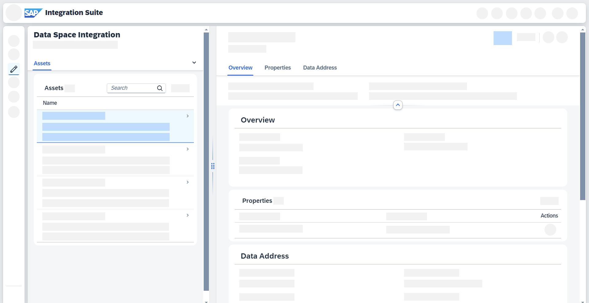

<!-- loiofa843190a46d49d496a6624f5b5ddbf6 -->

# Working with Assets

Learn about assets and how you can use them in a data space.

An asset is \(a set of\) data offered by a provider. See [Concepts in Data Space Integration](../concepts-in-data-space-integration-fcf96b2.md).

<a name="loiofa843190a46d49d496a6624f5b5ddbf6__section_mkl_ypt_jyb"/>

## Use Cases

Depending on your use case, you interact with assets in different ways:

-   As a **consumer**, you consume the assets either directly or in your business applications provided by other data space members according to their policies and the agreement you agreed to.

    See [Consuming Data Space Assets](../consuming-data-space-assets-5c0cdb8.md).

-   As a **provider**, your focus lies on creating and editing your own assets, preparing them for consumption by other data space members.

    See [Creating Assets](creating-assets-5e051be.md).

<a name="loiofa843190a46d49d496a6624f5b5ddbf6__section_ftc_2sm_jyb"/>

## Assets Overview

You can access all your assets by going to *Design* \> *Data Spaces* \> *Assets*. The following details are available in the table view:

-   *Name*

-   *ID*

-   *Description*

-   *Created By*

-   *Created At*

> ### Tip:  
> Use the search functionality to find your assets. You can search for \(parts of\) *Name*, *ID*, and *Description*.

Select an asset to open a more detailed view next to the table view:

**Related Information**  

[Creating Assets](creating-assets-5e051be.md "Create an asset and add properties in Data Space Integration.")

[Editing Assets](editing-assets-5f2d07d.md "Edit an existing asset in Data Space Integration.")

