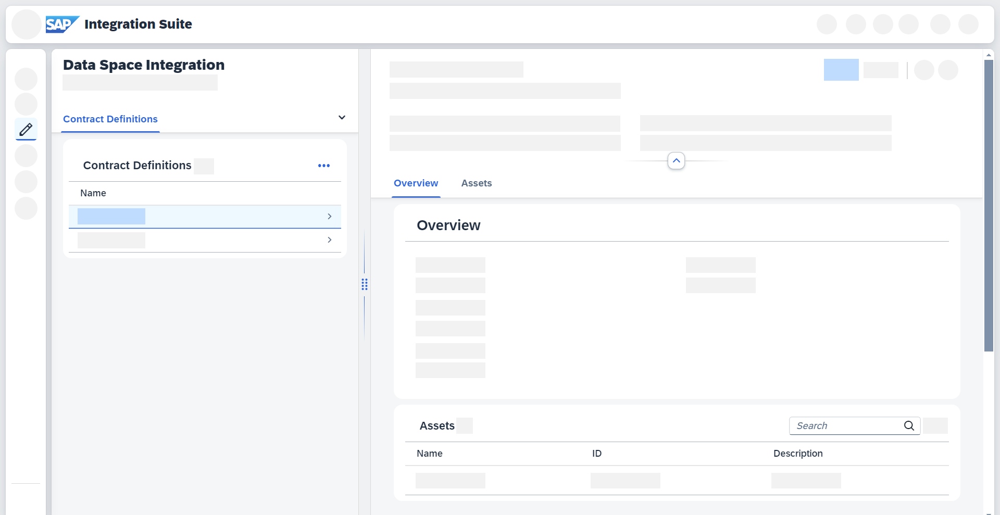

<!-- loiof136d72935d84bc386ee4ac6655921af -->

# Working with Contract Definitions

Learn about contract definitions and how you can interact with them in a data space.

A contract definition is an offer put out by a provider. Contract definitions combine assets and policies. See [Concepts in Data Space Integration](../concepts-in-data-space-integration-fcf96b2.md).

<a name="loiof136d72935d84bc386ee4ac6655921af__section_phj_z1p_kyb"/>

## Use Cases

Depending on your use case, you interact with contract definitions in different ways:

-   As a **consumer**, you can negotiate existing contract definitions drawn up by providers. Prior consent to contract definitions is a prerequisite for data access.

-   As a **provider**, you can combine assets and policies into contract definitions. Contract definitions are offered to one or multiple consumers.

<a name="loiof136d72935d84bc386ee4ac6655921af__section_fzz_hbp_kyb"/>

## Contract Definitions Overview

You can access all of your contract definitions by going to *Design* \> *Data Spaces* \> *Contract Definitions*. The table view displays useful details, such as name and description, but also the assets and policies associated with the contract definition.

> ### Note:  
> Use the search functionality to easily find your contract definitions. You can search for \(parts of\) *Name*, *Description*, *Access Policy*, and *Usage Policy*.

Select a contract definition to show a more detailed view next to the table view:

**Related Information**  

[Creating Contract Definitions](creating-contract-definitions-7746d65.md "Learn how to create a contract definition.")

[Editing Contract Definitions](editing-contract-definitions-38d141b.md "Edit a contract definition in Data Space Integration.")

