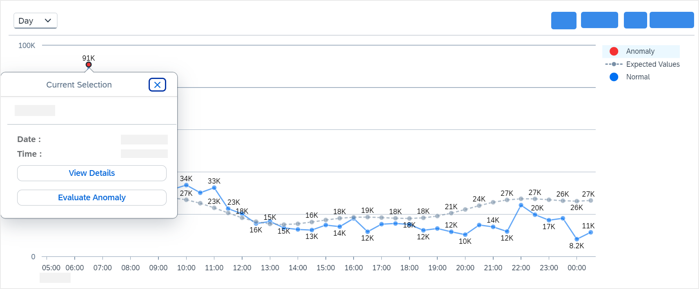
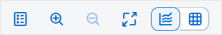

<!-- loio1c677b2472f94aa28ea4fc4ecc4e4bef -->

<link rel="stylesheet" type="text/css" href="../css/sap-icons.css"/>

# Working with Detected Anomalies

Access and analyze anomalies in the analytics dashboard. Discover details about the various types of anomalies, evaluate and resolve them.

> ### Note:  
> The availability of the anomaly detection and prediction features depends on your SAP Integration Suite service plan. For more information about different service plans and their supported feature set, see SAP Notes [2903776](https://me.sap.com/notes/2903776) and [3463620](https://me.sap.com/notes/3463620).

<a name="loio1c677b2472f94aa28ea4fc4ecc4e4bef__section_zvs_4nr_g1c"/>

## Viewing Anomalies

After enabling the anomaly detection setting and configuring the API selection, the system will display the details of any detected anomalies in the Analytics dashboard. Additionally, if you have subscribed to the **SAP Alert Notification Service**, you will receive an automated alert notifying you of the detected anomaly.

To view the detected anomalies from the Analytics dashboard, you can use the following methods:

-   In the analytics dashboard, you can find the anomaly notification bar located at the top of the **Overview** page. Choose *View Anomaly* to quickly navigate to the **Anomalies** page.

-   In the analytics dashboard, go to the *Anomalies* tab to view the detected anomalies.

<a name="loio1c677b2472f94aa28ea4fc4ecc4e4bef__section_ah3_bvr_g1c"/>

## Anomalies Page

The **Anomalies** page provides detailed information about any anomalies that have been detected. The information is displayed across screens:

### **Screen 1**

You can see a list of detected anomalies based on the anomaly type. The detected anomalies are categorized in two levels: System level and API level.

Each anomaly is accompanied by the following details:

-   Type: Displays the anomaly type. The following table describes the possible anomaly types:

    <table>
    <tr>
    <th valign="top">

    Anomaly Types
    
    </th>
    <th valign="top">

    Values Displayed
    
    </th>
    </tr>
    <tr>
    <td valign="top" rowspan="2">
    
    API Traffic
    
    </td>
    <td valign="top">
    
    **API Traffic Increase:** This value is displayed when there is an increase in the number of API calls made to a specific API.
    
    </td>
    </tr>
    <tr>
    <td valign="top">
    
    **API Traffic Decrease:** This value is displayed when there is a decrease in the number of API calls made to a specific API.
    
    </td>
    </tr>
    <tr>
    <td valign="top">
    
    API Response Time
    
    </td>
    <td valign="top">
    
    **API Response Time Increase:** This value is displayed when there is an increase in the total response time for a specific API.
    
    </td>
    </tr>
    <tr>
    <td valign="top" rowspan="2">
    
    API Errors
    
    </td>
    <td valign="top">
    
    **API Client Error Increase:** This value is displayed when there is an increase in the API client errors.
    
    </td>
    </tr>
    <tr>
    <td valign="top">
    
    **API Server Error Increase:** This value is displayed when there is an increase in the API server errors.
    
    </td>
    </tr>
    </table>
    
-   Time Stamp: Displays the date and time of the issue detection.
-   Affected Entity: Displays the name of the affected API. If there are multiple affected APIs, it will be shown as **Multiple APIs**.
-   Details: This field describes the issue detected by the system.

Choose an anomaly to view more in-depth information on the next screen.

### Screen 2

In this screen, you can view the anomaly type that describes the issue, along with a graphical representation. You can perform the following actions:

1.  **View Details:**

    -   Click on the red dot on the graph, and choose *View Details* to find more information on the next screen.

        For multiple APIs: Click on the red dot on the graph, select the anomaly type from the list, and choose *View Details*.

2.  **Evaluate Anomaly:** Evaluating anomalies helps the AI training model distinguish between genuine anomalies and similar fluctuations, thereby assisting the learning process and reducing the occurrence of false positives and false negatives in future classifications.

    To evaluate, follow these steps:

    1.  Click on the red dot on the graph, and choose *Evaluate Anomaly*.

    2.  In the *Evaluate Anomaly* window:
        -   Select *Yes* if the detected anomaly appears to be abnormal and to confirm it as a true anomaly.

        -   Select *No* if the detected anomaly seems to be normal and to confirm it as not an anomaly.
        -   In the *Comment* box, you can provide the reason for your evaluation. This information will be stored to help determine whether the anomaly has been assessed or not, along with other details such as the user who conducted the evaluation, and the date and time of the evaluation.
        -   Choose *Save* to confirm your changes.

    You can also evaluate an anomaly on the next screen by clicking on the *Evaluate* button. Once evaluated, the status will be displayed right below the **Evaluation** field.

### **Screen 3**

In this screen, you can access the following information:

-   Evaluation: Displays the status of an anomaly whether it has been evaluated or not. To evaluate, click on the *Evaluate* button.

-   API Anomaly Type: A red arrow is displayed to indicate a surge or drop, depending on the anomaly type. The possible anomaly types include API Traffic \(Increase or Decrease\), API Response Time \(Increase\), or API Error Count Increase \(client or server errors\).
-   Description: Displays the observed percentage variation.
-   Time Stamp: Displays the date and time of issue detection.
-   Details:
    -   API causing this anomaly: Displays the name of the API that is causing the anomaly.

    -   Affected Target Hosts: Displays the name of the affected API provider.
    -   Developer Details: Displays the name of the developer.

-   Suggestions: In this tab, you can view suggestions to help resolve the anomaly. Choose *View APIs* to be redirected to the *Configure* \> *APIs* page, where you can review the API that is causing the anomaly and conduct further investigation to resolve it.

> ### Note:  
> Anomaly Detection is an AI-based feature, and there is a possibility of receiving inaccurate responses. If you encounter any discrepancies, please share your valuable feedback by clicking on the  \(**Give feedback**\) icon.

<a name="loio1c677b2472f94aa28ea4fc4ecc4e4bef__section_vmz_k5l_31c"/>

## Graph: Actual vs. Expected Patterns for API Calls

The graph provides a visualization of actual and expected patterns for different types of API calls over a specified timeframe, focusing on key metrics such as **API Traffic** \(Increase or Decrease\), **API Response Time** \(Increase\), and **API Error Count Increase** \(Client or Server errors\). The x-axis represents time intervals, while the y-axis reflects the respective metrics' values.

**API Traffic**

**Actual**: The solid blue line on the graph represents the actual volume of API calls observed during the selected period. Peaks indicate surge in API traffic, while troughs signify decreased activity, a drop in the call count.

**Expected**: The expected pattern is represented by a dotted line on the graph. Deviations from this line may signify anomalies in the API call behavior.

**Action**: A consistent alignment between the actual and expected patterns suggests normal and expected API behavior, while variation, especially sudden increase or decrease, may indicate anomalies that require further investigation.

**API Response Time**

**Actual**: The solid blue line on the graph represents the actual response time in seconds for API calls observed during the selected period. Peaks indicate an increase in the API response time, while troughs signify a decrease.

**Expected**: The expected pattern is represented by a dotted line on the graph. Deviations from this line may signify anomalies in the API call behavior.

**Action**: A consistent alignment between the actual and expected patterns suggests normal and expected API behavior, while variation, especially a sudden increase, may indicate anomalies that require further investigation.

**API Errors \(Client or Server Errors\)**

**Actual**: The solid blue line on the graph represents the actual error count \(client or server errors\) observed during the selected period. Peaks indicate an increase in the error count, while troughs signify a decrease.

**Expected**: The expected pattern is represented by a dotted line on the graph. Deviations from this line may signify anomalies in the API call behavior.

**Action**: A consistent alignment between the actual and expected patterns suggests normal and expected API errors, while variation, especially a sudden increase, may indicate anomalies that require further investigation.

<a name="loio1c677b2472f94aa28ea4fc4ecc4e4bef__section_bm1_xwy_g1c"/>

## Action Bar

The Action Bar is located in the top right corner of **Anomalies** window. It provides controls that allow you to interact with the displayed data. These controls enable you to switch between graphical and tabular views, select the time period you wish to analyze for anomalies, and perform other actions as described below:

Choose  to switch between full screen view and default screen view.

Click the drop-down to select the time period. The data can be viewed for a maximum of 6 months.

Choose  for graphical view.

Choose  for tabular view.

Choose  or  to zoom in or out the graph. This option is helpful for accessing the red dot, which indicates an anomaly on the graph.

**Related Information**  

[Enabling Anomaly Detection and Predictions](enabling-anomaly-detection-and-predictions-98534a0.md "Activate the anomaly detection and prediction features for API proxy calls to enhance monitoring and forecasting capabilities.")

[Configuring APIs for Anomaly Detection](configuring-apis-for-anomaly-detection-9e7e5d1.md "View or configure APIs for anomaly detection.")

[Subscribing to Notification Alerts](subscribing-to-notification-alerts-88e96f4.md "Receive real-time alerts for anomaly detection services, delivered to your preferred communication channel.")

