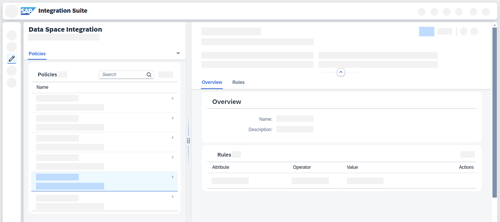

<!-- loioc930aed9fed54a9eb46822a2036807fe -->

# Working with Policies

Learn about policies and how you can use with them in a data space.

A policy is a set of \(predefined\) rules for data access control defining access rights and duration of access based on the needs of the data owner. See [Concepts in Data Space Integration](../concepts-in-data-space-integration-fcf96b2.md)

<a name="loioc930aed9fed54a9eb46822a2036807fe__section_vy5_1qt_jyb"/>

## Use Cases

Depending on your use case, you interact with assets in different ways:

-   As a **consumer**, you encounter policies as part of a contract definition that regulates the way you can interact with assets offered by a provider. You can negotiate these contract agreements.

-   As a **provider**, you use policies to define the way in which consumers can use your assets.

    See [Creating Policies](creating-policies-91458cf.md) and [Editing Policies](editing-policies-5ea31f2.md).

<a name="loioc930aed9fed54a9eb46822a2036807fe__section_ftc_2sm_jyb"/>

## Policy Overview

You can access all of your policies by going to *Design* \> *Data Spaces* \> *Policies*.

> ### Tip:  
> Use the search functionality to find your policies. You can search for \(parts of\) *Name*, *ID*, and *Description*.

Select a policy to open a more detailed view next to the table view:

**Related Information**  

[Creating Policies](creating-policies-91458cf.md "Create a policy in Data Space Integration.")

[Editing Policies](editing-policies-5ea31f2.md "Edit a policy in Data Space Integration.")

