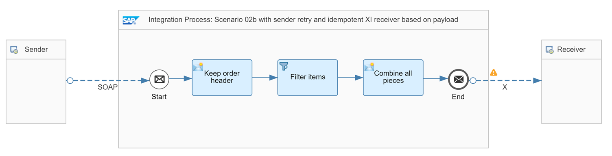

<!-- loio3add2bf66f4b45da8690a6850edbc090 -->

# XI Receiver Handles Duplicates \(based on unique ID in payload\)

The scenario described in this topic is similar to scenario [XI Receiver Handles Duplicates](xi-receiver-handles-duplicates-fcf026b.md), except that the sender protocol doesn't support a unique ID. Therefore, we need to make sure that the system derives a unique ID from the payload.

The following assumptions apply for the design of this scenario:

-   It implements the communication between exactly 1 sender and 1 receiver.
-   The message protocol doesn’t contain a unique ID.

    Therefore, the integration developer needs to design the scenario in such a way that Cloud Integration derives a unique ID from the payload.

-   The sender supports message retry.
-   The XI receiver adapter is used to reliably exchange messages with the receiver using the XI 3.0 protocol.

<a name="loio3add2bf66f4b45da8690a6850edbc090__section_lnz_nrk_gyb"/>

## Involved Integration Flows

To simulate the communication of sender and receiver systems through Cloud Integration for the different scenarios, the integration package comes with multiple integration flows. To learn more about how these integration flows interact with each other during the processing of a scenario, see [Interaction of the Involved Integration Flows](interaction-of-the-involved-integration-flows-44be68d.md).

<a name="loio3add2bf66f4b45da8690a6850edbc090__section_bqh_5nj_gyb"/>

## Example Scenario

As an example, we have modified scenario “XI Receiver Handles Duplicates”: Instead of the sender SAP RM adapter, the scenario uses SOAP 1.x protocol. The* Pattern Quality Of Service - Scenario 02b* integration flow illustrates this simple scenario.

The Content Modifier *Keep order header* stores the order ID as exchange property with name *orderNumber* using the following settings \(*Exchange Property* tab\).

<table>
<tr>
<th valign="top">

Parameter

</th>
<th valign="top">

Value

</th>
</tr>
<tr>
<td valign="top">

Name

</td>
<td valign="top">

orderNumber

</td>
</tr>
<tr>
<td valign="top">

Type

</td>
<td valign="top">

XPath

</td>
</tr>
<tr>
<td valign="top">

Data Type

</td>
<td valign="top">

java.lang.String

</td>
</tr>
<tr>
<td valign="top">

Value

</td>
<td valign="top">

string\(//@PurchaseOrderNumber\)

</td>
</tr>
</table>

At the receiver side, the scenario uses an XI receiver adapter. On the *Delivery Assurance* tab of the XI receiver adapter, the following settings have to be configured:

<table>
<tr>
<th valign="top">

Parameter

</th>
<th valign="top">

Setting

</th>
</tr>
<tr>
<td valign="top">

*XI Message ID Determination*

</td>
<td valign="top">

Map

</td>
</tr>
<tr>
<td valign="top">

*Source for XI Message ID*

</td>
<td valign="top">

$\{property.orderNumber\}

</td>
</tr>
<tr>
<td valign="top">

*Quality Of Service* 

</td>
<td valign="top">

Exactly Once

</td>
</tr>
<tr>
<td valign="top">

*Temporary Storage*

</td>
<td valign="top">

Either Data Store or JMS Queue

</td>
</tr>
</table>

This setting ensures that at runtime the value of the order ID property is mapped to a unique ID that is used to set up the XI Message ID. See: [Configure the XI Receiver Adapter](configure-the-xi-receiver-adapter-5d2670f.md).

The integration flow settings ensure that a unique ID is passed on to the receiver system. If the sender retries the message delivery with the same order ID, Cloud Integration maps the ID to the same unique ID and passes the latter on to the receiver. Because the receiver is idempotent, it recognizes the duplicate message and discards it.

To test the scenario, perform the following steps:

1.  Set up inbound *Basic* authentication for integration flow endpoints.

    See:

    -   [Basic Authentication with clientId and clientsecret for Integration Flow Processing](../40-RemoteSystems/basic-authentication-with-clientid-and-clientsecret-for-integration-flow-processing-647eeb3.md)
    -   [Setting Up Inbound HTTP Connections (with Basic Authentication), Neo Environment](https://help.sap.com/viewer/368c481cd6954bdfa5d0435479fd4eaf/Cloud/en-US/391c45cfcd0f4435952ab085283b7f7d.html "") :arrow_upper_right:

2.  Deploy a *User Credentials* artifact with the following parameters using the *Monitor* application \(*Security Material* tile under *Manage Security*\).

    <table>
    <tr>
    <th valign="top">

    Parameter
    
    </th>
    <th valign="top">

    Setting
    
    </th>
    </tr>
    <tr>
    <td valign="top">
    
    Name
    
    </td>
    <td valign="top">
    
    OWN
    
    </td>
    </tr>
    <tr>
    <td valign="top">
    
    User
    
    </td>
    <td valign="top">
    
    Enter the user as specified when setting up inbound basic authentication.
    
    </td>
    </tr>
    <tr>
    <td valign="top">
    
    Password
    
    </td>
    <td valign="top">
    
    Enter the password as specified when setting up inbound basic authentication.
    
    </td>
    </tr>
    </table>
    
    > ### Note:  
    > When you check out the integration flows *Pattern Quality Of Service – Mocked Sender* and *Pattern Quality Of Service - Scenario 02b*, you notice that the receiver adapters refer to a *User Credentials* artifact with the name *OWN*.

    Both integration flows operate on the same tenant and use the same user credentials for inbound requests.

3.  Deploy all 3 integration flows *Generic Receiver*, *Pattern Quality Of Service – Mocked Sender*, ad *Pattern Quality Of Service - Scenario 02b*.
4.  In the Postman client, open the *QualityOfService* folder in the *Enterprise Integration Patterns* collection, and run the *QualityOfService – Scenario 02b* request.

    If you set the request parameter `sendDuplicates` to `true` \(in the *Params* tab of Postman\), the *Pattern Quality Of Service – Mocked Sender* integration flow sends a second message to the* Pattern Quality Of Service - Scenario 02b* integration flow with a delay of 5 seconds.

5.  Once the system has processed the second message successfully, check the data store *Pattern-QualityOfService* \(open the *Monitor* application and select the *Data Stores* tile under *Manage Stores*\).

    > ### Tip:  
    > You see only 1 entry with an entry *ID* that is identical to the mapped ID based on the order ID.

6.  Before rerunning the test, clean up the data store. Optionally, maintain a new order ID in the message body.

7.  Optionally, you can switch on the trace to be able to verify the overall behavior.

