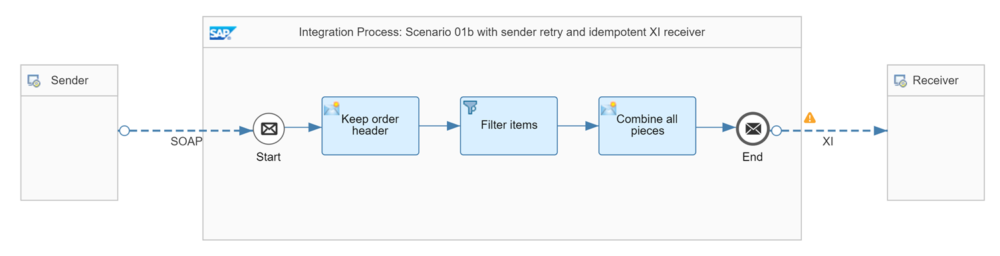

<!-- loiofcf026b6af6c4c7aba466e3b73f5fc49 -->

# XI Receiver Handles Duplicates

The scenario described in this topic is similar to scenario [Sender and Receiver with SAP RM Protocol](https://help.sap.com/docs/integration-suite/sap-integration-suite/sender-and-receiver-with-sap-rm-protocol), except that the receiver uses the XI protocol instead of SAP RM.

The following assumptions apply for the design of this scenario:

-   It implements the communication between exactly 1 sender and 1 receiver.
-   The message protocol contains a unique ID such as a message ID.
-   The sender supports message retry. It's assumed that the message ID remains the same for all retries.
-   The XI receiver adapter is used to reliably exchange messages with the receiver using the XI 3.0 protocol.

To simulate the communication of sender and receiver systems through Cloud Integration for the different scenarios, the integration package comes with multiple integration flows. To learn more about how these integration flows interact with each other during the processing of a scenario, see[Interaction of the Involved Integration Flows](https://help.sap.com/docs/cloud-integration/sap-cloud-integration/interaction-of-involved-integration-flows).

The Pattern Quality Of Service - Scenario 01b integration flow implements a content filter pattern \(for more information on this pattern, see also[Content Filter](https://help.sap.com/docs/integration-suite/sap-integration-suite/content-filter)\):

The scenario contains a SOAP \(SAP RM\) sender adapter with SAP Reliable Messaging message protocol. This setting ensures that the sender can pass on a protocol-specific message ID to the integration flow. Cloud Integration saves the ID in the header SapMessageIdEx. See [Configure the SOAP \(SAP RM\) Sender Adapter](https://help.sap.com/docs/cloud-integration/sap-cloud-integration/configure-soap-sap-rm-sender-adapter).

At the receiver side, the scenario uses an XI receiver adapter. On the**Delivery Assurance** tab of the XI receiver adapter, the following settings have to be configured:

<table>
<tr>
<th valign="top">

Parameter

</th>
<th valign="top">

Setting

</th>
</tr>
<tr>
<td valign="top">

XI Message ID Determination

</td>
<td valign="top">

Reuse

</td>
</tr>
<tr>
<td valign="top">

Quality Of Service

</td>
<td valign="top">

Exactly Once

</td>
</tr>
<tr>
<td valign="top">

Temporary Storage

</td>
<td valign="top">

Either Data Store or JMS Queue

</td>
</tr>
</table>

This setting ensures that the receiver uses the value of header SapMessageIdEx as XI Message ID. See [Configure the XI Receiver Adapter](https://help.sap.com/docs/integration-suite/sap-integration-suite/configure-xi-receiver-adapter).

With the described settings, you can ensure that the integration flow passes on the ID sent by the sender to the receiver system. If the sender retries the message delivery, the same ID is passed on to the receiver. As the receiver is idempotent, the duplicate message is discarded.

To make it easy for you to set up and run the scenario, the integration package contains the predefined integration flow **Pattern Quality Of Service – Mocked Sender**. This integration flow simulates different sender system situations. In the present case, the sender system is able to resend messages keeping the same message ID.

Furthermore, the **Generic Receiver** integration flow has been extended to mock different kind of receiver systems. In general, the **Generic Receiver** integration flow creates a data store entry for each receiver call. To support the present scenario, the**Integration Process: Idempotent receiver using XI protocol** integration process with XI sender adapter has been added. The**Entry ID** of the **Data Store Write** step is defined by the value of the header `SapMessageIdEx`. To verify this setting, check out the **Set context and id** content modifier of this integration process. As a result, each duplicate message overwrites the existing entry with the same payload instead of adding additional data store entries. Therefore, overall, the scenario is idempotent.

To test the scenario, perform the following steps:

1.  Set up inbound *Basic* authentication for integration flow endpoints.

    See:

    [Basic Authentication with clientId and clientsecret for Integration Flow Processing](../40-RemoteSystems/basic-authentication-with-clientid-and-clientsecret-for-integration-flow-processing-647eeb3.md)

    [Setting Up Inbound HTTP Connections (with Basic Authentication), Neo Environment](https://help.sap.com/viewer/368c481cd6954bdfa5d0435479fd4eaf/Cloud/en-US/391c45cfcd0f4435952ab085283b7f7d.html "") :arrow_upper_right: 

2.  Deploy a *User Credentials* artifact with the following parameters using the *Monitor* application \(*Security Material* tile under *Manage Security*\).

    <table>
    <tr>
    <th valign="top">

    Parameter
    
    </th>
    <th valign="top">

    Setting
    
    </th>
    </tr>
    <tr>
    <td valign="top">
    
    Name
    
    </td>
    <td valign="top">
    
    OWN
    
    </td>
    </tr>
    <tr>
    <td valign="top">
    
    User
    
    </td>
    <td valign="top">
    
    Enter the user as specified when setting up inbound basic authentication.
    
    </td>
    </tr>
    <tr>
    <td valign="top">
    
    Password
    
    </td>
    <td valign="top">
    
    Enter the password as specified when setting up inbound basic authentication.
    
    </td>
    </tr>
    </table>
    
    > ### Note:  
    > When you check out the integration flows *Pattern Quality Of Service – Mocked Sender* and *Pattern Quality Of Service - Scenario 01b*, you notice that the receiver adapters refer to a *User Credentials* artifact with the name *OWN*.

    Both integration flows operate on the same tenant and use the same user credentials for inbound requests.

3.  Deploy all 3 integration flows *Generic Receiver*, *Pattern Quality Of Service – Mocked Sender*, and *Pattern Quality Of Service - Scenario 01b*.
4.  In the Postman client, open the *QualityOfService* folder in the *Enterprise Integration Patterns* collection, and run the *QualityOfService – Scenario 01b* request.

    If you set the request parameter `sendDuplicates` to true \(in the *Params* tab of Postman\), the *Pattern Quality Of Service – Mocked Sender* integration flow sends a second message to the *Pattern Quality Of Service - Scenario 01b* integration flow with a delay of 5 seconds.

5.  Once the system has processed the second message successfully, check the data store *Pattern-QualityOfService* \(open the *Monitor* application and select the *Data Stores* tile under *Manage Stores*\).

    > ### Tip:  
    > You see only 1 entry with an entry *ID* that is identical to the message id of the *Pattern Quality Of Service – Mocked Sender* integration flow processing.

6.  Before rerunning the test, clean up the data store.

7.  Optionally, you can switch on the trace to be able to verify the overall behavior.

