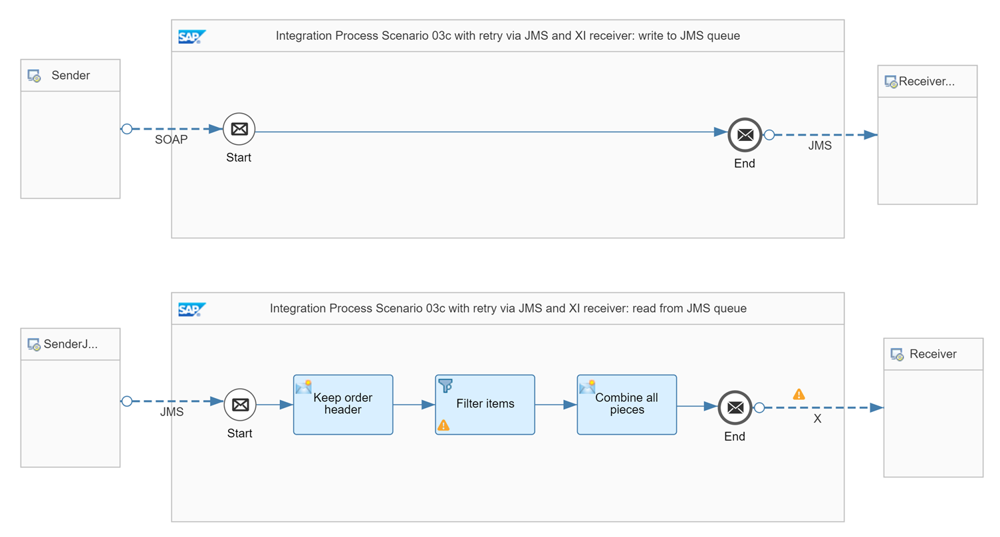

<!-- loiobd19abfb9b204d03a9350f97f5d63601 -->

# XI Receiver Handles Duplicates \(with decoupling via JMS Queue\)

The scenario described in this topic is similar to the scenario [Decoupling via JMS Queue](decoupling-via-jms-queue-ecbde19.md). A JMS queue is used to handle the retry of the message delivery if an error occurs. The receiver is idempotent, however here we describe how to ensure duplicate handling in case of an XI receiver instead of using SAP RM.

The following assumptions apply for the design of this scenario:

-   It implements the communication between exactly 1 sender and 1 receiver.
-   The sender doesn't retry messages. Therefore, the middleware \(Cloud Integration\) needs to carry out the retry of the message delivery if there's an error.

-   The XI receiver adapter is used to reliably exchange messages with the receiver using the XI 3.0 protocol.

In order to enable Cloud Integration to perform a retry, the message must be persisted. In this scenario, we use a JMS message queue.

A first integration flow stores the message in the specified storage.

A second integration flow reads the message from the storage to carry out the actual message processing steps. If there's an error during message processing within the second integration flow, the message stays in the JMS queue and is retried based on the configured retry. If there’s an error while delivering the message to the XI receiver, the message is actually retried from the persistency of the XI receiver adapter.

<a name="loiobd19abfb9b204d03a9350f97f5d63601__section_lnz_nrk_gyb"/>

## Involved Integration Flows

To simulate the communication of sender and receiver systems through Cloud Integration for the different scenarios, the integration package comes with multiple integration flows. To learn more about how these integration flows interact with each other during the processing of a scenario, see [Interaction of the Involved Integration Flows](interaction-of-the-involved-integration-flows-44be68d.md).

<a name="loiobd19abfb9b204d03a9350f97f5d63601__section_bqh_5nj_gyb"/>

## Example Scenario

As an example, we have modified scenario [XI Receiver Handles Duplicates](xi-receiver-handles-duplicates-fcf026b.md) by decoupling sender and receiver using a JMS queue. The *Pattern Quality Of Service - Scenario 03c* integration flow contains two integration processes.

The integration process *Integration Process Scenario 03c with retry via JMS and XI receiver: write to JMS queue* stores the message in a JMS queue after it is received from the sender system. The integration process contains one single JMS receiver channel with no further integration flow steps. Therefore, a JMS transaction handler isn't required. The JMS transaction is committed directly. After storing the message to the JMS queue, the sender receives the technical response. At sender side, the integration process uses a SOAP sender adapter. Because the retry is performed by the second integration process, there's no need that the sender system passes on a message id to the middleware. Instead of this, the scenario uses an ID that is unique to the message exchange.

The second integration process *Integration Process Scenario 03c with retry via JMS and XI receiver: read from JMS queue* reads the message from the same JMS queue, and carries out the flow steps. The system automatically initiates a JMS transaction when reading the message from the JMS queue. Therefore, there's no need to explicitly set the transaction behavior.

At the receiver side, the scenario uses an XI receiver adapter. On the *Delivery Assurance* tab of the XI receiver adapter, the following settings have to be configured:

<table>
<tr>
<th valign="top">

Parameter

</th>
<th valign="top">

Setting

</th>
</tr>
<tr>
<td valign="top">

*XI Message ID Determination*

</td>
<td valign="top">

Map

</td>
</tr>
<tr>
<td valign="top">

*Source for XI Message ID*

</td>
<td valign="top">

$\{header. SAP\_MessageProcessingLogID \}

</td>
</tr>
<tr>
<td valign="top">

*Quality Of Service* 

</td>
<td valign="top">

Exactly Once

</td>
</tr>
<tr>
<td valign="top">

*Temporary Storage*

</td>
<td valign="top">

JMS Queue

</td>
</tr>
</table>

This setting ensures that the receiver uses the value of header `SAP_MessageProcessingLogID` as XI Message ID which is constant throughout all potential retries from the JMS queue. See: [Configure the XI Receiver Adapter](configure-the-xi-receiver-adapter-5d2670f.md).

These integration flow settings ensure that Cloud Integration passes on a unique ID to the receiver system. If there's an error during message processing, Cloud Integration retries the message from the JMS queue. Because the retry is performed within the same instance of the message processing log, the message processing log ID and, as a result, the mapped unique ID remain the same.

To test the scenario, perform the following steps:

1.  Set up inbound *Basic* authentication for integration flow endpoints.

    See:

    [Basic Authentication with clientId and clientsecret for Integration Flow Processing](../40-RemoteSystems/basic-authentication-with-clientid-and-clientsecret-for-integration-flow-processing-647eeb3.md)

    [Setting Up Inbound HTTP Connections (with Basic Authentication), Neo Environment](https://help.sap.com/viewer/368c481cd6954bdfa5d0435479fd4eaf/Cloud/en-US/391c45cfcd0f4435952ab085283b7f7d.html "") :arrow_upper_right: 

2.  Deploy a *User Credentials* artifact with the following parameters using the *Monitor* application \(*Security Material* tile under *Manage Security*\).

    <table>
    <tr>
    <th valign="top">

    Parameter
    
    </th>
    <th valign="top">

    Setting
    
    </th>
    </tr>
    <tr>
    <td valign="top">
    
    Name
    
    </td>
    <td valign="top">
    
    OWN
    
    </td>
    </tr>
    <tr>
    <td valign="top">
    
    User
    
    </td>
    <td valign="top">
    
    Enter the user as specified when setting up inbound basic authentication.
    
    </td>
    </tr>
    <tr>
    <td valign="top">
    
    Password
    
    </td>
    <td valign="top">
    
    Enter the password as specified when setting up inbound basic authentication.
    
    </td>
    </tr>
    </table>
    
    > ### Note:  
    > When you check out the integration flows *Pattern Quality Of Service – Mocked Sender* and *Pattern Quality Of Service - Scenario 03c*, you notice that the receiver adapters refer to a *User Credentials* artifact with the name *OWN*.

    Both integration flows operate on the same tenant and use the same user credentials for inbound requests.

3.  Deploy all 3 integration flows *Generic Receiver*, *Pattern Quality Of Service – Mocked Sender*, ad *Pattern Quality Of Service - Scenario 03c*.
4.  In the Postman client, open the *QualityOfService* folder in the *Enterprise Integration Patterns* collection, and run the *QualityOfService – Scenario 03c* request.

    We assume that the sender isn't able to resend messages. Therefore, the request doesn't contain a parameter `sendDuplicates`.

5.  Once the system has processed the second message successfully, check the data store *Pattern-QualityOfService* \(open the *Monitor* application and select the *Data Stores* tile under *Manage Stores*\).

    > ### Tip:  
    > You see only 1 entry with an entry *ID* that is identical to the mapped ID based on the message processing log.

6.  Before rerunning the test, clean up the data store.

7.  Optionally, you can switch on the trace to be able to verify the overall behavior.

