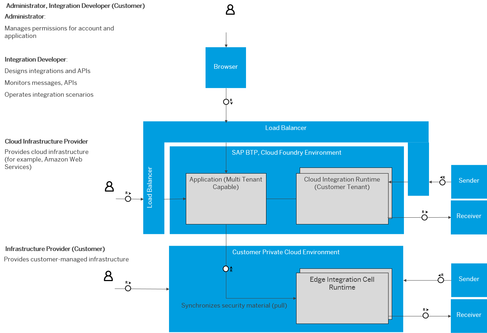

<!-- loiodaea676662b34211abcee7371ad34e21 -->

# Technical Landscape

The technical infrastructure comprises a set of technical components that can communicate with each other and with remote components in a secure way \(using certain protocols such as HTTPS or SFTP, for example\).

<a name="loiodaea676662b34211abcee7371ad34e21__section_yrn_nhc_5yb"/>

## Components and Communication Paths

In technical terms, the integration platform is designed as a containerized and clustered integration platform in the cloud. Messages processed by integration scenarios from different customers and requests addressed to API endpoints owned by different customers are handled on different parts of the platform \(referred to as tenants\).

Tenants processing integration scenarios from different customers are strictly separated from each other in terms of CPU, data storage, and user access.

SAP Integration Suite also supports a hybrid deployment in the following way:

You use SAP Integration Suite to design integration content. However, for the deployment and operation of the integration content at runtime, you have 2 options:

-   Deploying and operating the integration content on a Cloud Integration runtime component \(which is located on the customer tenant of SAP BTP\).

-   Deploying and operating the integration content in the private cloud environment of the customer \(which is referred to as Edge Integration Cell runtime, or Edge runtime for short\).

    > ### Note:  
    > For more security-related information on the technical landscape when Edge Integration Cell is used, see [Technical Landscape \(Edge Integration Cell\)](../technical-landscape-edge-integration-cell-f60efc1.md).
    > 
    > For more information about Edge Lifecycle Management security considerations, see [Security Considerations](https://help.sap.com/docs/EDGE_LIFECYCLE_MANAGEMENT/9d5719aae5aa4d479083253ba79c23f9/f69c8352d53d477394915f5ed610eba8.html).

The following figure shows a bird's eyes view on the technical architecture.

These are the basic constituents of the virtual platform:

-   A multi-tenant-capable application accomplishes tasks related to the management of a tenant and the preparation of monitoring data. It takes requests from the dialog users \(for example, when an integration developer deploys an integration flow using the browser-based user interface\).

-   As one deployment option, you can deploy integration content on the Cloud Integration runtime, which is part of SAP BTP. Using this option, at runtime the Cloud Integration runtime processes messages that are exchanged with external systems \(senders and receivers\). Therefore, the Cloud Integration runtime is connected to the external systems. In other words, the Cloud Integration runtime processes customer data that might be confidential and has to be protected.

    Cloud Integration runtime components are operated within customer-specific tenants. These tenants are strictly separated from each other.

-   As an alternative deployment option, you can deploy integration content in the private cloud environment managed by the customer. Using this option, messages are processed on a runtime component in the customer landscape. This way of integration is also referred to as ground-to-ground integration. In technical terms, this runtime is realized as set of compute clusters managed by Kubernetes.

As consequence of this cluster design, the following main communication paths are active during the operation of an integration scenario:

-   Communication of customer tenants and remote components \(when the Cloud Integration runtime is used\)

    You can use both cloud systems and on-premise systems \(such as on-premise SAP systems\) as remote components \(senders and receivers\).

    Remote receiver systems are directly connected to a Cloud Integration runtime component \(runs on the customer tenant; not depicted in the figure\) through a protocol, which depends on the type of the designed receiver adapter.

    For inbound communication from a sender targeting Cloud Integration, a load balancer is interconnected between remote sender systems and the involved SAP BTP components. The load balancer terminates incoming Transport Layer Security \(TLS\) requests and establishes new ones.

    When a sender calls Edge Integration Cell using HTTPS-based \(inbound\) requests, there are different ways for the calling sender to authenticate itself against the integration platform:

    -   Basic authentication

    -   OAuth

    -   Client certificate authentication

    For more information about XSUAA, see [What Is the SAP Authorization and Trust Management Service?](https://help.sap.com/docs/BTP/65de2977205c403bbc107264b8eccf4b/649961f8d4ad463daca33b3a20deba4c.html).

-   Communication of Edge runtime \(Kubernetes cluster in customer’s private cloud environment\) and remote components \(when Edge Integration Celll use case is applied\)

Various secure technical protocols can be used for these communication paths. Depending on the adapter type, the following protocols are available.

-   Hyper Text Transfer Protocol \(HTTP\) over Transport Layer Security \(TLS\), which is referred to as HTTPS.

-   SSH File Transfer Protocol \(SFTP\) for the exchange of data with an SFTP server.

-   Simple Mail Transfer Protocol Secure \(SMTPS\), Secure Post Office Protocol \(POP3S\), and Secure Internet Message Access Protocol \(IMAPS\) for the secure exchange of data with mail servers.

-   Transmission Control Protocol \(TCP\) used to connect to a Kafka broker or AMQP message broker.

-   WebSocket used to connect to an AMQP message broker.

For more information, see the links in the following table:

<table>
<tr>
<th valign="top">

Information Source

</th>
<th valign="top">

Describes …

</th>
</tr>
<tr>
<td valign="top">

[Security Aspects of Data, Data Flow for Cloud Integration](security-aspects-of-data-data-flow-for-cloud-integration-7895724.md)

[Connectivity Options](../connectivity-options-93d82e8.md)

</td>
<td valign="top">

The supported transport protocols and connectivity options

</td>
</tr>
<tr>
<td valign="top">

[Using Data Storage Features When Designing Integration Flows](../50-Development/using-data-storage-features-when-designing-integration-flows-a836b4e.md)

[Data Storages](../50-Development/data-storages-31efe35.md)

</td>
<td valign="top">

The data storages that are used during the operation of an integration scenario \(not depicted in the previous diagram\).

</td>
</tr>
</table>

<a name="loiodaea676662b34211abcee7371ad34e21__section_upt_g3c_5yb"/>

## User Access

Additional components come into play when a dialog user accesses the infrastructure \(for example, when an administrator accesses monitoring data or when an integration developer deploys an integration artifact\).

People with different roles can access the infrastructure – both on the side of the infrastructure provider and on the customer side. The following table describes human access points \(for dialog users\). See also previous diagram.

<table>
<tr>
<th valign="top">

Persona/Dialog User

</th>
<th valign="top">

Tasks

</th>
</tr>
<tr>
<td valign="top">

Cloud infrastructure provider

</td>
<td valign="top">

Dedicated experts at the side of the cloud infrastructure provider need access to the infrastructure.

</td>
</tr>
<tr>
<td valign="top">

Private Cloud infrastructure provider \(customer\)

</td>
<td valign="top">

When the Edge Integration Cell use case is applied, experts on the customer side need to set, maintain, and operate the Edge runtime \(Kubernetes cluster\).

</td>
</tr>
<tr>
<td valign="top">

Administrator, integration developer \(customer\)

</td>
<td valign="top">

Experts on the customer side access the infrastructure to design and deploy integration content and to monitor an integration scenario at runtime \(integration developers and tenant administrators\).

</td>
</tr>
</table>

For more information, see:

-   [Personas for Cloud Integration](personas-for-cloud-integration-2937e5c.md)

-   [Tasks and Permissions for Cloud Integration](tasks-and-permissions-for-cloud-integration-556d557.md)

