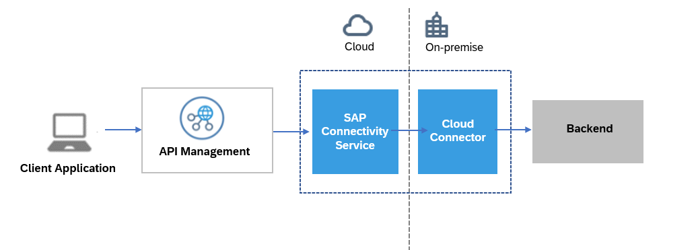

<!-- loio2fc7a5b57541459abedfc26eb63f7590 -->

# Accessing On-Premise Systems through API Management

The *on-premise-connectivity* plan helps in achieving principal propagation while connecting to an on-premise backend system.


<a name="loio2fc7a5b57541459abedfc26eb63f7590__section_j1f_y4j_flb"/>

## About the Plan

Let us consider an use case where you want to pass the identity and security context of the logged-in user in the client application \(known as the principal\) from client application to on-premise backend. It ensures that the downstream services have the necessary information to authenticate the client without requiring the client to re-authenticate for each service. When a client makes a request to an API gateway, the gateway authenticates the user. It then propagates the principal information, such as the user's identity, to the backend services that the client's request needs to access. This allows the downstream services to make authorization decisions based on the user's details.

> ### Note:  
> The API Management platform incorporates the circuit breaker pattern to enhance the resilience of the back-end. For more information, see [Circuit Breaker for On-Premise Provider](https://help.sap.com/viewer/66d066d903c2473f81ec33acfe2ccdb4/Cloud/en-US/bd3c2d5be9ec4051ac6c0295173b4c22.html "In the context of an API or service proxy, a circuit breaker is a design pattern used to improve the resilience and fault tolerance of the system. It is typically used to prevent cascading failures when a service or API endpoint becomes unresponsive or starts to exhibit high latency.") :arrow_upper_right:.



To accomplish principal propagation, you require a service key. This plan allows you to obtain the token by creating a service instance and generating a service key.

This topic explains how to obtain a service key in order to enable principal propagation using *API Management* in the Cloud Foundry Environment.


<a name="loio2fc7a5b57541459abedfc26eb63f7590__section_v3z_hkj_flb"/>

## Prerequisites

-   You've enabled API Management capability using SAP Integration Suite. For more information, refer [Subscribing to Integration Suite](https://help.sap.com/docs/SAP_INTEGRATION_SUITE/51ab953548be4459bfe8539ecaeee98d/8a3c8b7a6b1c4f249bb81d11644ef806.html?version=CLOUD) and [Activating Capabilities](https://help.sap.com/docs/SAP_INTEGRATION_SUITE/51ab953548be4459bfe8539ecaeee98d/2ffb343c163c48a4b3a90f9f3c487328.html?version=CLOUD).

-   You have created an API Provider of type *On Premise* and chosen *Principal Propagation* as a mode of authentication to connect to an on-premise system. For more information, see [Create an API Provider](50-Development/create-an-api-provider-6b263e2.md).


-   You have the `space developer` role assigned to you.


<a name="loio2fc7a5b57541459abedfc26eb63f7590__section_cgq_spk_flb"/>

## Creating a Service Instance on API Management, API Portal

Create a service instance to generate a service key that is used to enable the principal propagation.

1.  In your web browser, open the *SAP BTP Cockpit* - [https://cockpit.btp.cloud.sap](https://cockpit.btp.cloud.sap).
2.  From your *Subaccount*, navigate to *Spaces* in your Cloud Foundry environment and choose *Services* \> *Service Marketplace.*
3.  Select the *API Management, API portal* tile, and in the details section, choose *Create*.

    > ### Note:  
    > If you are unable to view the *API Management, API Portal* tile, please check your entitlements. For more information, see [Managing Entitlements and Quotas Using the Cockpit](https://help.sap.com/viewer/65de2977205c403bbc107264b8eccf4b/Cloud/en-US/c8248745dde24afb91479361de336111.html).

4.  In the *New Instance or Subscription* dialog that opens, choose the *on-premise-connectivity* plan.
5.  Enter a name for your instance in the *Instance Name* field and choose *Next*.
6.  Review and verify the instance details and choose *Create*.


<a name="loio2fc7a5b57541459abedfc26eb63f7590__section_b1j_ytl_hlb"/>

## **Service Key Generation**

After you have created a service instance, proceed with:

1.  Choose the created service instance link from the visible list.
2.  In the left-hand pane, navigate to *Service Keys* \> *Create Service Key*.
3.  In the *Create Service* dialog, provide a *Name* and *Description* \(optional\).

4.  In the text box enter one of the following payloads as per your requirement:


    <table>
    <tr>
    <th valign="top">

    To create service key of credential type…
    
    </th>
    <th valign="top">

    Use payload…
    
    </th>
    <th valign="top">

    Level of Security
    
    </th>
    <th valign="top">

    Important Notes
    
    </th>
    <th valign="top">

    Sample of generated credentials
    
    </th>
    </tr>
    <tr>
    <td valign="top">
    
    `“instance-secret”`\(without payload\)
    
    </td>
    <td valign="top">
    

    
    </td>
    <td valign="top">
    
    Low
    
    </td>
    <td valign="top">
    
    For instance-secret, the clientSecret generated is same for all the keys.
    
    </td>
    <td valign="top">
    
    ```
    {
    	"url": "https://token-enpoint-url",
    	"clientId": "your-client-id",	
    	"clientSecret": "xxxxxxxxxxxxxxxxxxxxxxx=",
        "orgId": "xxxxxxx-xxxx-xxxx-xxxx-xxxxxxxxx",
        "tokenUrl": "https://token-enpoint-url/oauth/token"
    
    }
    ```


    
    </td>
    </tr>
    <tr>
    <td valign="top">
    
    `“instance-secret”`\(with payload\)
    
    </td>
    <td valign="top">
    
    ```
    {
       "xsuaa":{
          "credential-type":"instance-secret"
       }
    }
    
    ```


    
    </td>
    <td valign="top">
    
    Low
    
    </td>
    <td valign="top">
    
    For instance-secret, the clientSecret generated is same for all the keys.
    
    </td>
    <td valign="top">
    
    ```
    {
    	"url": "https://token-enpoint-url",
    	"clientId": "your-client-id",	
    	"clientSecret": "xxxxxxxxxxxxxxxxxxx=",
        "orgId": "xxxxxxx-xxxx-xxxx-xxxx-xxxxxxxxx",
        "tokenUrl": "https://token-enpoint-url/oauth/token"
    }
    ```


    
    </td>
    </tr>
    <tr>
    <td valign="top">
    
    `"binding-secret"` 
    
    </td>
    <td valign="top">
    
    ```
    {
       "xsuaa":{
          "credential-type":"binding-secret"
       }
    }
    
    ```


    
    </td>
    <td valign="top">
    
    Medium
    
    </td>
    <td valign="top">
    
    For binding-secret, the clientSecret generated for every key is unique.
    
    </td>
    <td valign="top">
    
    ```
    {
    	"url": "https://token-enpoint-url",
    	"clientId": "your-client-id",	
    	"clientSecret": "xxxxxxxxxxxxxxxxxxxxxxxxxxxxxxxxxxxxxxxxxxxxxxx=",
        "orgId": "xxxxxxx-xxxx-xxxx-xxxx-xxxxxxxxx",
        "tokenUrl": "https://token-enpoint-url/oauth/token"
    }
    ```


    
    </td>
    </tr>
    <tr>
    <td valign="top">
    
    `"x509"`

    \(certificate based\)
    
    </td>
    <td valign="top">
    
    ```
    {
       "xsuaa":{
          "credential-type":"x509",
          "x509":{
             "key-length":2048,
             "validity":65,
             "validity-type":"DAYS"
          }
       }
    }
    
    ```


    
    </td>
    <td valign="top">
    
    High
    
    </td>
    <td valign="top">
    
    For X509, ensure that the credential rotation is done based on the validity provided in the payload. For example, delete and create a new service key every 65 days.
    
    </td>
    <td valign="top">
    
    For admin role:

    ```
    {
        "url": "https://xxxxxx.authentication.sap.hana.ondemand.com",
        "certificate": "xxxxxxxxxxxxxxxxxxx",
        "certurl": "https://xxxxxx.authentication.cert.sap.hana.ondemand.com",
        "clientId": "xxxxxxxxxxxxxxxxxxxxxxxxxxxxxxxxxxxx",
        "privateKey": "xxxxxxxxxxxxxxxxxxxxxx",
        "orgId": "xxxxxxx-xxxx-xxxx-xxxx-xxxxxxxxx"
        "tokenUrl": "https://token-enpoint-url/oauth/token"
    }
    ```


    
    </td>
    </tr>
    </table>
    
5.  Choose *Save*. The client credentials like *url*, *clientId*, *clientSecret*, and *tokenUrl* details appear for the given instance name.

    The *tokenUrl* is used to fetch the bearer token.

    Example:

    ```
    
    {
    	"url": "https://<apiportal application name>.cfapps.sap.hana.ondemand.com",
    	"tokenUrl": "https://<Space name>.authentication.sap.hana.ondemand.com/oauth/token",
    	"clientId": "sb-opproxy-xsuaa-clonexxxxxxxxx!xxxxxx|opproxy-xsuaa!xxxxxx",
    	"clientSecret": "xxxxxxxxxxxxxxxxxxxxxxx="
    }
    ```

    Copy the client credentials in a notepad.

    You can now navigate back to`Principal Propagation from Neo to the Cloud Foundry environment` or `Principal Propagation from the same Cloud Foundry subaccount` as you have the required client credentials.


You can use the credentials to establish:

-   [Principal Propagation from the Neo to the Cloud Foundry Environment](50-Development/principal-propagation-from-the-neo-to-the-cloud-foundry-environment-da0e97b.md): Enable an application in your subaccount in the Neo environment to access an API Management proxy created on a Cloud Foundry based *API Management, API portal* without a user login. For this scenario to work, the Neo subaccount needs to be trusted by the Cloud Foundry subaccount where *API Management, API portal* is enabled. Now, the application on Neo can call API Management proxy using OAuth2SAMLBearer destination.

-   [Principal Propagation from the Same Cloud Foundry Subaccount](50-Development/principal-propagation-from-the-same-cloud-foundry-subaccount-0e3d3e7.md): Enable an application in your subaccount in the Cloud Foundry environment to access an API Management proxy created on the same Cloud Foundry based API Management, API portal without a user login. The JWT user token in your application can be exchanged with the API Management token using the service key credentials created for *API Management, API portal*.

