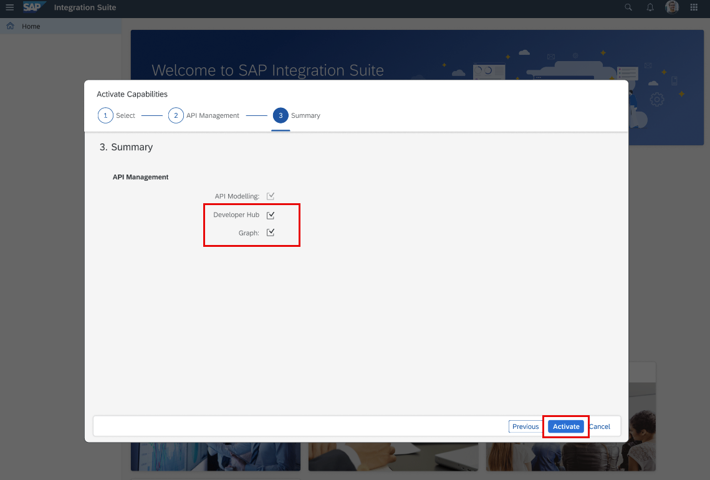

<!-- loiof6eb4332cd5144ef91f4a84cc614ba1c -->

<link rel="stylesheet" type="text/css" href="css/sap-icons.css"/>

# Activate and Configure the API Management Capability and Access Developer Hub

Steps to activate and configure the API Management capability in SAP Integration Suite and access Developer Hub from SAP Integration Suite home page.

<table>
<tr>
<th valign="top">

Steps

</th>
<th valign="top">

Details

</th>
</tr>
<tr>
<td valign="top">

Subscribe to SAP Integration Suite 

</td>
<td valign="top">

To set up the API Management capability from SAP Integration Suite, you should first have an Integration Suite subscription.

Subscribe to SAP Integration Suite in SAP BTP cockpit and assign yourself the *Integration\_Provisioner* role to gain access. For more information, see [Getting Started with SAP Integration Suite](10-InitialSetup/getting-started-with-sap-integration-suite-3dcf507.md).

> ### Note:  
> Please make sure that you do not have a starter plan instance created in the same subaccount where you intend to create an Integration Suite subscription. Additionally, please note that API Management capabilities from SAP Integration Suite and API Management subscriptions using the stand-alone tile cannot coexist in the same subaccount.

</td>
</tr>
<tr>
<td valign="top">

Activate the API Management capability

</td>
<td valign="top">

1.  On the Integration Suite home page, go to *Capabilities* and select *Add Capabilities*.
2.  To design, develop, publish, and oversee APIs in a secure and scalable environment, choose *Manage APIs* and choose *Next*.

    On the next screen, the *API Modelling* checkbox appears, and is enabled by default.

3.  To discover, consume and monitor APIs from a centralized API catalogue, select the *Developer Hub* checkbox.
4.  For exposing data as a connected graph, select *Graph* checkbox.
5.  Once all desired capabilities are selected, choose *Review*.
6.  Review the details and choose *Activate*.

For more information, see:

-   [Activating and Managing Capabilities](https://help.sap.com/docs/integration-suite/sap-integration-suite/activating-and-managing-capabilities?version=CLOUD)
-   [Graph](https://help.sap.com/docs/integration-suite/sap-integration-suite/graph-e03300f9f4134fbea2bbd16707e3dd8a?version=CLOUD)

</td>
</tr>
<tr>
<td valign="top">

Configure the API Management capability for Classic API Management

</td>
<td valign="top">

Access the *API Settings* page, and complete the onboarding process. For more information, see [Setting Up API Management](50-Development/setting-up-api-management-f34e86c.md).

To access the *API Settings*, you need to have the *APIManagement.Selfservice.Administrator* role.

> ### Note:  
> If you are using a trial account, SAP Integration Suite will be automatically activated and configured once you select the *APIs* option in the *Settings* menu. During the provisioning process, the system will assign a default virtual host for you. You will receive a notification when the provisioning is complete. At this point, the *APIs* option will no longer be visible in the side-navigation menu under *Settings*. You will be logged out of SAP Integration Suite automatically. To continue, simply log in again. After logging in, you will have the ability to create APIs, build API proxies as a service provider, and utilize other convenient services offered by the platform.

</td>
</tr>
<tr>
<td valign="top">

Access Developer Hub

</td>
<td valign="top">

From the Integration suite home page, choose the  product switcher icon and select *Developer Hub*. For this option to appear in the product switcher within Integration Suite, *APIPortal.Administrator* role collection must be assigned to you.

> ### Note:  
> To access Developer Hub, the *AuthGroup.SelfService.Admin* role must me assigned to you. This is an one time activity.
> 
> Please be aware that the *Authgroup.API.Admin* role is required for onboarding into Developer Hub. This role will be automatically assigned to your scope once you have been assigned the *AuthGroup.SelfService.Admin* role. After the onboarding process is completed, it is necessary for an admin to assign the *AuthGroup.Content.Admin* role to a user in order to access and discover the APIs from different business systems in Developer Hub.

</td>
</tr>
</table>

> ### Note:  
> For visual intructions on how to activate and configure API Management capability from SAP Integration Suite, refer the tutorial [Set Up API Management from Integration Suite | Tutorials for SAP Developers](https://developers.sap.com/tutorials/api-mgmt-isuite-initial-setup.html).

