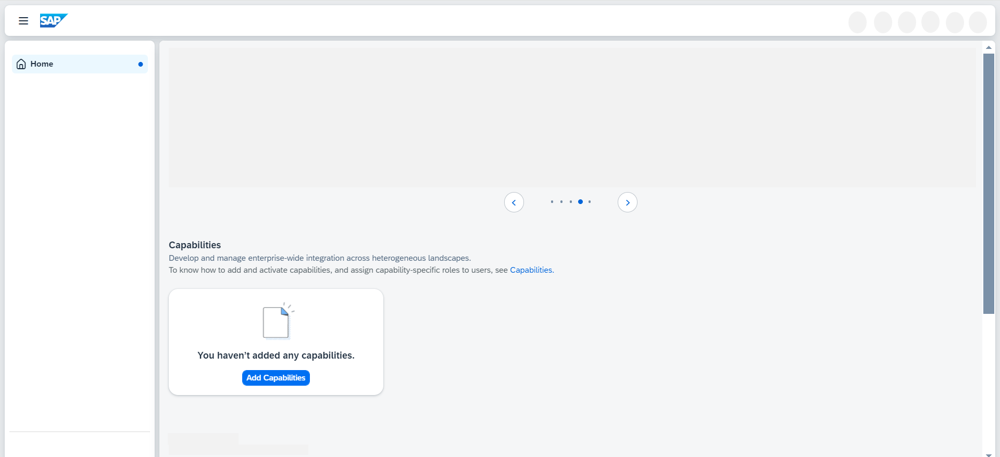
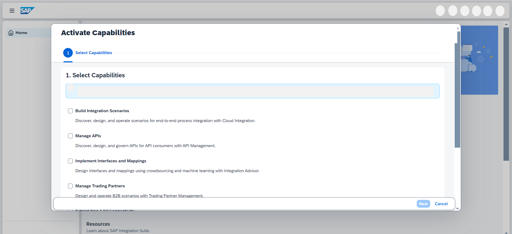
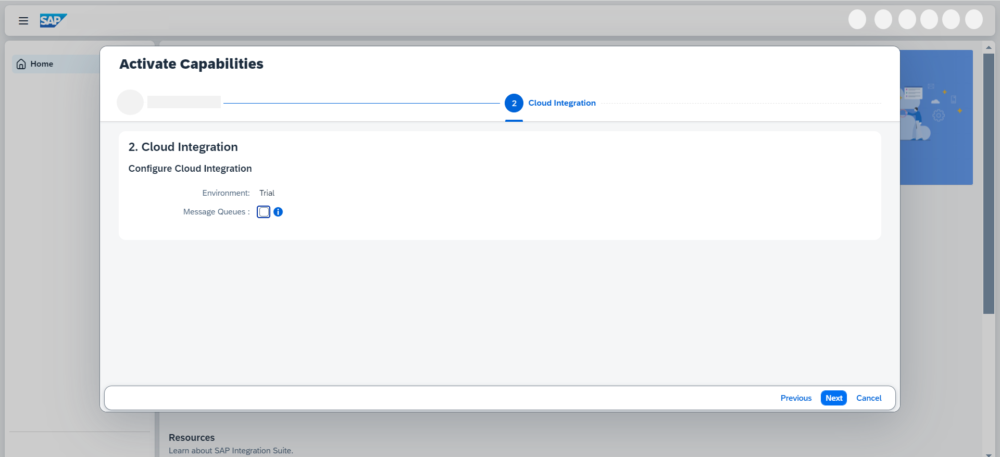
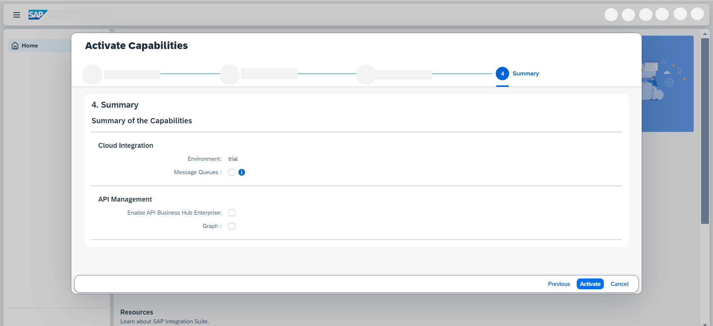

<!-- loio2ffb343c163c48a4b3a90f9f3c487328 -->

<link rel="stylesheet" type="text/css" href="css/sap-icons.css"/>

# Activating and Managing Capabilities

Activate capabilities for SAP Integration Suite.

<a name="loio2ffb343c163c48a4b3a90f9f3c487328__prereq_ydy_lxj_dmb"/>

## Prerequisites

-   You have access to the SAP Integration Suite home page. See [Working with SAP Integration Suite Home](20-Working_with_SAP_Integration_Suite_Home/working-with-sap-integration-suite-home-a53dce3.md).
-   You have the Integration\_Provisioner role collection assigned to your user. See [Subscribing and Configuring Initial Access to SAP Integration Suite](10-InitialSetup/subscribing-and-configuring-initial-access-to-sap-integration-suite-8a3c8b7.md).

<a name="loio2ffb343c163c48a4b3a90f9f3c487328__context_mpf_myf_dmb"/>

## Context

This topic describes how to add and activate relevant capabilities in SAP Integration Suite. The following capabilities are available:

-   Cloud Integration

-   API Management

    -   Graph

-   Event Mesh

-   Open Connectors

-   Integration Advisor

-   Trading Partner Management

-   OData Provisioning

-   Data Space Integration

-   Integration Assessment

-   Migration Assessment

You can watch a short video about activating capabilities, and getting access to functionality here:

## Procedure

1.  On the SAP Integration Suite home page, under the *Capabilities* section, choose either *Add Capabilities* \(if it's your first time accessing the SAP Integration Suite home page\) or  *Manage Capabilities* .

2.  On the *Activate Capabilities* screen, under *Select Capabilities*, select the relevant capabilities as shown in the following table and choose *Next* to configure additional functionality for individual capabilities. 

    <table>
    <tr>
    <th valign="top">

    To Activate...
    
    </th>
    <th valign="top">

    Select...
    
    </th>
    </tr>
    <tr>
    <td valign="top">
    
    Cloud Integration
    
    </td>
    <td valign="top">
    
    *Build Integration Scenarios*

    > ### Note:  
    > -   Select the environment based on your operational needs:
    > 
    >     -   *Non-Production* for non-critical business activities like performance testing, testing new integration scenarios.
    >     -   *Production* for critical business activities.
    > 
    >     > ### Recommendation:  
    >     > If you want to activate both API Management and Cloud Integration capabilities within the same tenant, select the same environment for both capabilities. Once you have activated API Management capability, you can align the environment by setting the *Account Type* field \(Production or Non-Production\) on the *Settings* \> *Runtimes* \> *API Management* section. See [Enable API Management Capability](https://help.sap.com/docs/integration-suite/sap-integration-suite/enabling-api-management-capability-from-integration-suite).
    > 
    > -   To support the usage of Java Message Service \(JMS\) queues as temporary storage, select Message Queues. Using JMS message queues allow you to configure asynchronous decoupling of sender and receiver message processing to ensure that in case of an error a retry is done from SAP Integration Suite rather than the sender system. You can use the tenant to manage these queues. See [Managing Message Queues](https://help.sap.com/viewer/368c481cd6954bdfa5d0435479fd4eaf/Cloud/en-US/cdcce24f484a41c08ab46d12ab666451.html).

    
    
    </td>
    </tr>
    <tr>
    <td valign="top">
    
    API Management
    
    </td>
    <td valign="top">
    
    *Manage APIs*

    If you want to consume APIs and events published on Developer Hub—a web-based platform that allows organizations to publish their APIs and events for developers to discover, explore, and use—you need to select the *Developer Hub* checkbox.

    To expose your business data as a semantically connected data graph, select the *Graph* checkbox.

    > ### Note:  
    > The Developer Hub checkbox must be selected in order to activate Graph.

    For end-to end instructions on how to activate the API Management capability, see [Enable API Management Capability](https://help.sap.com/docs/integration-suite/sap-integration-suite/enabling-api-management-capability-from-integration-suite). You can also refer to the [Set Up API Management from Integration Suite](https://developers.sap.com/tutorials/api-mgmt-isuite-initial-setup.html) tutorial for visual instructions.
    
    </td>
    </tr>
    <tr>
    <td valign="top">
    
    Event Mesh 
    
    </td>
    <td valign="top">
    
    *Manage Business Events*

    > ### Remember:  
    > If you're an exisitng customer of the standalone SAP Event Mesh service \(default plan\), you can't subscribe to the Event Mesh capability in the same subaccount. In such cases, you must subscribe to SAP Integration Suite in a different subaccount.

    
    </td>
    </tr>
    <tr>
    <td valign="top">
    
    OData Provisioning

    > ### Remember:  
    > To register OData services from the SAP Business Suite you need to install a Cloud Connector and perform the necessary configurations for connecting to the on-premise back-end system. For more information, see [Cloud Connector](https://help.sap.com/docs/connectivity/sap-btp-connectivity-cf/cloud-connector?version=Cloud).

    
    </td>
    <td valign="top">
    
    *Access data in SAP Business Suite*

    For end-to-end instructions on activating the OData Provisioning capability, see [Runtime Access and Role Assignment for OData Provisioning](runtime-access-and-role-assignment-for-odata-provisioning-b46816c.md)
    
    </td>
    </tr>
    <tr>
    <td valign="top">
    
    Open Connectors
    
    </td>
    <td valign="top">
    
    *Extend Non-SAP Connectivity* 
    
    </td>
    </tr>
    <tr>
    <td valign="top">
    
    Integration Advisor
    
    </td>
    <td valign="top">
    
    *Implement Interfaces and Mapping* 
    
    </td>
    </tr>
    <tr>
    <td valign="top">
    
    Trading Partner Management

    > ### Note:  
    > Cloud Integration \(with Message Queues\) and Integration Advisor capabilities are prerequisites for activating Trading Partner Management.

    
    </td>
    <td valign="top">
    
    *Manage Trading Partners* 
    
    </td>
    </tr>
    <tr>
    <td valign="top">
    
    Data Space Integration 
    
    </td>
    <td valign="top">
    
    *Exchange Data Within Data Spaces* 
    
    </td>
    </tr>
    <tr>
    <td valign="top">
    
    Integration Assessment
    
    </td>
    <td valign="top">
    
    *Manage and Provide Integration Technology Guidance* 
    
    </td>
    </tr>
    <tr>
    <td valign="top">
    
    Migration Assessment 
    
    </td>
    <td valign="top">
    
    *Assess Migration Scenarios* 
    
    </td>
    </tr>
    </table>
    
3.  Choose *Activate*. 

    > ### Note:  
    > -   The availability of capabilities for activation is dependent on your SAP Integration Suite service plan. For more information about different service plans and their supported feature set, see SAP Note [2903776](https://me.sap.com/notes/2903776).
    > 
    > -   If you face any issues during activation or the activation fails, then refer SAP Note [2904202](https://me.sap.com/notes/2904202) and proceed accordingly.
    > 
    > -   You can choose *Manage Capabilities* to activate additional capabilities at a later point in time.
    > 
    > -   After activation, assign the required role collections to users for accessing the individual capabilities. See [Configuring User Access](configuring-user-access-to-sap-integration-suite-2c6214a.md).

<a name="loio2ffb343c163c48a4b3a90f9f3c487328__result_pph_4z5_plb"/>

## Results

-   Capabilities are displayed on the home page as tiles. To access the functionalities offered by these capabilities, users must have the required role collections assigned. See [Configuring User Access to SAP Integration Suite](configuring-user-access-to-sap-integration-suite-2c6214a.md).
-   After activating Cloud Integration, create a service broker instance. See [Creating Service Instance and Service Key for Inbound Authentication](40-RemoteSystems/creating-service-instance-and-service-key-for-inbound-authentication-19af5e2.md).

-   The API Management capability needs a few more configuration steps before activation. See [Additional Configurations for API Management](additional-configurations-for-api-management-5ac63ab.md).
-   The Event Mesh capability needs an additional configuration step before usage. See: [Initiating the Message Broker](initiating-the-message-broker-61eb5dd.md).

-   After activating Data Space Integration, continue with the additional preparatory steps. See [Preparatory Steps](preparatory-steps-95366b2.md).

**Related Information**  

[Centralized Developer Hub](centralized-developer-hub-38422de.md "Developer Hub is a central API catalog, allowing application developers to consume APIs and other assets, from a common platform.")

