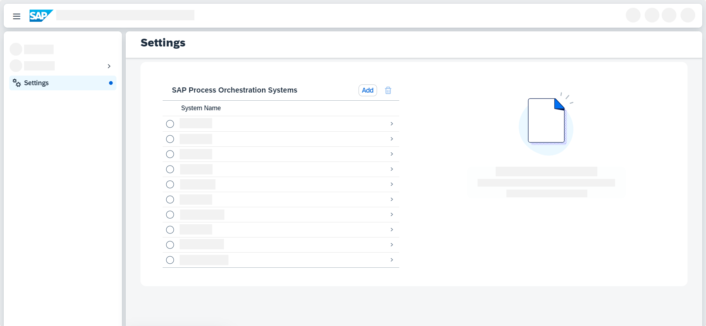

<!-- loio5f7672334ca74f90843d38375220d757 -->

<link rel="stylesheet" type="text/css" href="css/sap-icons.css"/>

# Add an SAP Process Orchestration System

Establish a connection between your SAP Process Orchestration system and Migration Assessment so you can work with the data from your system in later steps.

<a name="loio5f7672334ca74f90843d38375220d757__prereq_k5f_dgj_55b"/>

## Prerequisites

-   You've enabled the Migration Assessment capability in the SAP BTP cockpit as described in [Activating and Managing Capabilities](activating-and-managing-capabilities-2ffb343.md).

    > ### Note:  
    > Do you prefer hands-on instructions? Check out the tutorial [Enable Migration Assessment Application](https://developers.sap.com/tutorials/migration-assessment-enablement.html).

-   You've set up the relevant access rights for yourself and your users as described in [Configuring User Access to SAP Integration Suite](configuring-user-access-to-sap-integration-suite-2c6214a.md).

-   To include performance details such as message size and processing time in your data extraction, ensure that performance data collection is enabled as described in [Monitoring Performance](https://help.sap.com/docs/SAP_NETWEAVER_750/5cf7d2de571a45cc81f91261668b7361/48b2dfe86b156ff4e10000000a42189b.html).

-   As API endpoints and subpaths are used to extract data from your SAP Process Orchestration system, make sure that the SAP Destination service can access the endpoints listed in the following. See [Destination Service](https://help.sap.com/docs/BTP/65de2977205c403bbc107264b8eccf4b/eeb0ec2318fb4dda87830a09ac7a02fa.html).

    -   Directory Content

        -   `/CommunicationChannelInService`
        -   `/IntegratedConfigurationInService`
        -   `/SenderAgreementInService`
        -   `/AlertRuleInService`
        -   `/IntegratedConfiguration750InService`
        -   `/ValueMappingInService`
        -   `/ConfigurationScenarioInService`
        -   `/BPMFacadeBeanImplService`
        -   `/ReceiverAgreementInService`
        -   `/ReceiverRuleInService`
        -   `/ReceiverDeterminationInService`
        -   `/InterfaceDeterminationInService`

    -   ESR Content

        -   `/dir/read/ext`
        -   `/dir/query/ext`
        -   `/rep/support/SimpleQuery`
        -   `/rep/read/ext`
        -   `/rep/query/ext`
        -   `/rep/query/int`

    -   Message Monitoring
        -   `/mdt`

    The endpoints are constructed according to the pattern `<protocol>://<hostname>:<port><endpoint>`, for example, `https://po75-systema.sap:443/CommunicationChannelInService`.

    You can use Cloud Connector to securely expose these endpoints:

    -   Ensure that your Cloud Connector is connected to your subaccount. See [Establish Connections to SAP BTP](https://help.sap.com/docs/CP_CONNECTIVITY/cca91383641e40ffbe03bdc78f00f681/db9170a7d97610148537d5a84bf79ba2.html?locale=en-US&version=Cloud#establish-connections-to-sap-btp).
    -   Create a new HTTP destination \(cloud to on-premise\) with back-end type *SAP Process Integration*. See [Configure Access Control \(HTTP\)](https://help.sap.com/docs/CP_CONNECTIVITY/cca91383641e40ffbe03bdc78f00f681/e7d4927dbb571014af7ef6ebd6cc3511.html?locale=en-US&version=Cloud).

        > ### Note:  
        > To avoid potential issues during the connection process, don't use the character `_` \(underscore\) in the address name.

    -   Limit access to the previously mentioned endpoints and subpaths by changing *Access Policy* to *Path And All Sub-Paths*.

## Context

To connect your SAP Process Orchestration system with the Migration Assessment application, perform the following steps.

## Procedure

1.  In the Migration Assessment application, navigate to  Settings.

2.  In the table labeled *SAP Process Orchestration Systems*, choose *Add*.

    

3.  Enter a *System Name*.

4.  Select a *System Version*. You can either manually select a version from the dropdown list or choose *Auto-Detect* to automatically recognize the system's version.

5.  Enter the following details for *Integration Directory*:

    1.  As *Address*, enter your system URL.

    2.  Enter the *User ID* of your technical user in your SAP Process Orchestration system.

        > ### Note:  
        > The user must be assigned to the following roles in your SAP Process Orchestration system:
        > 
        > -   `SAP_XI_API_DISPLAY_J2EE`
        > -   `SAP_XI_API_DEVELOP_J2EE`
        > -   `SAP_XI_MONITOR_J2EE`

    3.  Enter the user's *Password*.

6.  Next, enter details for *ES Repository*.

    -   If you're not using a central Enterprise Services \(ES\) Repository, check the box for *Same as Integration Directory*. The same details are then used for both sections.

    -   If you're using the central ES Repository, enter the following details:

        1.  As *Address*, enter your system URL.

        2.  Enter the *User ID* of your technical user in your SAP Process Orchestration system.

            > ### Note:  
            > The user must be assigned to the following roles in your SAP Process Orchestration system:
            > 
            > -   `SAP_XI_API_DISPLAY_J2EE`
            > -   `SAP_XI_API_DEVELOP_J2EE`
            > -   `SAP_XI_MONITOR_J2EE`

        3.  Enter the user's *Password*.

7.  Choose *Create*. The new system is now listed under *SAP Process Orchestration Systems*.

8.  To check if the connection is working properly, select your system and choose *Test Connection*.

    This test verifies that the main resources needed for the SAP Process Orchestration extraction are reachable.

    > ### Remember:  
    > Perform this test even if previous Cloud Connector and destination connection tests were successful, as those don't check for resource accessibility.

    If you get an error during this step, please check the [Troubleshooting for Migration Assessment](troubleshooting-for-migration-assessment-63430e2.md).

<a name="loio5f7672334ca74f90843d38375220d757__postreq_ykf_tzy_5wb"/>

## Next Steps

Having added your source system, you can now continue by extracting data from it and evaluating your scenarios. See [Create a Data Extraction Request](create-a-data-extraction-request-ce0ad0e.md) and [Create a Scenario Evaluation Request](create-a-scenario-evaluation-request-435ec61.md).

