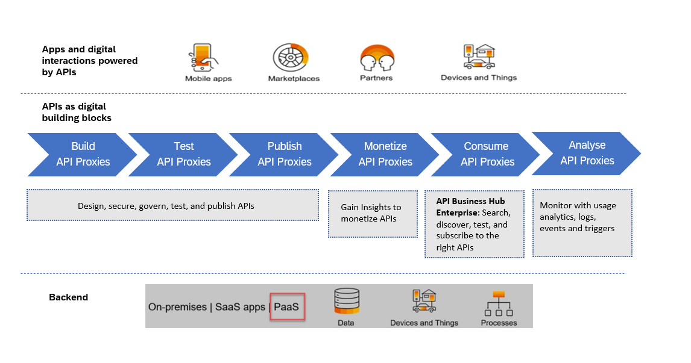

<!-- loio5e8ea7d81ea1429686fa68d59575eb8b -->

# API Lifecycle

The API lifecycle in API Management encompasses a series of well-defined stages that enable organizations to securely expose, manage, consume, and analyze APIs. SAP provides a comprehensive platform for managing APIs throughout their lifecycle—from design and deployment to monetization and analysis.

API Management in SAP Integration Suite is used to discover, shape, compose, integrate, manage, and secure APIs in the entire landscape. APIs are ultimately published in the form of a catalog \(developer portal\), and exposed for consumption by developers, who develop multi-experience applications. Below are the key stages of the API lifecycle in SAP API Management:

1.  **Build API Proxies**

    As the API admin, your first step is to create API proxies that securely expose backend services to external or internal consumers. You define how APIs are presented, configure routing to the backend, and apply essential policies for:

    -   Security \(OAuth, API Key, JWT validation\)
    -   Traffic control \(quotas, rate limiting\)

    This layer decouples the backend systems from the consumers and gives you the control needed for governance and standardization. See, [Build API Proxies](50-Development/build-api-proxies-74c042b.md).

2.  **Test API Proxies**

    Before APIs go live, it's your responsibility to test the API proxies to validate their behavior and enforce the applied policies. Using the built-in testing tools, you:

    -   Simulate API calls and examine responses
    -   Verify authentication mechanisms
    -   Ensure policy execution behaves as expected

    This phase is crucial to prevent downstream issues and ensure APIs meet SLA and security standards. See, [Test API Proxies](https://help.sap.com/viewer/66d066d903c2473f81ec33acfe2ccdb4/Cloud/en-US/3ba6151391bc474b9f1fa69455f65e3b.html "Use the API Test Console to test the runtime behavior of the API proxies.") :arrow_upper_right:.

3.  **Publish API Proxies**

    Once tested, you publish the API proxies to the Developer Hub. As the admin, you decide:

    -   Which APIs are exposed
    -   Which developer roles or groups can access them

    This is also where you group APIs into API Products and define access tiers, laying the foundation for usage control and monetization. See, [Publish API Proxies](50-Development/publish-api-proxies-75a4a11.md).

4.  **Monetize APIs**

    If your organization supports API monetization, you configure usage plans, rate limits, and pricing models. As an API admin, your tasks include:

    -   Create a rate plan
    -   Link the rate plan to specific API products to control and monetize access
    -   Monitor consumption and billing data per developer/application for transparency and reporting

    See, [Monetize APIs](50-Development/monetize-apis-fcdc89b.md).

5.  **Consume APIs**

    You support and manage the environment where developers and partners consume APIs. Your responsibilities here include:

    -   Managing developer onboarding via the Developer Hub
    -   Approving application registrations and access requests
    -   Ensure that consumers have a smooth experience while maintaining security and governance over who can access what

    See, [Consume APIs](50-Development/consume-apis-ea561e4.md).

6.  **Analyze API Proxies**

    Finally, you monitor API usage using analytics and reporting tools. This is key to maintaining quality and ensuring business alignment. You track:

    -   API performance \(latency, error rates\)
    -   Usage metrics \(top APIs, consumers, regions\)
    -   Identify anomalies

    See, [Analyze API Proxies](50-Development/analyze-api-proxies-7712c61.md).

