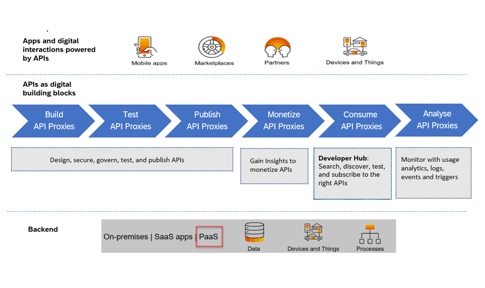

<!-- loio5e8ea7d81ea1429686fa68d59575eb8b -->

# API Lifecycle

The API lifecycle, starts from API planning, creation and implementation by company developers and other API creators and composers, to the consumption of these APIs by other employees, partners or users of the company’s products and services.

API Management in SAP Integration Suite is used to discover, shape, compose, integrate, manage, and secure APIs in the entire landscape. APIs are ultimately published in the form of a catalog \(developer portal\), and exposed for consumption by developers, who develop multi-experience applications

**Related Information**  

[Build API Proxies](50-Development/build-api-proxies-74c042b.md "SAP Integration Suite provides a common platform for API designers to define and publish APIs. Every SAP Integration Suite customer is provided with their own SAP Integration Suite application on cloud. The SAP Integration Suite offers capabilities to configure systems, build and publish APIs, analyze and test APIs.")

[Test API Proxies](https://help.sap.com/viewer/66d066d903c2473f81ec33acfe2ccdb4/Cloud/en-US/3ba6151391bc474b9f1fa69455f65e3b.html "Use the API Test Console to test the runtime behavior of the API proxies.") :arrow_upper_right:

[Publish API Proxies](50-Development/publish-api-proxies-75a4a11.md "To make your API consumable by external application developers, it is necessary to publish API proxies. Publishing allows you to expose the API proxies in a structured manner, presenting them as a product. To publish API proxies effectively, it is important to understand how to bundle them together and present them as a cohesive product.")

[Monetize APIs](50-Development/monetize-apis-fcdc89b.md "SAP Integration Suite provides monetization feature to all API providers to generate revenue for using the APIs.")

[Consume APIs](50-Development/consume-apis-ea561e4.md "You can consume APIs via Developer Hub. In Developer Hub, an application developer registers, explores the APIs exposed by customers, creates applications, and tests API proxies.")

[Analyze API Proxies](50-Development/analyze-api-proxies-7712c61.md "Use the capabilities of API Analytics to analyze API proxy usage and performance.")

