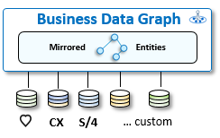
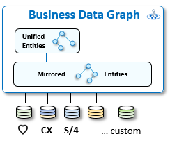
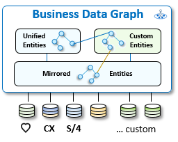
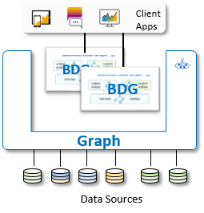

<!-- copy894e28c9eda1498ab8a9f153a3ff9b48 -->

# Business Data Graph

The business data graph is a connected graph of all your business data.

Business data is by nature richly connected. For example, a sales order has many items, and each item references a product. Still, traditional APIs \(based on SOAP, or plain REST\) access data as individual endpoints. Developers don't only use separate API calls to access different types of data, but they must also learn and remember how to reconstruct the connection between different types of data in their code. This leads to error-prone code and fragile, non-portable applications.

More recent modeling methodologies, such as SAP's Cloud Application Programming model \(CAP\), introduce semantic, graph-like, relationships between different data types. In the past few years, modern open-standard query protocols emerged that can take advantage of these graph-like data models. OData, based on REST principles, was one of the first such protocols, and GraphQL, developed by Facebook, is growing in popularity.

With Graph, developers use a single API, and the most up-to-date OData V4 and GraphQL protocols, to efficiently access all business data in a landscape of data sources.

Graph's data graph is constructed as a projection on these data sources. The nodes of the graph represent entities. Entities are composed of attributes – the data fields. Entity-connecting attributes, the edges of the graph, are referred to as associations. This graph is effectively an abstract data model, whose entities are defined as projections on entities from actual data sources \(back-end applications, systems, and microservices\) with one or more APIs. The data graph is constructed at design time in three steps:

1.  [Mirrored Entities](50-Development/mirrored-entities-720a1d8.md)

    

    Graph automatically creates projections from each of the entities of the discovered data sources in the landscape. We call these automatic data projections *mirrored entities*.

    Graph distinguishes known data source types \(for example, SAP S/4HANA, SAP SuccessFactors, and SAP C4C\) and unknown data sources. The mirrored entities of supported SAP data sources are added to the data graph under a reserved SAP namespace \(`sap.s4`, `sap.c4c`, and `sap.hcm`\) and then connected to each other by potentially hundreds of additional semantic associations. Entities from unsupported data sources are mirrored under custom namespaces.

2.  [Unified Entities](50-Development/unified-entities-1cded7b.md)

    

    Graph then adds additional projections on top of the mirrored entities from supported SAP systems, which we call *unified entities*. Unlike the mirrored entities, these are thoughtfully designed and constructed projections, created by SAP experts under the reserved namespace `sap.graph`. Unified entities follow the SAP One Domain Model compatibility guidelines and are designed to bridge and connect semantically common business concepts from multiple data sources \(for example, `Business Partner`, and `Product`\). This allows client apps to get started with cross-system queries.

3.  [Custom Entities](50-Development/custom-entities-b6318bf.md)

    

    Graph adds the final set of projections, *custom entities*. Custom entities are created by a skilled customer modeler to extend the data graph, through the design and addition of their own projections as a collection of attribute mappings from available SAP and non-SAP data source entities. The modeler can submit a set of custom entity definition files, developed with any text editor.

4.  To complete the process, customer administrators create a *Business Data Graph*: a runtime manifestation of the data graph based on a concrete configuration and version, accessible as a unified API by activating the data graph. The business data graph provides a connected 360° view of the data in the landscape.

    

Graph functions as a runtime mediation layer. From the perspective of the API consumer, the nodes of a business data graph look like data entities. Client applications use the business data graph API and graph protocols, such as OData V4 or GraphQL, to issue powerful cross-entity requests like "get a list of products sold to customer C in August, ordered by value" or "what is the address of the top supplier of product P?". Graph interprets and deconstructs complex access requests into simpler query components that typically refer to a single data item \(such as `product`, and `supplier`\). It consults the business data graph configuration to determine which data sources hold the pertinent data for these simpler queries, in order to execute the access request and return the response. Here, Graph must select the appropriate native API that is exposed by the data source, implement its technical API protocol, and work around the specific limitations and capabilities of the native API.

**Related Information**  

[Data Locating Policy](50-Development/data-locating-policy-28d2c2c.md "Data in the business data graph is connected via key-based references.")

[Model](50-Development/model-31f8c54.md "It is common knowledge that data-driven software should be modeled on its underlying business processes.")

