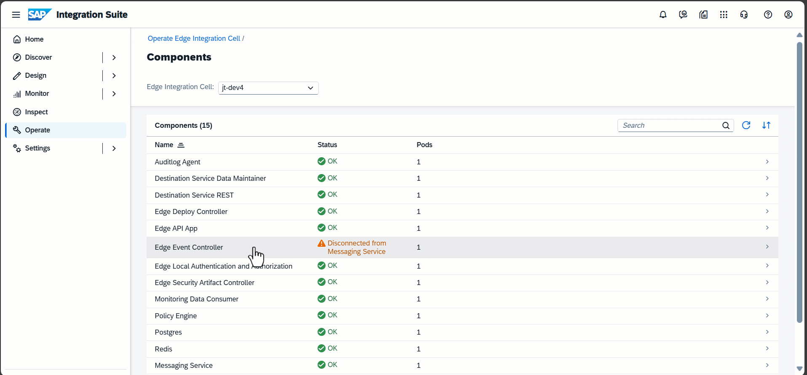
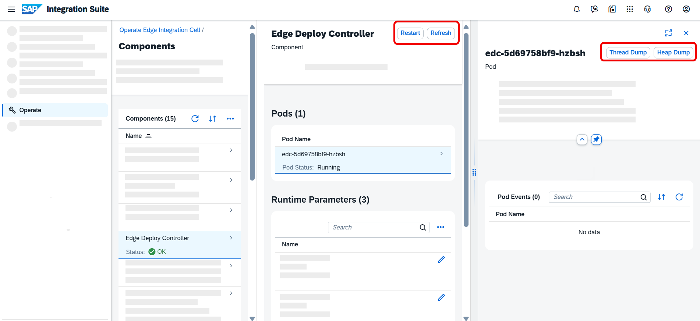

<!-- loio49f487ec05c54861a0f970e9bdc529e5 -->

<link rel="stylesheet" type="text/css" href="css/sap-icons.css"/>

# Component Monitor

Get information on your components.

The *Component Monitor* card in the **Operations Cockpit** shows you the most important information regarding your components at a glance. Out of all components for Edge Integration Cell, the card always shows either those components in status *Error* and *Warning*, or the status of the top three components, *Policy Engine*, *Worker*, and *Message Service* in status *OK*.

Choose the card to view the full list of your deployed components and learn more about them.

**Component Monitor** has a three-pane layout. When you select an item, a new, more detailed pane opens to the right.

<a name="loio49f487ec05c54861a0f970e9bdc529e5__section_dff_pyq_fgc"/>

## Components

The overview page shows a table with the following information:

<table>
<tr>
<th valign="top">

Field

</th>
<th valign="top">

Description

</th>
</tr>
<tr>
<td valign="top">

**Name**

</td>
<td valign="top">

The name of the component \(the list is in alphabetical order\).

</td>
</tr>
<tr>
<td valign="top">

**Status**

</td>
<td valign="top">

The status of the component's resources: **OK**, **Error** or **Warning.**

This column shows the combined state of all pods and is calculated based on the **Ready** and **Pod Status** information. For the Status to be **OK** all pods'**Pod Status** must be **Running**, and their current value must equal the expected value in the **Ready** column.

</td>
</tr>
<tr>
<td valign="top">

**Pods**

</td>
<td valign="top">

Number of pods

</td>
</tr>
</table>

You can select a component with a critical status to learn more about the issue and how to resolve it.

<a name="loio49f487ec05c54861a0f970e9bdc529e5__section_plx_yzq_fgc"/>

## Component Details

On the second pane, you get context information about the status of the selected component.

You can also find details about the pods and runtime parameters associated with the component:

**Pods**

<table>
<tr>
<th valign="top">

Field

</th>
<th valign="top">

Description

</th>
</tr>
<tr>
<td valign="top">

*Pod Name*

</td>
<td valign="top">

The technical name of the pod.

</td>
</tr>
<tr>
<td valign="top">

*Ready*

</td>
<td valign="top">

The number of resources for each component.

The values \(<number\> of <max. number\>\) indicate how many containers are ready in a pod out of the configured target number of containers.

</td>
</tr>
<tr>
<td valign="top">

*Pod Status* 

</td>
<td valign="top">

The status of the component's recent pod events. It can be any of the following:

-   *Evicted* 

-   *Running*

-   *CrashLoopBackOff* 

-   *Completed* 

-   *Pending*

-   *Terminating*

-   *Init*

If a pod's status indicates an error for one of its components, you can view the specific details of the pod events by selecting the pod. For more information about pod statuses, refer to the [Kubernetes Documentation](https://kubernetes.io/docs/concepts/workloads/pods/pod-lifecycle/).

</td>
</tr>
<tr>
<td valign="top">

*Restarts*

</td>
<td valign="top">

The number of times a pod has restarted after it was initialized.

> ### Note:  
> These restarts are common in Kubernetes and are nothing to worry about. However, a high number of restarts indicate that a component has a problem.

</td>
</tr>
</table>

**Runtime Parameters**

<table>
<tr>
<th valign="top">

 

</th>
<th valign="top">

 

</th>
</tr>
<tr>
<td valign="top">

**Name**

</td>
<td valign="top">

The technical name.

</td>
</tr>
<tr>
<td valign="top">

**Category**

</td>
<td valign="top">

-   **Configuration**

-   **Environment**

</td>
</tr>
<tr>
<td valign="top">

**Default**

</td>
<td valign="top">

The default value set for this parameter. The default value can be overwritten by adding a custom value.

</td>
</tr>
<tr>
<td valign="top">

**Custom Value**

</td>
<td valign="top">

Enter a custom value and change the default value by choosing :pencil2:. Make your changes and confirm by selecting **Apply**. Choose **Save** to run the changes in the back end. A change of a runtime parameter typically causes a rolling restart of pods in Edge Integration Cell.

> ### Note:  
> You can't decrease the default values of certain parameters. If you attempt to make such changes, an error message informs you of this restriction.

</td>
</tr>
</table>

For more information about runtime parameters, see [Runtime Parameters](runtime-parameters-63c5276.md).

<a name="loio49f487ec05c54861a0f970e9bdc529e5__section_t5v_k2r_fgc"/>

## Pod Details

The pod pane displays key metrics for the selected pod. These metrics compare current values with expected values. If there's a deviation, the UI indicates it in the overall component status using a warning message.

You can also get information about *Pod Events*.

<a name="loio49f487ec05c54861a0f970e9bdc529e5__section_rjh_sfr_fgc"/>

## Actions

At the top of the page, you can find action buttons. The available actions depend on the component type. Some actions are available at the component level, while others are available at the pod level:

You can perform the following actions on the selected component:

****

<table>
<tr>
<th valign="top">

Action

</th>
<th valign="top">

Description

</th>
<th valign="top">

Component

</th>
</tr>
<tr>
<td valign="top">

*Restart*

</td>
<td valign="top">

Perform a rolling restart for your components. This way, new pods for a component launch first, and then the existing pods shut down.

> ### Note:  
> Restarting is necessary only in rare cases. For example, if the integration flow deployment gets stuck due to a broken connection from Edge Integration Cell to Cloud Integration, the Edge Event Controller typically needs a restart once the connection issue is resolved.

</td>
<td valign="top">

Most components support restarts, except for *Message Service*, *Redis*, and *Postgres*.

</td>
</tr>
<tr>
<td valign="top">

*Invalidate*

</td>
<td valign="top">

Manually invalidate access tokens to streamline authorization changes. By invalidating access tokens, you ensure that the system doesn't reuse old tokens from the cache when you change role assignments. Instead, it generates new tokens accordingly. This way, the authorization changes become effective without delay.

</td>
<td valign="top">

*Policy Engine*

</td>
</tr>
<tr>
<td valign="top">

*Rotate*

</td>
<td valign="top">

View the names and validity dates of both the currently active and previous \(deprecated\) keys for the*Edge Local Authentication and Authorization* component. You can choose *Rotate* to deprecate the current key and generate a new one. To preserve active requests, the deprecated key can still verify already issued tokens. However, after a 10-minute grace period following the signing key rotation, it can't sign new tokens anymore. For more information, see [Manually Rotate Signing Keys of Access Tokens](60-Security/manually-rotate-signing-keys-of-access-tokens-0e38815.md).

> ### Caution:  
> In the confirmation popup, there's an option to purge the key. This means that a new *Active* signing key is created and it can be used for signing and verifying access tokens without any grace period. Use this option only in exceptional cases, like when a private key is compromised. This operation might cause active requests to fail, as tokens can't be verified anymore.

</td>
<td valign="top">

*Edge Local Authentication and Authorization*

</td>
</tr>
<tr>
<td valign="top">

*Heap Dump*

</td>
<td valign="top">

Diagnose issues related to memory consumption for the selected pod. For more information, see [Diagnostics](diagnostics-80f3050.md).

</td>
<td valign="top">

-   *Edge Deploy Controller*

-   *Edge API App*

-   *Monitoring Data Consumer*

-   **Edge Security Artifact Controller**

</td>
</tr>
<tr>
<td valign="top">

*Thread Dump*

</td>
<td valign="top">

Diagnose unequal resource usage that may cause system slowness for the selected pod. For more information, see [Diagnostics](diagnostics-80f3050.md)

The action is enabled when the pod is in the **Running** status and when the number of target containers matches the number in the **Ready** column.

</td>
<td valign="top">

-   *Edge Deploy Controller*

-   *Edge API App*

-   *Monitoring Data Consumer*

-   **Edge Security Artifact Controller**

</td>
</tr>
</table>

**Related Information**  

[Operations Cockpit](operations-cockpit-ec0fc95.md "The Operations Cockpit is the central control point for operating edge integration cells and allows the Edge Integration Cell administrator to monitor and adjust system configurations and resources.")

[Job Management](job-management-4146fa5.md "Organize and schedule your existing system jobs, and add new jobs manually.")

[Runtime Parameters](runtime-parameters-63c5276.md "View the runtime parameters of the components of your Edge Integration Cell.")

