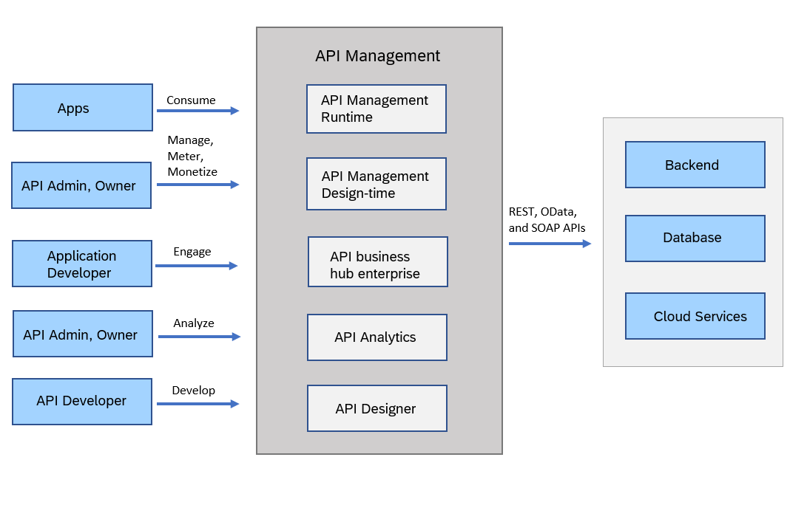

<!-- loioe02ae5316c6b428db83cd6690a5e8ebe -->

# Components of API Management

The API Management components work together to provide a comprehensive solution, enabling organizations to securely expose, manage, and monetize their APIs while empowering developers to build applications that leverage these APIs effectively.

The API Management infrastructure comprises of five key components:

-   **API Management Runtime**: You can deploy and effectively utilize your APIs. Applications consume the API runtime, request API authentication, and gain access.

-   **API Management Design Time**: Serves as a platform for easy API discovery, allowing API administrators to manage, meter, and secure their APIs. Additionally, it enables administrators to define and publish rate plans for their APIs. For more information, see [Build API Proxies](50-Development/build-api-proxies-74c042b.md), [Publish API Proxies](50-Development/publish-api-proxies-75a4a11.md), [Monetize APIs](50-Development/monetize-apis-fcdc89b.md), [Analyze API Proxies](50-Development/analyze-api-proxies-7712c61.md).

-   **Developer Hub**: It is a self-service portal for application developers. You can discover, browse, and explore APIs. Subscribe to a rate plan and build application. For more information, see [Consume APIs](50-Development/consume-apis-ea561e4.md).

-   **API Analytics**: Offers advanced analytical capabilities to track your API usage. Utilize API Analytics to gather data on URL usage, user IDs associated with API calls, latency information, and more. For more information, see [Analyze API Proxies](50-Development/analyze-api-proxies-7712c61.md).

-   **API Designer**: API developers have the ability to define, implement, and document APIs. The API Designer offers support for open APIs and allows for the generation of various outputs. For more information, see [Create an API Proxy Using the API Designer](50-Development/create-an-api-proxy-using-the-api-designer-26e1bbd.md).

The diagram below illustrates the interaction between various stakeholders and the different components of API Management. It also demonstrates how API Management integrates with both cloud and on-premise systems.

The API Management capability within SAP Integration Suite allows you to utilize SAP's internal API providers as well as external APIs, regardless of whether they are SAP-related or not. By leveraging your existing investments in SAP solutions, the API Management capability facilitates integration with non-SAP solutions. This platform plays a crucial role in unlocking the value of your digital assets and empowers you to create and deliver content effectively. With this capability, applications can seamlessly access secure backend data, ensuring smooth operations. Additionally, it offers a unified experience for managing and monitoring APIs across diverse data platforms, accompanied by real-time analytics.

