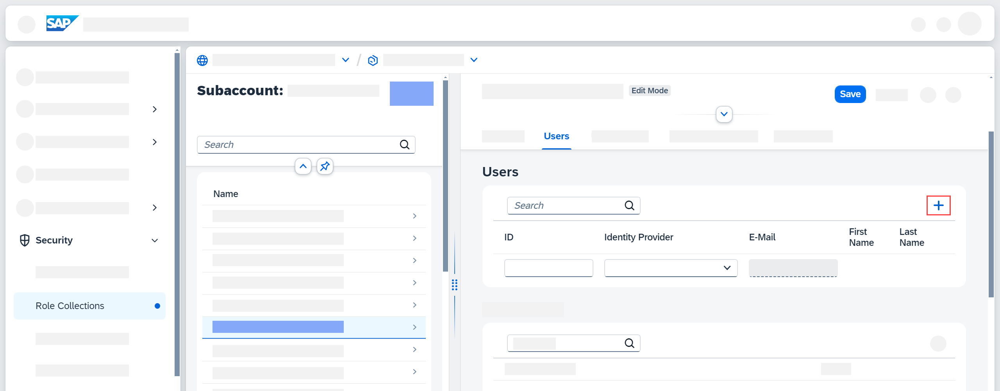

<!-- loio6ae0ff74bcbe4758b7c9d6c844bad454 -->

<link rel="stylesheet" type="text/css" href="css/sap-icons.css"/>

# Configuring User Access

Before users can access the application, you need to assign the relevant role collections to them.

<a name="loio6ae0ff74bcbe4758b7c9d6c844bad454__prereq_qxw_vf2_2yb"/>

## Prerequisites

-   You've completed the steps described in [Preparatory Steps](preparatory-steps-95366b2.md) where you activate SAP Integration Suite and the Cloud Integration capability.

-   You've completed the steps described in [Activating the Capability](activating-the-capability-b49ad35.md) where you add Data Space Integration to your list of active capabilities of SAP Integration Suite.

## Procedure

1.  In your subaccount in SAP BTP cockpit, navigate to *Security* \> *Role Collections*.

2.  Select the role collection that you want to assign and choose *Edit*.

    To perform the connector setup, you require the role `DataspaceTechnicalAdmin`. See [Configuring Connector Setup Using the UI \(Recommended Approach\)](configuring-connector-setup-using-the-ui-recommended-approach-4909d3f.md).

    For consumer or provider roles, select either `DataspaceConsumer` or `DataspaceProvider`, or both, depending on your needs.

    > ### Note:  
    > If you **don't see the relevant role collections**, check that you've activated the capability as described in [Activating the Capability](activating-the-capability-b49ad35.md).

    For more information about the role collections available for Data Space Integration, see [Personas and Roles](60-Security/identity-and-access-management-for-data-space-integration-211c66a.md#loio211c66a2f65e4bf0ad0e93e68cfff984__section_cxz_vsk_pcc).

3.  In the *Users* section, enter the ID of the user you want to assign the role collection to.

    For each additional user, choose :heavy_plus_sign: and enter their ID.

    If the user only exists in a connected identity provider, you must choose the identity provider and type in the e-mail address.

    

4.  Save your changes.

<a name="loio6ae0ff74bcbe4758b7c9d6c844bad454__result_p4d_3h2_2yb"/>

## Results

You've now assigned this user to the role collection. The user has all the authorizations of the role collection. You can now access the capability in SAP Integration Suite.

<a name="loio6ae0ff74bcbe4758b7c9d6c844bad454__postreq_dvq_3h2_2yb"/>

## Next Steps

Since Data Space Integration relies on functionality of Cloud Integration, your next step lies in creating service keys in Cloud Integration. See [Preparing Cloud Integration](preparing-cloud-integration-07f81f2.md).

**Related Information**  

[Assign Users to Role Collection](https://help.sap.com/docs/btp/sap-business-technology-platform/assign-users-to-role-collections)

