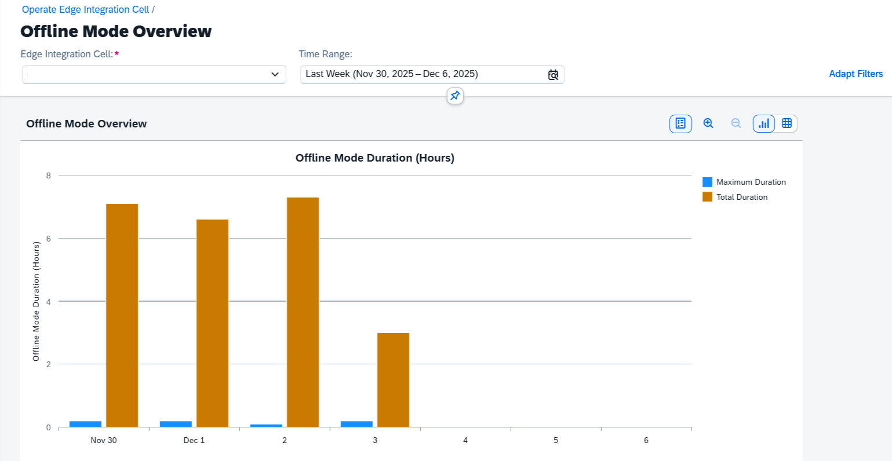
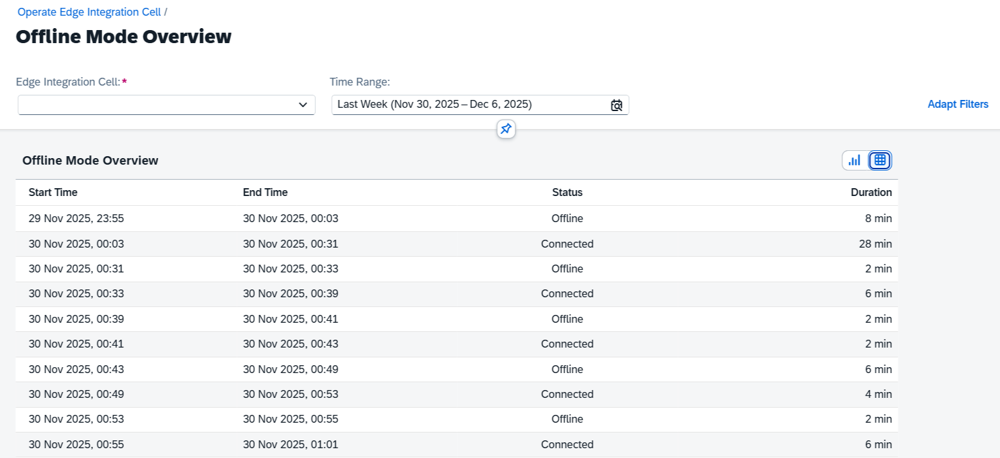

<!-- loio1f60cf8b34514f7c92013f36391b4317 -->

<link rel="stylesheet" type="text/css" href="css/sap-icons.css"/>

# Connection Status

Track and analyze periods when your Edge Integration Cell disconnects from the cloud.

<a name="loio1f60cf8b34514f7c92013f36391b4317__section_xrj_kbr_hhc"/>

## Context

In exceptional situations, like a network outage or loss of internet connectivity, your Edge Integration Cell continues to function temporarily in offline mode.

The *Connection Status* view lets you monitor these periods of disconnection from the cloud. You can see if your system has been offline, for how long, and when these events occurred. Tracking the duration of connectivity loss is essential for troubleshooting and monitoring the health of your system.

You can access this feature from the *Operations* cockpit, by selecting *Connection Status* from the *Quick Links* card.

<a name="loio1f60cf8b34514f7c92013f36391b4317__section_o41_mbr_hhc"/>

## Screen Components

Choose the *Edge Integration Cell* filter to select the system you want to monitor. You can also elect a specific time range for the analysis.

You can analyze the connection status using two different views: a chart \(\) and a table \(\). Use the icons in the top-right corner of the panel to switch between them.

Chart View: 

The chart view provides a daily summary of disconnection times, helping you quickly identify days with significant offline periods. Choose a bar to see the precise disconnection time.

-   *Max Disconnected*\(Blue Bar\): Shows the duration of the continuous period the system was disconnected on a given day.
-   *Total Disconnected* \(Brown Bar\): Shows the total duration the system was disconnected throughout a given day.

Table View:

The table view provides a detailed time range of connection and disconnection periods.

> ### Note:  
> The system checks the connection status every 10 minutes. As a result, the reported times are estimates and the system may not detect very short disconnections. The total time ranges for disconnections may also not be precise.

> ### Note:  
> Historical connection status data is stored for six months. Data older than six months is automatically deleted.

