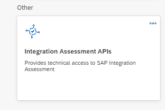

<!-- loio749897fbe3724b40a3dfcaffd4b4c2da -->

# Creating Service Instance and Service Key to enable API calling

<a name="loio749897fbe3724b40a3dfcaffd4b4c2da__section_q1j_15f_tzb"/>

## Prerequisites

You have created a subaccount in your global account using the SAP BTP cockpit and added the entitlement *integration-assessment* to the subaccount. For more information, see [Setting Up Your Account](10-InitialSetup/setting-up-your-account-079c68f.md)

<a name="loio749897fbe3724b40a3dfcaffd4b4c2da__section_c2m_yxk_zsb"/>

## Creating Service Instance

1.  Go to SAP BTP cockpit.

2.  Select the subaccount that hosts your SAP Integration Suite application.

3.  Choose your subaccount, navigate to *Services* \> *Service Marketplace*, and select *Integration Assessment APIs*.

    

4.  Choose *Create*.

5.  In the *New Instance or Subscription* dialog box, `Integration Assessment APIs` is already preselected as *Service*.

6.  Specify the following parameters:

    <table>
    <tr>
    <th valign="top">

    Parameter
    
    </th>
    <th valign="top">

    Value
    
    </th>
    </tr>
    <tr>
    <td valign="top">
    
    *Plan* 
    
    </td>
    <td valign="top">
    
    default
    
    </td>
    </tr>
    <tr>
    <td valign="top">
    
    *Runtime Environment* 
    
    </td>
    <td valign="top">
    
    You can choose any environment \(for example cloudfoundry/kyma/Kubernetes etc.\)
    
    </td>
    </tr>
    <tr>
    <td valign="top">
    
    *Space* 
    
    </td>
    <td valign="top">
    
    Select a space \(for example *dev*\).
    
    </td>
    </tr>
    <tr>
    <td valign="top">
    
    *Instance Name* 
    
    </td>
    <td valign="top">
    
    Enter a meaningful short name.
    
    </td>
    </tr>
    </table>
    
7.  Optional: Choose *Next* to review and verify the instance details.

8.  Choose *Create*.

<a name="loio749897fbe3724b40a3dfcaffd4b4c2da__section_vlj_zxk_zsb"/>

## Creating Service Key

With this step, you create a service key for the instance.

1.  Using SAP BTP cockpit, enter your subaccount and go to *Instances and Subscriptions*.

    You can see your instances in a table.

2.  Select the service instance.

3.  Under *Actions \(°°°\)*, choose *Create Service Key*.

4.  Enter a name for the service key under *Service Key Name*. You can use up to 32 characters.

5.  Choose *Create*.

6.  Choose the newly created service key to display the details of the service key. You need the values of the service key for later reference.

    The following table lists the key-values that are required to access the APIs:

    <table>
    <tr>
    <th valign="top">

    Key
    
    </th>
    <th valign="top">

    Value
    
    </th>
    </tr>
    <tr>
    <td valign="top">
    
    *entities* 
    
    </td>
    <td valign="top">
    
    Base URL for accessing API’s.
    
    </td>
    </tr>
    <tr>
    <td valign="top">
    
    *clientid* 
    
    </td>
    <td valign="top">
    
    clientid to be used as credential when requesting the access token from the token server.
    
    </td>
    </tr>
    <tr>
    <td valign="top">
    
    *clientsecret* 
    
    </td>
    <td valign="top">
    
    clientsecret to be used as password when requesting the access token from the token server.
    
    </td>
    </tr>
    <tr>
    <td valign="top">
    
    *url* 
    
    </td>
    <td valign="top">
    
    URL of token server that issues the access token. Append “/oauth/token” in the url to request for token.
    
    </td>
    </tr>
    </table>
    

**Related Information**  

[Integration Assessment APIs](integration-assessment-apis-47847b5.md "")

