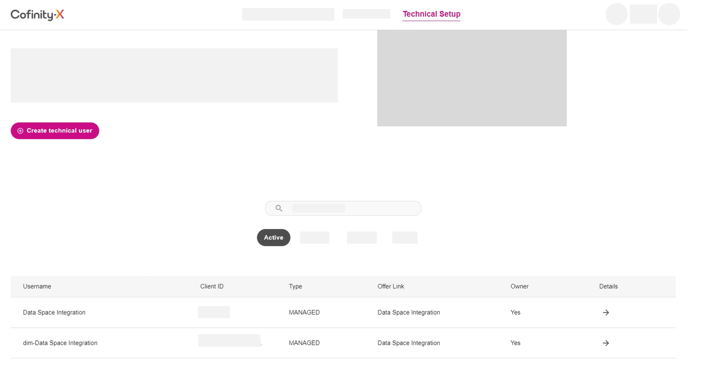
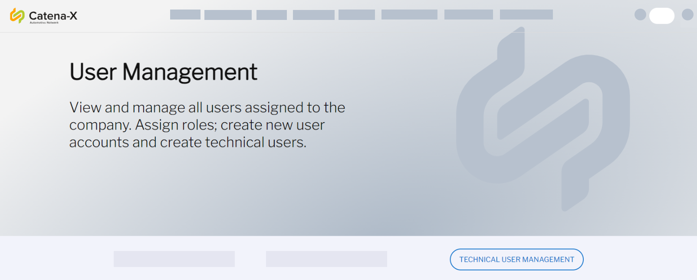

<!-- loiob95f0ef5f2d048dd814a9b09280d944f -->

# Creating Technical Users in Landscape Portal

Prepare your technical users in the landscape portal of your chosen data space.

<a name="loiob95f0ef5f2d048dd814a9b09280d944f__section_bpq_n1q_42c"/>

## Prerequisites

-   You've registered with the data space of your choice.

-   You have the credentials to log into your company account with that data space.

-   You have the role `Company Admin` in the landscape portal of your chosen data space.

<a name="loiob95f0ef5f2d048dd814a9b09280d944f__section_ycv_41q_42c"/>

## Context

As part of the preparation in your onboarding, you must create two technical users in the landscape portal of the Catena-X or Cofinity-X network. The first technical user must have the *Identity Wallet Management* role and the second technical user must have the *Offer Management* role.

The following instructions outline the process of creating technical users in the landscape portal of either **Catena-X** or **Cofinity-X**.

<a name="loiob95f0ef5f2d048dd814a9b09280d944f__section_hrv_p1q_42c"/>

## Procedure

Follow the steps for the landscape to which you want to onboard: either **Cofinity-X** or **Catena-X**.

-   Creating technical users in the **Cofinity-X** portal

    > ### Note:  
    > Due to the role concept of Cofinity-X, you may not have sufficient privileges to create users yourself. To create the users yourself, you can assign the company role `Service Provider` to yourself in the portal of Cofinity-X. For details on the creation of the roles, you can then refer to the instructions for the Catena-X landscape portal.
    > 
    > Alternatively, follow these steps and SAP will create the users for you:

    1.  Open the portal of your landscape and log in with your account. Log in to the portal to which the connector must be onboarded.
    2.  Choose the company account that you want to use. You're redirected to authenticate yourself with the underlying identity provider. Log in with your credentials.
    3.  Navigate to the *App Marketplace* and search for `Data Space Integration`. Once found, subscribe to it.
    4.  SAP will contact you and ask for your SAP Integration Suite URL, which you subscribed to previously. Then, SAP creates the required technical users for you.
    5.  Navigate to *Technical Setup* \> *Technical User Management*, which is where you manage all users assigned to the company.
    6.  Scroll down. The technical users that were created for you are now visible in the technical user list.

        

        The user *Data Space Integration* has the *Offer Management* role, the user *dim-Data Space Integration* has the *Identity Wallet Management* role.

-   Creating technical users in the **Catena-X** portal

    1.  Open the portal of your landscape and log in with your account. Log in to the portal to which the connector must be onboarded.
    2.  Choose the company account that you want to use. You're redirected to authenticate yourself with the underlying identity provider. Log in with your credentials.
    3.  Open *User Management*, which is where you manage all users assigned to the company. To create a new technical user with the *Identity Wallet Management* role, choose *Technical User Management* \> *Technical User Creation*.

        

    4.  Enter a *Username* and *Description*, then select the *Identity Wallet Management* technical user role.
    5.  Select *Confirm*. The technical user that you created \(usually prefixed with `-dim`\) is now visible in the technical user list.
    6.  Repeat steps 3–6 for the *Offer Management* role.

<a name="loiob95f0ef5f2d048dd814a9b09280d944f__section_mk4_v1q_42c"/>

## Results

You've created two technical users in the landscape portal of your data space, one user with the role *Identity Wallet Management* and one with the role *Offer Management*, and their credentials.

<a name="loiob95f0ef5f2d048dd814a9b09280d944f__section_phy_v1q_42c"/>

## Next Steps

Now, you can continue with [Configuring Connector Setup Using the UI \(Recommended Approach\)](configuring-connector-setup-using-the-ui-recommended-approach-4909d3f.md) or [Configuring Connector Setup Using the API \(Alternative Approach\)](configuring-connector-setup-using-the-api-alternative-approach-bfa408c.md).

