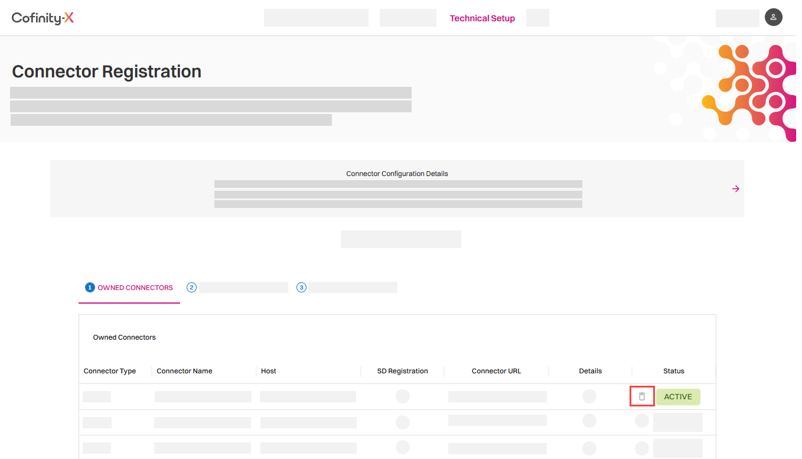
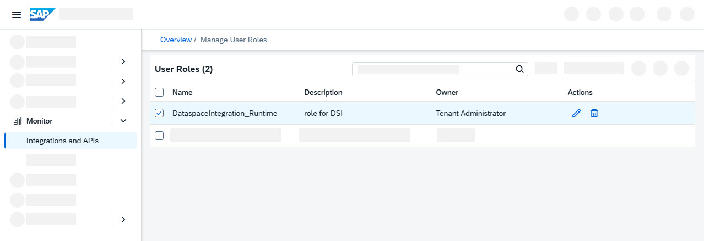

<!-- loio67c080d6a39a46fa8ec4ee6c46b58433 -->

<link rel="stylesheet" type="text/css" href="css/sap-icons.css"/>

# Deprovisioning Data Space Integration

Learn how to deprecate a connector in Data Space Integration.

<a name="loio67c080d6a39a46fa8ec4ee6c46b58433__prereq_cpn_41x_tgc"/>

## Prerequisites

Your user has the role collections `PI_Administrator` and `Integration_Provisioner`.

## Context

You want to de-provision Data Space Integration because you want to use a different SAP Integration Suite instance or you've decided not to work with data spaces anymore.

## Procedure

1.  In your landscape portal \(for example, Catena-X or Cofinity-X\), delete the connector as follows:

    1.  Open the landscape portal and go to *Technical Setup* \> *Connector Registration*.
    2.  In the list of owned connectors, find the connector your want to delete and choose :wastebasket:.

        

    3.  In the confirmation dialog, choose *Deactivate*.

2.  Additionally, we recommend that you delete all items that you created in SAP Integration Suite to activate Data Space Integration. This includes Cloud Integration service keys, security material in Cloud Integration, the custom role, and the deployed integration flows. See [Preparing Cloud Integration](preparing-cloud-integration-07f81f2.md).

    If you're using these flows, the security material, or the service keys anywhere else, check with their consumers to decide whether the items can be deleted.

    1.  First, delete the instances:

        1.  In the SAP BTP cockpit, go to *Services* \> *Instances and Subscriptions*.
        2.  In the *Instances* table, you can see entries for the service *Process Integration Runtime* and the plans `api` and `integration-flow`. Select the entry for the plan `api`.
        3.  To delete the service key, choose  Actions and then *Delete*.
        4.  Go back to the *Instances* table, select the entry for the plan `integration-flow`, and delete its service key as well.

    2.  Next, delete the custom role you created in the initial setup:

        1.  In SAP Integration Suite, go to *Monitor* \> *Integrations and APIs*.
        2.  Open the *User Roles* tile.
        3.  Select the user role `DataspaceIntegration_Runtime` and choose :wastebasket:.

            

    3.  Finally, delete all security material created for Data Space Integration:

        1.  In SAP Integration Suite, go to *Monitor* \> *Integrations and APIs*.
        2.  Open the *Security Material* tile.
        3.  For all entries that contain "SAP\_DataspaceIntegrationCredential" within their name, choose :wastebasket:.

3.  In SAP Integration Suite home, you can now deactivate Data Space Integration. Open the *Manage Capabilties* tile and then choose *Deactivate* for Data Space Integration.

<a name="loio67c080d6a39a46fa8ec4ee6c46b58433__postreq_f15_v2x_tgc"/>

## Next Steps

If you want to use Data Space Integration on a new SAP Integration Suite tenant, you have to perform all steps described in [Initial Setup](initial-setup-b2bdea7.md) again.

