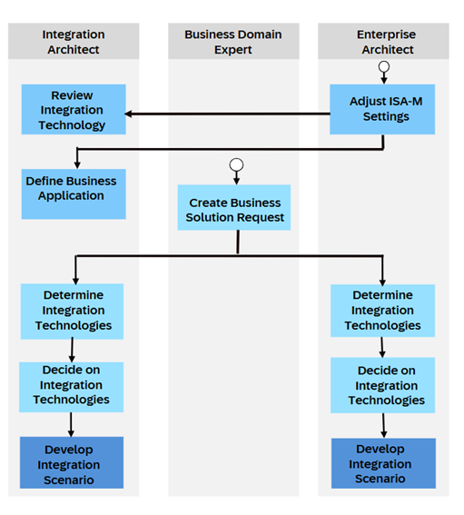
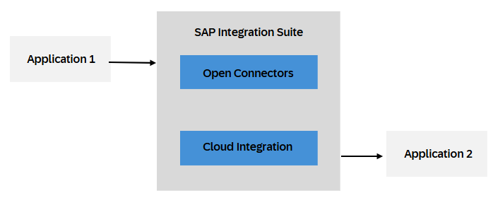
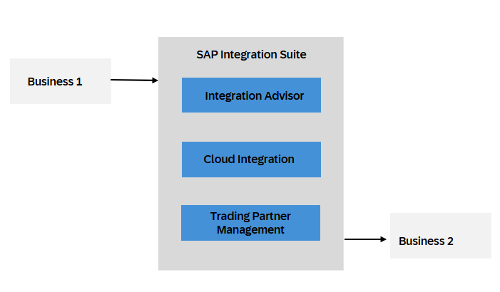
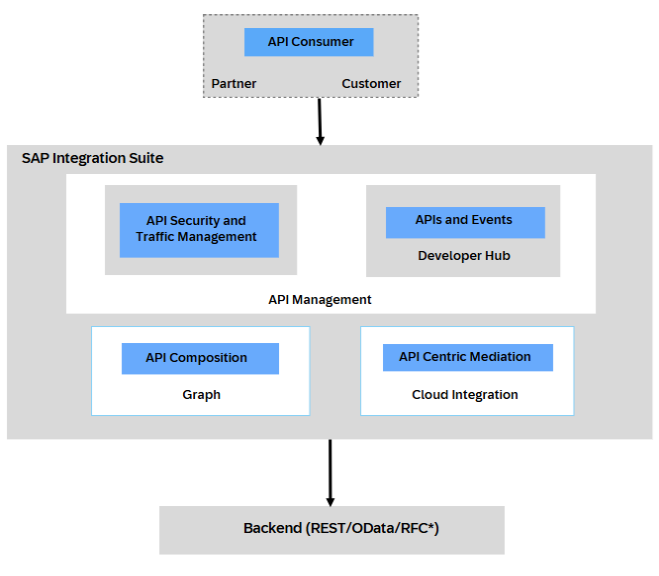
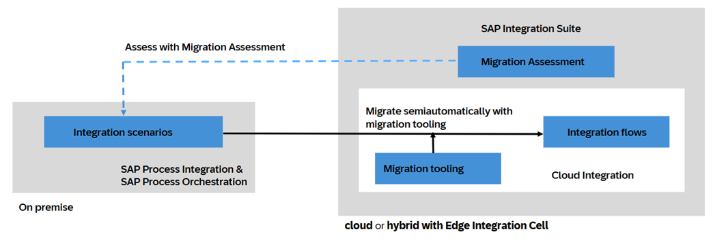
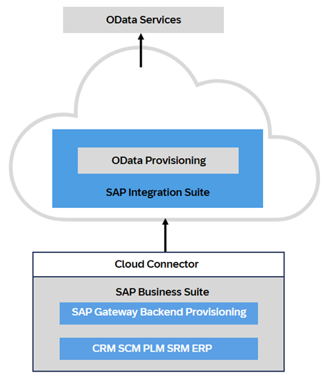

<!-- loiob550bbd0ce6542debf574061ad09c60e -->

# How Different Capabilities in SAP Integration Suite Interact

The capabilities of SAP Integration Suite can function independently and, at times, interact with each other to provide a cohesive and efficient integration environment.

In this section, we outline how these capabilities work independently and with each other to support different integration scenarios:

<table>
<tr>
<td valign="top">

Integration Assessment

</td>
<td valign="top">

Integration Assessment typically involves evaluating the efficiency, security, scalability, and overall performance of your integration landscape. This process ensures that your integration solutions are functioning as intended and meeting business requirements.

Integration Assessment is fundamental to the success of A2A and B2B integrations. It ensures that all relevant factors are considered, risks are mitigated, and the integration aligns with business objectives and technical requirements. This comprehensive approach helps in delivering robust and efficient integrations that add value to the organization.

</td>
</tr>
<tr>
<td valign="top">

A2A \(Application-to-Application\) integration in SAP Integration Suite

</td>
<td valign="top">

A2A \(Application-to-Application\) integration in SAP Integration Suite refers to the seamless connection and data exchange between different SAP systems, modules, or applications. This type of integration ensures that data is consistent, up-to-date, and accessible across various SAP solutions, enabling streamlined business processes and improved operational efficiency.

SAP Integration Suite provides tools like Cloud Integration, API Management, and Open Connectors to simplify the process of connecting and managing A2A integrations.

**How They Work Together**:

Open Connectors and Cloud Integration work synergistically to create robust, scalable, and efficient A2A integrations. Open Connectors provide the standardized interfaces necessary for communication, while Cloud Integration platforms manage, orchestrate, and secure these communication channels, ensuring smooth and reliable data exchange between applications.

</td>
</tr>
<tr>
<td valign="top">

B2B \(Business-to- Business\) integration in SAP Integration Suite

</td>
<td valign="top">

B2B integration in SAP Integration Suite involving Integration Advisor, Cloud Integration, and Trading Partner Management is a comprehensive solution designed to facilitate Business-to-Business \(B2B\) transactions and communications between different organizations.

**How They Work Together**:

-   Message Standard Design: Integration Advisor is used to define the message formats and mappings needed for B2B transactions. These definitions are then used in Cloud Integration.
-   Integration Flows: In Cloud Integration, iFlows are created to handle the end-to-end process, including receiving messages from trading partners, transforming them using Integration Advisor, and routing them to the appropriate backend systems, for example, SAP and S/4HANA\).
-   Partner Management: Trading Partner Management maintains the details and configurations for each trading partner, ensuring smooth and secure communication. This includes managing certificates, protocols, and profiles that are referenced in the integration flows.

Example:

Order Processing-  Automating the receipt of purchase orders from customers, converting them into the required format, and processing them in the backend ERP system.

</td>
</tr>
<tr>
<td valign="top">

API Management/ API Centric Integration

</td>
<td valign="top">

You can use API Management capability to manage the lifecycle of APIs. This includes governing, securing, managing, and consuming APIs in your environment. This process involves creating API artifacts/ APi proxies, applying security policies, and handling API keys or OAuth tokens for authentication and authorization. API Management facilitates the deployment of APIs across various environments such as development, testing, and production. See [Working with API Management](working-with-api-management-321fb4d.md).

The Graph component, under the API Composition module, enables you to expose all your business data in the form of a semantically connected data graph, accessed via a single unified and powerful API. See [Graph](50-Development/graph-7d19a62.md).

Additionally, you can utilize Developer Hub, which serves as a centralized catalog where developers can discover and consume APIs. See [Developer Hub](developer-hub-41f7c45.md).

There's also API-centric integration that involves using APIs as the primary means of connecting and integrating different applications, services, and data sources. Here's a simplified breakdown of how it works:

-   Manage and secure Application APIs
-   Transform the payload / backend response
-   Expose APIs via Developer Hub
-   Engage with API consumer via Developer Hub 

</td>
</tr>
<tr>
<td valign="top">

Migrating from SAP Process Integration and SAP Process Orchestration to SAP Integration Suite 

</td>
<td valign="top">

**SAP Process Integration** and **SAP Process Orchestration** are on-premise solutions for integration. If you’re still using these on-premise solutions, moving to the cloud ensures that your business processes are up to date and efficient. In the cloud, you can leverage not only Cloud Integration, but all of SAP Integration Suite’s capabilities. See [Migration Guide for SAP Process Orchestration](https://help.sap.com/docs/migration-guide-po/migration-guide-for-sap-process-orchestration/migration-guide-sap-process-orchestration).

Before you migrate, use the **Migration Assessment** capability of SAP Integration Suite to assess your scenarios in SAP Process Orchestration and receive guidance on how to migrate them. After you connect your SAP Process Orchestration system with Migration Assessment, the capability extracts your data and prepares an estimation of the technical effort involved in the migration, evaluating which of your integration scenarios can be migrated. See [Migration Assessment](https://help.sap.com/docs/integration-suite/sap-integration-suite/migration-assessment).

The actual migration can be done semi-automatically by the **migration tooling**, which is part of the Cloud Integration capability of SAP Integration Suite. The tool migrates your integration scenarios from SAP Process Orchestration to integration flows in SAP Integration Suite by using integration patterns that map migratable objects with equivalent integration flow artifacts. Some objects can’t be migrated automatically and require additional manual effort on your side. See [Migration Tooling](https://help.sap.com/docs/integration-suite/sap-integration-suite/migration-tooling).

When you move to SAP Integration Suite, you can use **Edge Integration Cell**, a hybrid integration runtime. Instead of completely switching to the cloud, it allows you to deploy and run your integration content in your private landscape, while still designing and monitoring your integration content in the cloud. See [What Is Edge Integration Cell](https://help.sap.com/docs/integration-suite/sap-integration-suite/what-is-sap-integration-suite-edge-integration-cell).

The following graphic shows the dependencies between the different entities involved in your migration journey:

</td>
</tr>
<tr>
<td valign="top">

OData Provisioning 

</td>
<td valign="top">

OData Provisioning allows you register OData services from SAP Business Suite. This allows you to access business data and logic from SAP Business Suite on the SAP Business Technology Platform, where you can use it in any cloud applications.

</td>
</tr>
</table>

