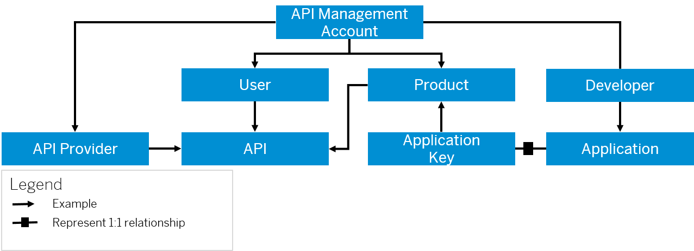

<!-- loio414808b0f9c84a2dafc0feb80c76e8d4 -->

# Important Concepts of API Management

The structure of the API Management capability within SAP Integration Suite revolves around APIs, products, applications, users, developers, and accounts. APIs are grouped into products, which are accessed by applications created by developers.

Users interact with APIs through applications, and accounts are used to manage access and permissions. Understanding this structure is crucial for effectively managing and organizing APIs within API Management.

To effectively utilize the API portal within SAP Integration Suite, it is important to grasp the following concepts:

<table>
<tr>
<th valign="top">

**Entity**

</th>
<th valign="top">

**Definition**

</th>
</tr>
<tr>
<td valign="top">

API Management Account

</td>
<td valign="top">

An API Management account is the highest level of data hierarchy. An account is a representation of all components including APIs, products, applications, systems, users, and developers.

</td>
</tr>
<tr>
<td valign="top">

System

</td>
<td valign="top">

In API Management, **System** refers to the API provider systems where the actual backend services reside. System could either be an ABAP system, SAP Gateway system, Enterprise Services Repository, or systems that host generic REST services or third party provider systems. API Management allows you to add and manage an API provider system. After you have added a system, you can browse for the APIs in that system.

</td>
</tr>
<tr>
<td valign="top">

User

</td>
<td valign="top">

API Management can have multiple users. Different users have different roles and privileges assigned. For example, people who create APIs and products or analyze the metrics or the application consumer who can access the APIs provisioned by API Management.

</td>
</tr>
<tr>
<td valign="top">

API

</td>
<td valign="top">

APIs are Application Programming Interfaces. They comprise a set of routines, protocols, and tools for building software applications. APIs define sets of requirements that govern how applications communicate with one another. They facilitate interaction by selectively exposing certain functionalities, allowing different applications, websites, or devices to communicate effectively with each other.

> ### Note:  
> API Management supports OData, REST, and SOAP services.

</td>
</tr>
<tr>
<td valign="top">

Product

</td>
<td valign="top">

A product is a bundle of APIs. It contains metadata specific to your business for monitoring or analytics. For example, all APIs related to CRM can be bundled as one CRM product. API Management collects data for analyzing the products.

</td>
</tr>
<tr>
<td valign="top">

Developer

</td>
<td valign="top">

One or more developers can create applications in the API Management account. A developer can consume the APIs, but cannot create APIs.

To create an application, the developer must have registered the account. After having created an application, the developer uses the app \(application\) key to consume the APIs.

</td>
</tr>
<tr>
<td valign="top">

Application

</td>
<td valign="top">

Applications include the Web or mobile applications that consume the exposed APIs. When you create an application, you select the product to include in this application. For each application that you create, API Management generates an app key and secret. Use this key to gain access to multiple products. Developers create one or more applications using the APIs you expose.

</td>
</tr>
<tr>
<td valign="top">

App Key

</td>
<td valign="top">

Based on the authorization mechanism you define for your APIs, the application passes an app \(application\) key together with every request to your APIs. If that key is valid, the request is permitted. API Management supports different types of authentication, such as a simple API key, OAuth, and so on.

</td>
</tr>
</table>

