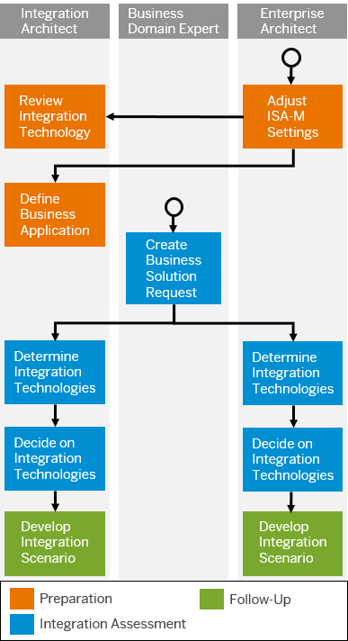

<!-- loio5769fcd4209b470ba85d2aa5ad32b397 -->

# Integration Assessment Process

Define, document, and govern your integration technology strategy.

Integration Assessment provides you with the necessary tools to determine the most suitable integration technology strategy.

The way in which you assess your integration strategy is based on the SAP Integration Solution Advisory Methodology \(ISA-M\) \(see [SAP Integration Solution Advisory Methodology](sap-integration-solution-advisory-methodology-a2e17f3.md)\).

This method ensures a structured assessment process.

The following figure shows the overall process for assessing your integration strategy using Integration Assessment:

### Review and Adjust ISA-M Settings

Assess your integration strategy using the SAP Integration Solution Advisory Methodology \(ISA-M\).

The integration assessment process and final determination of the suitable integration technology is based on certain settings. These settings comprise, for example, a list of integration technologies and information about which key characteristics are supported by each technology. Using this information, during the assessment process the system calculates a recommendation for an integration technology for your interface request.

Integration Assessment comes with a number of settings predefined by SAP. For example, a list of all integration technologies provided by SAP. You can also adjust these settings and add your own technologies or other data.

In this phase, you review the settings and, if necessary, adjust them to your project.

Furthermore, the settings also contain questionnaires defined by SAP and you can add your own questionnaires. During the interface request process, you are guided through these questionnaires. The system then calculates the best suitable technologies. This step is also referred to as technology mapping.

Go to the *Settings* section to perform this task.

**More information: [Review and Adjust ISA-M Settings](review-and-adjust-isa-m-settings-957de13.md)**

### Review Integration Technology

In this phase, perform the following tasks:

-   Review and adjust related integration technologies.

-   Add technology instances.

You can use SAP standard integration technologies \(for example, SAP Integration Suite, Cloud Integration\), or you can adjust the configuration to use your own integration technologies.

Go to the *Configure* section and select *Integration Technologies* to perform this task.

More information: [Review Integration Technology](review-integration-technology-47439ac.md)

### Define Business Applications

In this phase, perform the following tasks:

-   Review and adjust related applications.

-   Add application instances.

You can use SAP standard applications \(for example, SAP ERP\), or you can adjust the configuration to use your own applications.

Go to the *Configure* section and select *Applications* to perform this task.

More information: [Define a Business Application](define-a-business-application-0da1b1e.md)

### Create Business Solution Requests

In this phase, perform the following tasks:

-   Create business solution requests for the business users/project managers. You can create requests in the application and provide initial context.

-   Create an interface request.

Go to the *Request* section to perform this task.

**More information: [Create a Business Solution Request and Interface Request](create-a-business-solution-request-and-interface-request-f3d983a.md)**

### Determine Integration Technology

During the creation of an interface request, you are guided through a questionnaire. The questions are defined as part of the ISA-M settings.

Using this procedure, the system captures the interface requirements in a structured way and uses the outcome for an intelligent technology recommendation.

More information: [Determine an Integration Technology](determine-an-integration-technology-69b6dae.md)

### Decide on Integration Technology

Once the questionnaire is answered, you perform the following tasks:

-   Review the results of the interface request based on the settings and the questionnaire.

-   Trigger the system to decide on the technology to use.

    The technology mapping is performed by the system.

More information: [Decide on an Integration Technology](decide-on-an-integration-technology-fb4bc24.md)

### Persona

Personas cover the tasks performed by specific roles associated with an integration project.

More information: [Personas for Integration Assessment](60-Security/personas-for-integration-assessment-5df5af1.md)

