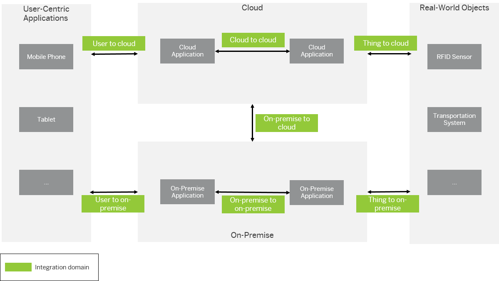

<!-- loioe8360d27f4e94de68981834a93330958 -->

# Integration Domains

An integration domain describes an area in a hybrid landscape where integration is needed, for example, on-premise-to-cloud or cloud-to-cloud integration.

Identifying integration domains provides the entry point into SAP Integration Solution Advisory Methodology \(ISA-M\).

The following figure illustrates the meaning of integration domains.

> ### Example:  
> The business processes for your organization require integration between cloud applications. In this case, the integration domain *cloud to cloud* is relevant for you.

