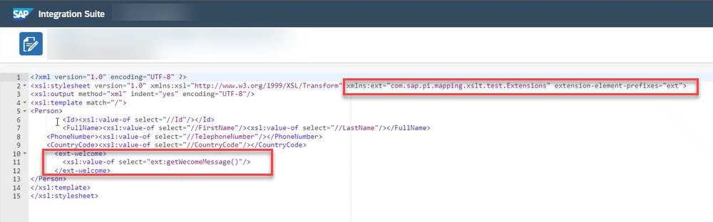

<!-- loio7a552d40e1144af78d6ee0981ff2a54c -->

# Known Limitations

Know about the limitations of the migration tooling.

The following table describes the limitations when using the migration tooling:

<table>
<tr>
<th valign="top">

Components

</th>
<th valign="top">

Limitations

</th>
</tr>
<tr>
<td valign="top">

Message Mapping

</td>
<td valign="top">

User-defined Functions \(UDFs\) with function libraries, imported archives, or parameters aren't supported when migrating a message mapping.

Importing, viewing, and editing a local Java UDF is supported.

For more information, see: [Importing Mapping Content from ES Repository](50-Development/IntegrationSettings/importing-mapping-content-from-es-repository-e18fc05.md).

</td>
</tr>
<tr>
<td valign="top">

XSLT Mapping

</td>
<td valign="top">

Extensions aren't supported in the XSLT mapping. The recommendation is to remove all such references in your resources to avoid errors. For example, the usage of `xmlns:ext` reference.

</td>
</tr>
<tr>
<td valign="top">

CSV to XML Converter

XML to CSV Converter

</td>
<td valign="top">

For the templates that use CSV to XML or XML to CSV converter, the following limitations apply:

-   XSD schema files from the source ICO aren't migrated. As an integration developer, you must manually download the schema files from the Enterprise Services Repository of SAP Process Orchestration and upload the same as resources in the integration flow. Then, configure the converter flow step before you deploy the integration flow.

-   Field Fixed Length separator isn't supported. You can't directly migrate field fixed length file-based Integrated Configuration Objects \(ICOs\).

See:

-   [P2P\_ASYNC\_CSV\_0001](supported-templates-ad867ae.md#loio468e43826e1b42549baaf1e0771e3521)

-   [P2P\_ASYNC\_CSV\_0002](supported-templates-ad867ae.md#loiod03185fa66674bec8b258de8352325ce)

-   [P2P\_ASYNC\_CSV\_0003](supported-templates-ad867ae.md#loio2bb532d7b4b24bb2a34219f6e62e4ede)

</td>
</tr>
<tr>
<td valign="top">

Multiple Operations on service instance

</td>
<td valign="top">

Interfaces that use multiple operations aren't supported.

You must redesign your interface using an integration pattern to properly identify and handle the multiple operations. You could insert a router step to identify the correct operation and redirect the message to the proper message mapping and receiver.

</td>
</tr>
</table>

