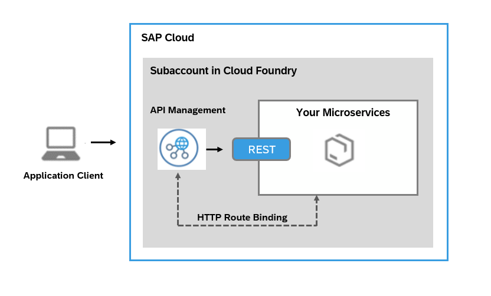

<!-- loioe609a3efe6d64e1781cbf81ae5592071 -->

# Managing Cloud Foundry Microservices through API Management

The *apim-as-route-service* plan helps you in managing Cloud Foundry applications by including policies such as rate limit, quota. The service instance you create through this plan allows you to bind to the route service and creates an API Proxy. This API Proxy serves in establishing a secure connection with your Cloud Foundry application and all the calls made to the Cloud Foundry application are routed via*API Management, API portal*.


<a name="loioe609a3efe6d64e1781cbf81ae5592071__section_njp_xwj_blb"/>

## About the Plan

This service plan is necessary if you have a microservice built and deployed on the SAP Cloud Foundry environment and you want to manage it using API Management. With this plan, even when calling the actual microservice URL \(not the API proxified URL\), the Cloud Foundry router will ensure that API Management is invoked first. This means that regardless of whether the API proxified URL or the actual microservice URL is called, API Management policies will always be enforced. This functionality is only available for APIs developed and deployed on the Cloud Foundry environment.



The service instance you create through this plan allows you to bind to the route service and creates an API Proxy. This API Proxy serves in establishing a secure connection with your Cloud Foundry application and all the calls made to the Cloud Foundry application are routed via*API Management, API portal*.


<a name="loioe609a3efe6d64e1781cbf81ae5592071__section_tvr_2gh_blb"/>

## Prerequisites

-   You've enabled API Management capability using SAP Integration Suite and have completed the setup. For more information, refer [Subscribing to Integration Suite](https://help.sap.com/docs/SAP_INTEGRATION_SUITE/51ab953548be4459bfe8539ecaeee98d/8a3c8b7a6b1c4f249bb81d11644ef806.html?version=CLOUD) and [Activating Capabilities](https://help.sap.com/docs/SAP_INTEGRATION_SUITE/51ab953548be4459bfe8539ecaeee98d/2ffb343c163c48a4b3a90f9f3c487328.html?version=CLOUD).

-   You have the `space developer` role assigned to you.


<a name="loioe609a3efe6d64e1781cbf81ae5592071__CreatingAPIMInstance"/>

## Creating an API Management, API portal Service Instance

Create a service instance in *API Management, API portal* to start managing your Cloud Foundry applications.

Follow the below procedure to create a service instance on Cloud Foundry:

1.  In your web browser, open the *SAP BTP Cockpit* - [https://cockpit.btp.cloud.sap](https://cockpit.btp.cloud.sap).
2.  From your *Subaccount*, navigate to *Spaces* in your Cloud Foundry environment and choose *Services* \> *Service Marketplace.*
3.  Select the *API Management, API portal* tile, and in the details section, choose *Create*.

    > ### Note:  
    > If you are unable to view the *API Management, API Portal* tile, please check your entitlements. For more information, see [Managing Entitlements and Quotas Using the Cockpit](https://help.sap.com/viewer/65de2977205c403bbc107264b8eccf4b/Cloud/en-US/c8248745dde24afb91479361de336111.html).

4.  In the *New Instance or Subscription* dialog that opens, choose the *apim-as-route-service* plan.
5.  Enter a name for your instance in the *Instance Name* field and choose *Next*.
6.  Review and verify the instance details and choose *Create*.

> ### Note:  
> The *apim-as-route-service* plan allows you to create multiple service instances and connect to many Cloud Foundry applications using the same Subaccount.


<a name="loioe609a3efe6d64e1781cbf81ae5592071__Binding"/>

## Binding a Multi-Cloud Foundation Application to an API Management, API Portal Service Instance

Create a service instance and bind the Cloud Foundry application to *API management, API portal* service. When you bind an application, an API proxy is created and a new route is added to the application. The route initially redirects all calls to the proxy URL and then to the application.

**Prerequisites**

-   You have the `space developer` role assigned to you.
-   You have created a service instance under *API Management, API portal*.

Open the command-line interface for Cloud Foundry and enter the following command:

> ### Sample Code:  
> ```
> 
> cf bind-route-service sap-cf-domain.com apim-service-instance-name --hostname my-app -c '{"api_name" : ”custom_api_proxy_name”}'
> 
> <-- Example
> //Without parameters
> cf bind-route-service cfapps.sap.hana.ondemand.com apim-prod-instance --hostname taxapp
> 
> //Cloud foundry URL for the above example is https://taxapp.cfapps.sap.hana.ondemand.com
> 
> //With parameters for Linux/MAC system
> cf bind-route-service sap-cf-domain.com apim-service-instance-name --hostname my-app -c '{"api_name" : "test_api"}'
> 
> //With parameters for Windows system
> cf bind-route-service sap-cf-domain.com apim-service-instance-name --hostname my-app -c "{\"api_name\" : \"test_api\"}"
> 
> -->
>  
> ```

> ### Note:  
> *API Management, API portal* supports only English alpha numerics, hyphens \(-\) and underscores \(\_\) characters for "api\_name".
> 
> You can bind an application to a service only from the command-line interface and not from SAP BTP Cockpit.
> 
> Providing a value for the parameter during binding is optional. If you provide a value for api\_name, then the API proxy created in *API Management, API portal* for current binding gets the given name. Also, if an API with the same name exists in the API portal, then the same API proxy is used for the binding. That is, the API proxy end point is registered as the route service URL for the current binding.

