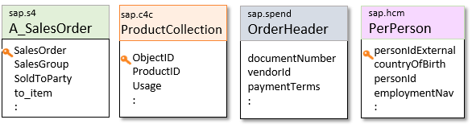
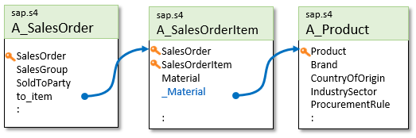

<!-- copy07fdc7a6ca2b4543ba25b81c1014b9ca -->

# Mirrored Entities

Developers familiar with existing SAP product data models can continue to consume the resources of these models with Graph. Rather than accessing them separately via different system APIs, they’re accessed from the business data graph, using the Graph API. The mirrored entities of supported SAP data sources are added to the data graph under a reserved SAP namespace. Entities from unsupported data sources are mirrored under custom namespaces.

The following SAP system-specific namespaces are supported:

<table>
<tr>
<th valign="top">

Namespace

</th>
<th valign="top">

Description

</th>
</tr>
<tr>
<td valign="top">

`sap.s4` 

</td>
<td valign="top">

Mirrored entities from the data model of SAP S/4HANA.

</td>
</tr>
<tr>
<td valign="top">

`sap.c4c` 

</td>
<td valign="top">

Mirrored entities from the data model of SAP Sales Cloud, which is part of SAP CX's suite of products.

</td>
</tr>
<tr>
<td valign="top">

`sap.hcm` 

</td>
<td valign="top">

Mirrored entities from the data model of SAP Human Capital Management \(HCM, also known as SAP SuccessFactors\).

</td>
</tr>
</table>

When referencing a mirrored entity, the namespace is simply prepended. For example: `sap.s4/A_SalesOrder` references sales order information from an SAP S/4HANA data source, and `sap.hcm/PerPerson` references person information from an SAP SuccessFactors data source.

Developers can easily combine all these resources in one application, focusing on the data, without having to know where the specific data sources are located or how to connect to them.

<a name="copy07fdc7a6ca2b4543ba25b81c1014b9ca__section_frr_bky_gvb"/>

## Additional Connections

In addition to consolidating the different system models, Graph introduces hundreds of additional connections between related entities in the business data graph, in the form of associations that are recognized by OData or GraphQL. A common example is the relation from an order item to an ordered product:

The additional connections are usually named by prefixing an underscore to the name of an attribute of type `String`, which represents the reference value. In the illustrated example, the original attribute `Material` is a string that represents a foreign key, and `_Material` is a relation.

Such relationships improve the semantic intent of the business data graph and lead to simpler, more intuitive, and more efficient navigational queries. For example, a developer could follow the illustrated relationships to access `sap.s4/A_SalesOrder(15)/to_Item(10)/_Material/Brand` in a single OData query, answering the question: *show the brand of the product ordered in item 10 of the sales order with key 15*.

Similarly, the business data graph represents hierarchical entities as compositions, which clearly expose the structural boundaries of the model, simplifying the interaction and reducing developer errors. An example of a composition is a book with chapters – you need to access the book to read the chapters. In the diagram, the relationship between `A_SalesOrder` and `A_SalesOrderItem` is modeled as a composition via `to_Item`, ensuring that developers always access a sales order item by going through the root of the composition \(the root entity\).

To complete the consolidation of the system models, Graph introduces hundreds of additional connections between related root entities in the business data graph, in the form of associations that are recognized by OData or GraphQL. A common example is the relationship from an order item to an ordered product.

Using a more traditional API, this small example would have required at least three different round-trip API calls, plus the necessary expertise to develop the business logic to extract the keys to match the requirements of the different entity instances.

