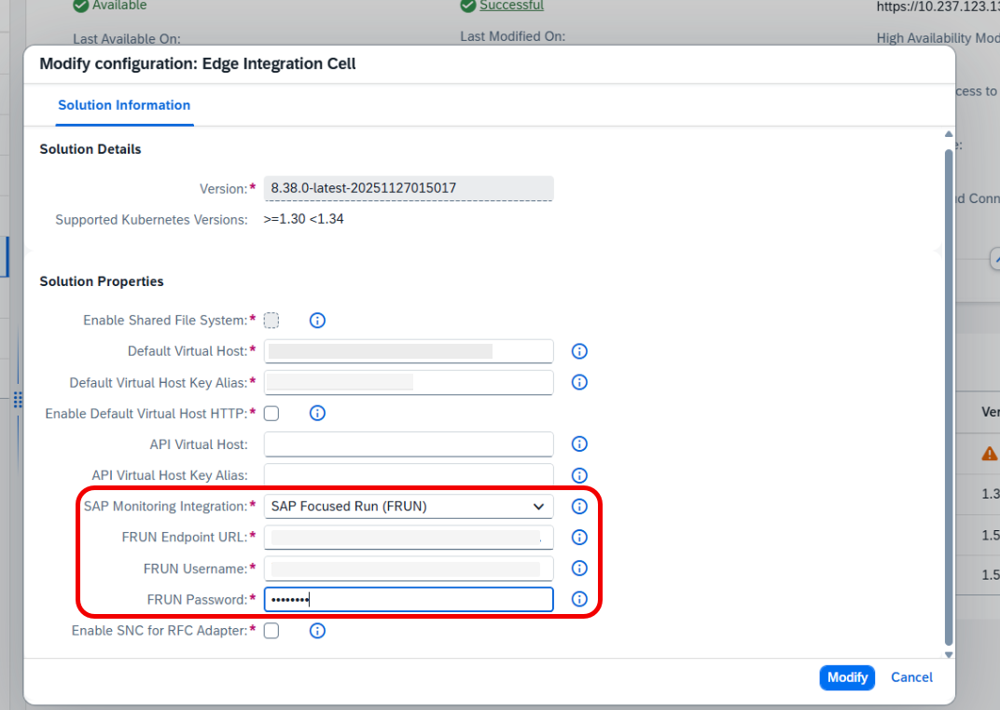
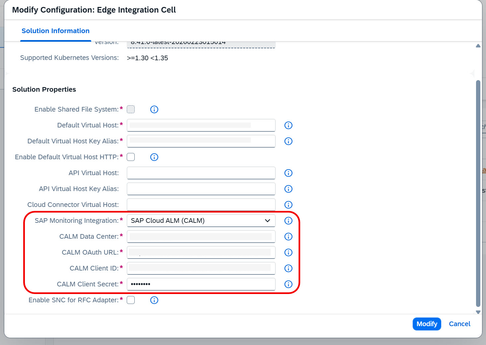

<!-- loio9c9b12f3f1904e50a43519cb3cc98dea -->

# Monitor Message Processing on SAP Focused Run and SAP Cloud ALM

Monitor message processing data using a push-based approach in SAP Focused Run and SAP Cloud ALM.

## Prerequisites

Complete these prerequisites to connect Edge Integration Cell to SAP Focused Run: [SAP Integration Suite \(Edge Integration Cell\)](https://support.sap.com/en/alm/sap-focused-run/expert-portal/frun-supported-products/frun-setup-eic.html).

Activate data collection for **Integration & Exception Monitoring** on SAP Cloud ALM. For more information, see [Configuration](https://help.sap.com/docs/cloud-alm/applicationhelp/configuring-integration-monitoring).

## Context

This document explains how to integrate SAP Focused Run and SAP Cloud ALM with the Edge Integration Cell runtime. This integration allows you to monitor the processing of messages by integration flows and API artifacts running on Edge Integration Cell.

You can transfer message processing log between your Edge Integration Cells and SAP Focused Run/SAP Cloud ALM systems, and monitor integrations on their respective UIs.

On SAP Focused Run the *Health Monitoring* and *Integration & Exception Monitoring* applications are supported for Edge Integration Cell. On SAP Cloud ALM, *Integration & Exception Monitoring*.

Edge Lifecycle Management collects data and transfers it to the SAP Focused Run/SAP Cloud ALM systems. Follow these steps to configure the connectivity parameters and push message processing data from Edge Integration Cell to SAP Focused Run and/or SAP Cloud ALM:

## Procedure

1.  Open the *Edge Lifecycle Management* user interface.

2.  Go to the *Edges Nodes* tab. Select the edge node where you want to update the solution properties.

3.  Select the Edge Integration Cell solution whose properties you want to update.

4.  From the *Operations* context menu, choose *Modify Configuration*.

5.  In the dialog box that opens, configure the necessary parameters.

    **SAP Focused Run**

    1.  The required fields for SAP Focused Run integration appear inside the red box in the following image:

        

    2.  For *SAP Monitoring Integration*, select *SAP Focused Run*.
    3.  Add the *FRUN Endpoint URL*.

        > ### Note:  
        > The URL uses the following format: https://<host\>:<port\>/sap/frun/ngdci.

    4.  Enter your FRUN credentials.
    5.  When you finish configuring the properties, choose **Modify**.

    **SAP Cloud ALM**

    1.  The required fields for SAP Cloud ALM integration appear inside the red box in the following image:

        

    2.  For *SAP Monitoring Integration*, select *SAP Cloud ALM \(CALM\)*.
    3.  Add the *CALM Data Center*. For more information, see [Supported Data Centers](https://help.sap.com/docs/cloud-alm/setup-administration/supported-data-centers).

        > ### Example:  
        > If your data center is named `cf-eu10`, enter only `eu10` in this field.

    4.  Add the *CALM OAuth URL*.

        > ### Note:  
        > This is the SAP Cloud ALM service key parameter URL followed by `/oauth/token`.

    5.  Enter your credentials. To learn how to access your service credentials, see [Managing Your Service Credentials](https://help.sap.com/docs/cloud-alm/setup-administration/service-key).
    6.  When you finish configuring the properties, choose **Modify**.

6.  The jobs run in the background and send MPL data to the SAP Focused Run or SAP Cloud ALM services. You can check the status of the jobs in *Job Management* in the Operations cockpit. See: [Job Management](job-management-4146fa5.md).

7.  When the job completes, the registration process finishes. The service registers as **SAP Edge Integration Cell** in the **Landscape Management** of **SAP Focused Run** or **SAP Cloud ALM**.

8.  Go to the respective *SAP Focused Run* or *SAP Cloud ALM* systems, and open the *Integration and Exception Monitoring* application.

9.  In the scope selection, add SAP Edge Integration Cell as the *Cloud Service Type*, and find your edge node in the services list.

## Results

After you configure the destination, the transfer of message processing logs automatically starts if the SAP Focused Run/SAP Cloud ALM system is reachable. You can now see an overview of the processed integration flows for your selected scope.

> ### Note:  
> The data transport can fail if the system can't find a unique tenant identifier for onboarding with SAP Cloud ALM or SAP Focused Run for the NEURONEDGE service type. If this issue occurs, onboarding on SAP Focused Run or SAP Cloud ALM wasn't successful. It could also mean that the credentials in EdgeLM aren't correct. If the identifier is already onboarded and you still see this error, report the issue to the SAP Cloud ALM or SAP Focused Run applications.

For more information about monitoring integrations on SAP Focused Run, see [SAP Integration Suite \(Edge Integration Cell\)](https://support.sap.com/en/alm/sap-focused-run/expert-portal/focused-run-advanced-integration-monitoring-cloud-services/frun-integration-eic.html).

For more information about monitoring integrations on SAP Cloud ALM, see [Integration & Exception Monitoring](https://help.sap.com/docs/cloud-alm/applicationhelp/integration-exception-monitoring?locale=en-US).

