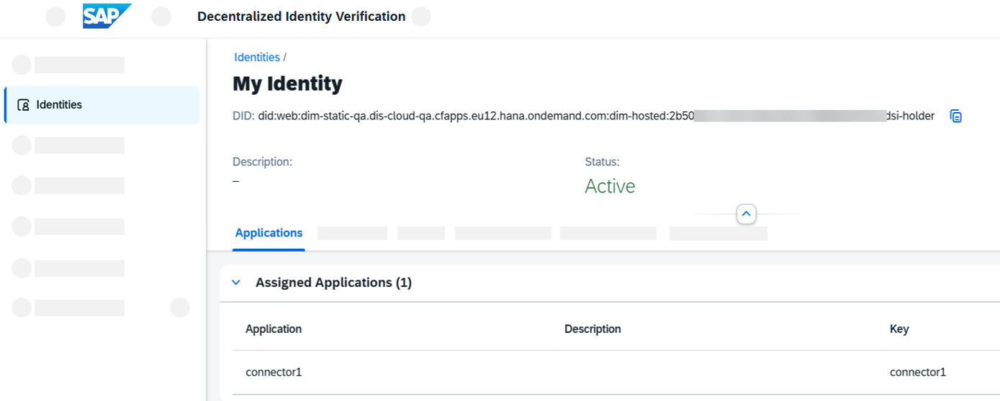

<!-- loioafb114e07bf1437992447806fc3442b4 -->

# Onboarding With a Wallet in Decentralized Identity Verification

You want to work with Data Space Integration and have decided to use a wallet located in Decentralized Identity Verification.


## Prerequisites

-   You've onboarded to SAP Integration Suite with a service plan that includes Data Space Integration and, by default, Decentralized Identity Verification.
-   Entitlements DSI
-   Your global account admin has added entitlements for Decentralized Identity Verification to your subaccount using the plan `integration-suite-bundle`. See [Configure Entitlements and Quotas for Subaccounts](https://help.sap.com/docs/btp/sap-business-technology-platform/configure-entitlements-and-quotas-for-subaccounts?version=Cloud#configure-entitlements-and-quotas-from-your-subaccount).
-   The role `Integration_Provisioner` is assigned to your user in SAP BTP cockpit. See [Configuring User Access to SAP Integration Suite](configuring-user-access-to-sap-integration-suite-2c6214a.md).
-   You've activated the Cloud Integration capability of SAP Integration Suite.
-   You've decided that you want to use Data Space Integration with your own wallet \("Bring Your Own Wallet"\).


## Context

If you want to work with Data Space Integration, you have to authenticate yourself during the onboarding. This way, all data space collaborators can be sure that they're only working with verified collaborators in a secure manner.

The verification happens using a wallet, which can have the following different sources:

-   **Bring Your Own Wallet \(BYOW\)**: You want to use a wallet hosted by a **third party**, or the SAP BTP service **Decentralized Identity Verification**, which you can use to manage your digital identities.
-   **Landscape**: Your wallet is hosted by the **company that operates your data space**, for example, Cofinity-X.

The following procedure describes how to set up and use your wallet located in Decentralized Identity Verification for onboarding to Data Space Integration. For the other use cases, follow the procedures described under [Initial Setup](initial-setup-b2bdea7.md).

> ### Note:  
> Parts of this procedure can take 24–48 hours to complete.


## Procedure

1.  Open **SAP Integration Suite** and do the following:

    1.  On the home page, choose *Manage Capabilities*.

        If you have not already activated Data Space Integration, continue with step 1b.

        If you have already activated Data Space Integration, continue with step 1c.

    2.  Choose *Add Capabilities*. In the wizard, select *Data Space Integration* and choose *Next*. in the second step, select *Enable Decentralized Identity Verification* to activate it as well, and finish the wizard.

    3.  Next to the section for Data Space Integration, choose *Edit*. A checkbox with the label *Decentralized Identity Verification* appears. Select it and choose *Save*.


2.  Go to your subaccount in the **SAP BTP cockpit** and do the following:

    1.  Go to *Security* \> *Users* and select your existing user.

    2.  Choose *Assign Role Collection* and select the following roles, based on your needs:

        -   **Data Space Integration**: To finish the connector setup, you need the role `DataspaceTechnicalAdmin`. You can check if other roles are relevant to you at [Configuring User Access to SAP Integration Suite](configuring-user-access-to-sap-integration-suite-2c6214a.md).
        -   **Decentralized Identity Verification**: To access your decentral ID \(DID\), select the role `DIV_Application_Administrator`. If you want to create additional identities in Decentralized Identity Verification, you also need the role `DIV_System_Administrator`.

    3.  Confirm your choices by choosing *Assign Role Collection*.

    4.  To ensure that the new authorizations are applied, log out of SAP BTP cockpit and SAP Integration Suite, then log in again.


3.  In your subaccount in the **SAP BTP cockpit**, create a custom role and service instances and key as described in [Preparing Cloud Integration](preparing-cloud-integration-07f81f2.md).

4.  Go back to **SAP Integration Suite** and do the following:

    1.  Start the onboarding to Data Space Integration by going to *Settings* \> *Data Spaces*. Fill in all information except for the offer management user and the section *Identity Wallet Management*. For instructions, see [Configuring Connector Setup Using the UI](configuring-connector-setup-using-the-ui-4909d3f.md).

    2.  In the section *Identity Wallet Management*, select *Decentralized Identity Verification* from the drop-down list of wallet sources. The *Admin URL*, which is specific to your tenant, appears.

    3.  To go to the Decentralized Identity Verification application, open the *Admin URL*.


5.  In the **Decentralized Identity Verification** application, go to *Admin Dashboard* \> *Identities*. Here, you can find an automatically created entry called `My Identity`. Open it and copy the decentral ID \(**DID**\) you find there.

    The following graphic shows the user interface of the application:

    

6.  In **Cofinity-X**, do the following:

    1.  Start your registration.

    2.  During the registration, you're asked to provide your DID, which you just retrieved in the Decentralized Identity Verification application.

        Cofinity-X uses this DID to push your verifiable credentials into your wallet in Decentralized Identity Verification. **This process can take 24–48 hours**. To find out whether your wallet is ready to be used, check either the Cofinity-X portal or your wallet to confirm that you see your verifiable credentials. Only then is your wallet ready.

    3.  Finish by creating an offer management user. See [Creating Technical Users in Landscape Portal](creating-technical-users-in-landscape-portal-b95f0ef.md). Have the details of that user ready for the next steps.


7.  In your subaccount in the **SAP BTP cockpit**, do the following:

    1.  Go to *Services* \> *Instances and Subscriptions* and choose *Create* to create a new service instance.

    2.  For the new service instance, select or enter the following details:

        -   *Service*: `Decentralized Identity Verification`
        -   *Plan*: `integration-suite-bundle`
        -   Enter an *instance name*.

        Choose *Next*.

    3.  In the *Parameters* step, enter the following JSON. If you created other applications and/or identities, replace `connector1` with the name of the application you assigned to your identity.

        ```
        {
          "applicationAccess": ["connector1"],
          "xs-security": {
            "authorities": ["$XSMASTERAPPNAME.ReadApplication", "$XSMASTERAPPNAME.ReadVerifiableCredential", "$XSMASTERAPPNAME.ReadCompanyIdentity", "$XSMASTERAPPNAME.ResolveDID", "$XSMASTERAPPNAME.VerifiablePresentation"]
          }
        }
        ```

    4.  Choose *Create*.

    5.  Wait for the creation to finish, then create a key as described in [Creating Service Key](https://help.sap.com/docs/cloud-integration/sap-cloud-integration/creating-service-instance-and-service-key-for-inbound-authentication#creating-service-key). Copy its JSON to use in the next step.


8.  Finally, go back to **SAP Integration Suite** and return to *Settings* \> *Data Spaces*, where you paused in the *Identity Wallet Management* section.

    You don't need to enter your DID. It's retrieved automatically once Data Space Integration has verified your wallet.

    > ### Caution:  
    > Before you can complete the onboarding, **your wallet must be ready to use**. That means your verifiable credentials have been procured, which takes Cofinity-X 24-48 hours to do. Please check your wallet or the Cofinity-X portal and make sure that your wallet is ready before continuing, or your onboarding fails.

    1.  Under *Offer Management User*, paste the details from the offer management user you created in Cofinity-X.

    2.  Choose *Paste Service Key* and paste the service key of the instance you created in the previous step.

    3.  Save the changes that you made in the tab *Connect to a Data Space*.

        If saving fails, Cofinity-X probably hasn’t finished pushing your verifiable credentials to your wallet yet, so Data Space Integration couldn’t check them with your business partner number. Your changes were saved though, except for any passwords or credentials. Check your wallet or the Cofinity-X portal and wait for your verifiable credentials to be available, then try again here. You'll have to enter the credentials from both the service key and the offer management user again, and save again.


9.  Continue the onboarding as described in step 2 of [Configuring Connector Setup Using the UI](configuring-connector-setup-using-the-ui-4909d3f.md).


## Results

You've onboarded to Data Space Integration using a wallet hosted in Decentralized Identity Verification. You can now use Data Space Integration.

