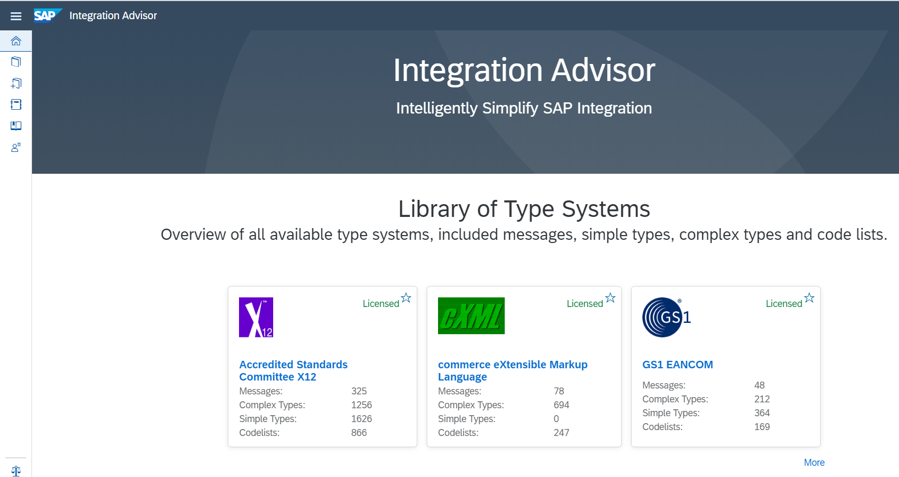
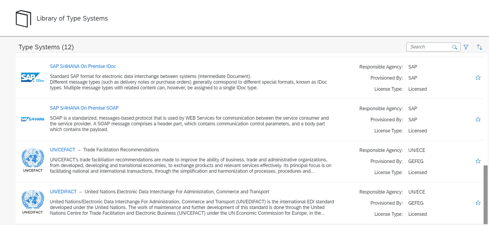

<!-- loiof99fdafcb4d245df984c8fa541d3bd54 -->

# Overview of SAP Integration Advisor

Get an overview of SAP Integration Advisor and its components.

SAP Integration Advisor is a cloud application that simplifies and streamlines the implementation flow of your B2B/A2A and B2G integration process. The crowd-based machine learning approach helps you create integration content easily. Tests indicate that you can speed up the content creation to deployment process by almost 60% using SAP Integration Advisor. You can also manage and share your content, and leverage the content shared by other users of the application with similar business needs.

This is the landing page of the application:

The Application consists of the following sections:

<a name="loiof99fdafcb4d245df984c8fa541d3bd54__section_vxk_xsl_5mb"/>

## Type System Overview

The library of type systems is a collection of message templates that are provided by agencies that maintain the B2B/A2A/B2G standards. Each of the type system is developed and maintained by the agency that owns it. For example, the type system SAP IDoc is developed and maintained by SAP SE. Similarly, the type system ASC X12 is maintained by ANSI ASC X12. This is a good starting point for implementing your B2B integration provided if you and your business partners are using these industry standards for your business messages.

To know more, see [Library of Type Systems](50-Development/library-of-type-systems-740136b.md)

<a name="loiof99fdafcb4d245df984c8fa541d3bd54__section_h3n_s5l_5mb"/>

## Custom Type Systems

The library of custom type systems allows you to upload custom messages – this enables you to create MIGs and MAGs based on your own message structures. Use cases for this could be proprietary messages, standard messages extended by you and messages from B2B standards not available in the SAP Integration Advisor. With this feature, you can:

-   Upload custom interface xsd files

-   Create MIG and MAG
-   Customize your MIG
-   View the list of your custom messages

To know more, see [Custom Type Systems](50-Development/custom-type-systems-884bb25.md)

<a name="loiof99fdafcb4d245df984c8fa541d3bd54__section_uwx_vwl_5mb"/>

## Message Implementation Guidelines

Message implementation guideline, also referred to as MIG, is used as the source or target in a mapping guideline \(MAG\) of SAP Integration Advisor. This is created using one of the messages in the type system that is relevant to your scenario as the template.

The MIG contains all the information for implementing a customized message interface. SAP Integration Advisor uses the message in a type system as a starting point to ensure that you don't have to refer to any additional documents to implement the interface. By providing a MIG, you ensure that all users who are involved in the process of implementing the interface have a clear understanding of the guidelines.

Here are the next steps for you:

-   [Creating a New Message Implementation Guideline](50-Development/creating-a-new-message-implementation-guideline-b894de0.md)

-   [Working with a Message Implementation Guideline](50-Development/working-with-a-message-implementation-guideline-9d1c1df.md)

<a name="loiof99fdafcb4d245df984c8fa541d3bd54__section_ms5_nbm_5mb"/>

## Mapping Guidelines

A mapping guideline is the runtime artifact that you use in the mapping step of an integration application like SAP Cloud Integration. This is used as a reference or guidance for implementing mapping in the integration application. By providing such an artifact, you simplify the mapping task for users who use messages that adhere to the A2A/B2B type system standards.

A Mapping Guideline \(MAG\) is based on a source and a target message implementation guideline. It demonstrates how the defined nodes at each side are mapped, describing all mapping elements in detail with definitions or notes and providing further instructions for the transformation, such as functions or code value mappings.

Here are the next steps for you:

-   [Creating a New Mapping Guideline](50-Development/creating-a-new-mapping-guideline-a42920e.md)

-   [Working with a Mapping Guideline \(MAG\)](50-Development/working-with-a-mapping-guideline-mag-0803ca6.md)

**Related Information**  

[Blog: Integration Advisor - Overview of components for building B2B integration content and further reading](https://blogs.sap.com/2021/09/28/integration-advisor-overview-of-components-for-building-b2b-integration-content-and-further-reading/)

