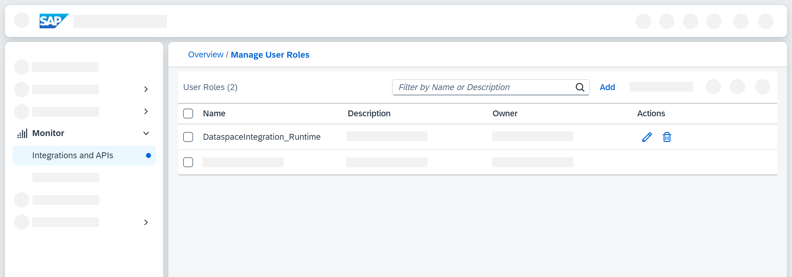
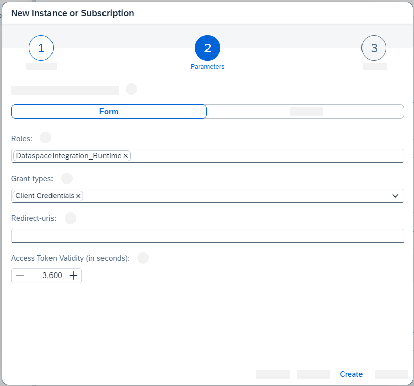

<!-- loio07f81f2b6c3742ae8880016911cdc757 -->

# Preparing Cloud Integration

Data Space Integration interacts with Cloud Integration, so you must perform a few preparatory steps before you can get started with Data Space Integration.

<a name="loio07f81f2b6c3742ae8880016911cdc757__prereq_qxw_vf2_2yb"/>

## Prerequisites

-   You've completed the steps described in [Preparatory Steps](preparatory-steps-95366b2.md) where you activate SAP Integration Suite and the Cloud Integration capability.

-   You've completed the steps described in [Activating the Capability](activating-the-capability-b49ad35.md) where you add Data Space Integration to your list of active capabilities of SAP Integration Suite.

-   You've completed the steps described in [Configuring User Access](configuring-user-access-6ae0ff7.md) where you define user roles for Data Space Integration.

> ### Caution:  
> If there are **[access policies](https://help.sap.com/docs/integration-suite/sap-integration-suite/access-policies) in your Cloud Integration tenant**, the onboarding of Data Space Integration can run into issues.
> 
> Therefore, before you proceed, check if your Cloud Integration tenant uses any access policies that would block activities for the artifacts of Data Space Integration. All Data Space Integration artifacts start with `com.sap.integration.dsi`. If it does, you must modify your regular expression to add an exception for Data Space Integration as follows:
> 
> 1.  In the SAP Integration Suite, go to *Monitor* \> *Integrations and APIs*. Choose the *Access Policies* tile.
> 
> 2.  Select the relevant access policy to open its references. Choose *Edit* the reference that would block the onboarding of Data Space Integration.
> 
> 3.  For example, you have an existing access policy with the regular expression `^.*`, which protects all integration flows.
> 
>     To exclude all items coming from Data Space Integration, modify the relevant condition in the reference as follows:
> 
>     -   Type: *Integration Flow*
> 
>     -   Attribute: *ID*
> 
>     -   Condition: *Matches*
> 
>     -   Expression: `^(?!.*(com.sap.integration.dsi))`
> 
> 
> 4.  Choose *Create*.
> 
>     You've now created an exception for all integration flows and script collections of Data Space Integration. The policy now affects all integration flows except the ones with the namespace of Data Space Integration.

<a name="loio07f81f2b6c3742ae8880016911cdc757__context_pkk_4zg_kyb"/>

## Context

Data Space Integration relies on Cloud Integration and thus Cloud Foundry for data plane functionality. That’s why you need to create two Cloud Integration service keys in the SAP BTP cockpit. You'll need them in a later step when you onboard Data Space Integration.

> ### Note:  
> The process of how to create a service instance, and service keys in general, is described in [Creating Service Instance and Service Key for Inbound Authentication](https://help.sap.com/docs/cloud-integration/sap-cloud-integration/creating-service-instance-and-service-key-for-inbound-authentication?version=Cloud&locale=en-US&q=service%20keys).

<a name="loio07f81f2b6c3742ae8880016911cdc757__steps_y1x_nzg_kyb"/>

## Procedure

1.  Make sure to assign the role collection `PI_Administrator` to your user in the SAP BTP cockpit so you have the rights to work with Cloud Integration.

2.  To create the required service keys, you first need to create a role called `DataspaceIntegration_Runtime`. Navigate from the cockpit to SAP Integration Suite, and go to *Monitor* \> *Integrations and APIs* \> *User Roles*.

3.  Choose *Add* and provide the following details for the new user role:

    <table>
    <tr>
    <th valign="top">

    Parameter
    
    </th>
    <th valign="top">

    Value
    
    </th>
    </tr>
    <tr>
    <td valign="top">
    
    *Role Name*
    
    </td>
    <td valign="top">
    
    `DataspaceIntegration_Runtime`
    
    </td>
    </tr>
    <tr>
    <td valign="top">
    
    *Description*
    
    </td>
    <td valign="top">
    
    Enter a description, for instance, that this role is for Data Space Integration.
    
    </td>
    </tr>
    </table>
    
    Choose *Add*.

    

4.  Proceed to creating Cloud Integration service keys. In SAP BTP cockpit, go to *Services* \> *Service Marketplace* and select *Process Integration Runtime.* For more information, and a detailed description on how to create service instances, see [Creating Service Instance and Service Key for Inbound Authentication](https://help.sap.com/docs/cloud-integration/sap-cloud-integration/creating-service-instance-and-service-key-for-inbound-authentication).

5.  Choose *Create*.

6.  Select the `api` plan.

    > ### Note:  
    > If you can't select this plan, check that the correct entitlements are assigned to your subaccount in the SAP BTP cockpit as described in [Preparatory Steps](preparatory-steps-95366b2.md).

7.  In the next step, specify the following parameters:

    <table>
    <tr>
    <th valign="top">

    Parameter
    
    </th>
    <th valign="top">

    Value
    
    </th>
    </tr>
    <tr>
    <td valign="top">
    
    *Roles*
    
    </td>
    <td valign="top">
    
    `AuthGroup_IntegrationDeveloper` 
    
    </td>
    </tr>
    <tr>
    <td valign="top">
    
    *Grant Type*
    
    </td>
    <td valign="top">
    
    `Client Credentials` 
    
    </td>
    </tr>
    </table>
    
    Choose *Next*, then *Create*.

8.  Create a service key for this service instance as described in [Creating Service Key](https://help.sap.com/docs/cloud-integration/sap-cloud-integration/creating-service-instance-and-service-key-for-inbound-authentication#creating-service-key).

9.  Now, you can proceed by creating the second service instance with the `integration-flow` plan.

    In the second step, remove the predefined role *ESBMessaging.send*, and instead specify the following parameters:

    <table>
    <tr>
    <th valign="top">

    Parameter
    
    </th>
    <th valign="top">

    Value
    
    </th>
    </tr>
    <tr>
    <td valign="top">
    
    *Roles*
    
    </td>
    <td valign="top">
    
    `DataspaceIntegration_Runtime`
    
    </td>
    </tr>
    <tr>
    <td valign="top">
    
    *Grant Type*
    
    </td>
    <td valign="top">
    
    `Client Credentials` 
    
    </td>
    </tr>
    </table>
    
    

    Choose *Next*, then *Create*.

10. Create a service key for this service instance as described in [Creating Service Instance and Service Key for Inbound Authentication](https://help.sap.com/docs/cloud-integration/sap-cloud-integration/creating-service-instance-and-service-key-for-inbound-authentication?version=Cloud&locale=en-US&q=service%20keys).

<a name="loio07f81f2b6c3742ae8880016911cdc757__result_otm_glc_kcc"/>

## Results

You've created two Cloud Integration service keys and a new role `DataspaceIntegration_Runtime`.

<a name="loio07f81f2b6c3742ae8880016911cdc757__postreq_dvq_3h2_2yb"/>

## Next Steps

Now that you've prepared Cloud Integration for your work with Data Space Integration, you can continue with [Creating Technical Users in Landscape Portal](creating-technical-users-in-landscape-portal-b95f0ef.md).

