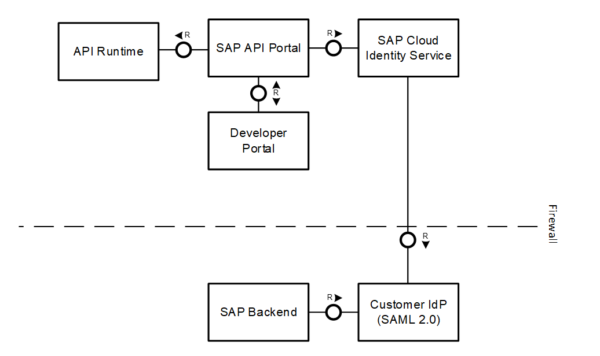

<!-- loio1e88d9cb4e90466cb0ab2c53e33b2e1c -->

# Setting Up API Management with SAP Cloud Identity Services

SAP Cloud Platform allows customers to connect their SAP Cloud Identity Services with the BTP offerings.

SAP Cloud Identity \(SCI\) service supports SAML 2.0 for identity federations. Using SAML, it can federate and connect with any Custom IDP that supports SAML 2.0.

The high-level view for SAP API Management and the SAP Cloud Identity is captured in the diagram below:

**Related Information**  

[Configuring Additional Virtual Host in Cloud Foundry Environment](configuring-additional-virtual-host-in-cloud-foundry-environment-a7b91e5.md "A virtual host allows you to host multiple domain names on the API Management capability within SAP Integration Suite.")

[Region-Specific IP Addresses Available for API Management Cloud Foundry Environment](region-specific-ip-addresses-available-for-api-management-cloud-foundry-environment-683a97c.md "API Management protects your backend services. However, API Management needs to establish connectivity to your backend services during an API call execution.")

[Shadow Users](shadow-users-a0f5fe5.md "Whenever a user authenticates at an application in your subaccount using any identity provider, it’s essential that user-related data provided by the identity provider is stored in the form of shadow users.")

[Cancel API Management Service Subscription](cancel-api-management-service-subscription-df6df2b.md "You can deactivate your API Management capability from SAP Integration Suite to disable your account from the API Management service.")

