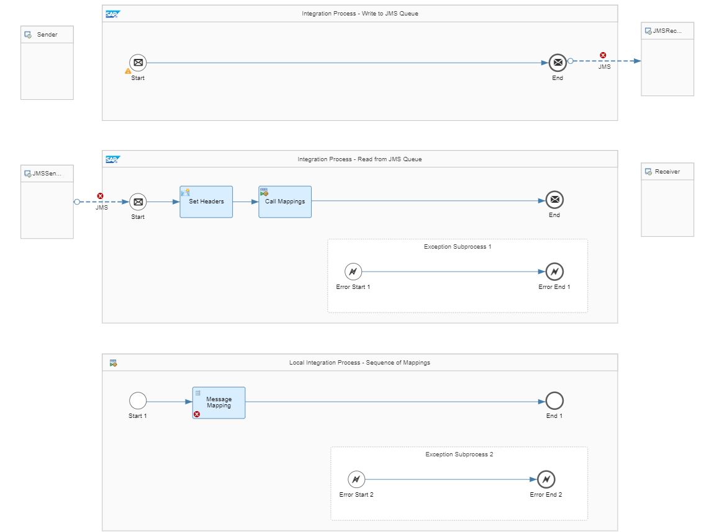

<!-- loioad867aea1fc749a99abc2cf643c94038 -->

# Supported Patterns

Learn about the patterns that are available in the migration tooling.

With the move from template-based approach to pattern-based approach, the migration tooling where all the flow steps are generated dynamically, which in turn, covers more integration objects for migration. In the template-based approach, there were 30+ templates that were supported which is simplified now to three patterns. While there are only three patterns, these patterns cover not only the 30+ templates but also much more scenarios that were not covered earlier. In summary, the patterns are elastic and can dynamically add flow steps to the migrated integration flow based on the steps used in the integration object.

> ### Note:  
> With the move from template-based approach to pattern-based approach, there are no regressions caused to the previously migrated integration objects using the old templates.

<a name="loio270776550dc34dbe97cb95403810f93f"/>

<!-- loio270776550dc34dbe97cb95403810f93f -->

## Point-to-Point Asynchronous

**Point-to-Point asynchronous interface between 1 sender and 1 receiver decoupled using two integration processes** is the basic version available within the Point-to-Point Asynchronous pattern. By default, the option to decouple the sender and receiver adapters is enabled. For more information, see [Decoupling via JMS Queue](50-Development/decoupling-via-jms-queue-ecbde19.md).

Either by having more components in your source integration object or by choosing the options available in the Migration Tooling, you can have different versions of the Point-to-Point Asynchronous pattern.

For example:

-   If your source integration object contains at least one message mapping object, the pattern becomes **Point-to-Point asynchronous interface between 1 sender and 1 receiver with 1 message mapping decoupled using two integration processes**.

-   If your source integration object contains at least one message mapping object, you enable the option to decouple the sender and receiver adapters, and you also enable the option to let the receiver adapter ignore duplicate messages, the pattern becomes **Point-to-Point asynchronous interface between 1 sender and 1 receiver with 1 message mapping and and 1 idempotent process decoupled using two integration processes**.

<a name="loioab015e027d85473f81e4323e370ac0a1"/>

<!-- loioab015e027d85473f81e4323e370ac0a1 -->

## Point-to-Point Synchronous

**Point-to-Point synchronous interface between 1 sender and 1 receiver** is the basic version available within the Point-to-Point Synchronous pattern.

By having more components in your source integration object, you can have different versions of the Point-to-Point Synchronous pattern.

For example:

-   If your source integration object contains message mapping objects for response and requests, the pattern becomes **Point-to-Point synchronous interface between 1 sender and 1 receiver with message mappings for request and response**.

-   If your source integration object contains XSLT mapping objects for response and requests, the pattern becomes **Point-to-Point synchronous interface between 1 sender and 1 receiver with XSLT mappings for request and response**.

<a name="loiob5d43f624696473b93b812cdc36277ad"/>

<!-- loiob5d43f624696473b93b812cdc36277ad -->

## Recipient List Asynchronous

Recipient List Asynchronous pattern is used to migrate multi-casted integration pattern between a sender and multiple receiver systems via multiple routes. Based on the scenario, the migration tooling applies the Recipient List Asynchronous pattern and dynamically adds the flow steps. The pattern implements JMS queues to store the message after it is received from the sender and decouple the sender and the multiple receivers.

SAP recommends using this pattern for conditions based scenarios where you know that more than one condition can be true at runtime. That is, multiple receivers receives the message or payload based on the conditions.

<a name="loio3d95082f12ad4020b2157bf8e1e88254"/>

<!-- loio3d95082f12ad4020b2157bf8e1e88254 -->

## Content-Based Routing

Content-Based Routing pattern is used to migrate condition-based integration scenarios where messages are routed to a single receiver. Based on the scenario, the migration tooling applies the Content-Based Routing pattern and dynamically adds the flow steps.

SAP recommends using this pattern for conditions based scenarios where you know that only one of the conditions can be true at runtime. That is, only one receiver receives the message or payload.

