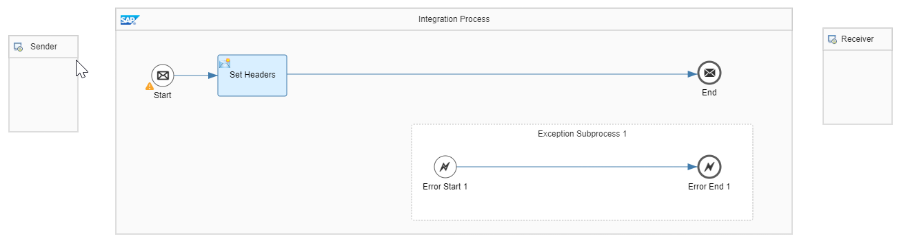

<!-- loioad867aea1fc749a99abc2cf643c94038 -->

# Supported Patterns

Learn about the patterns that are available in the migration tooling.

<a name="loio270776550dc34dbe97cb95403810f93f"/>

<!-- loio270776550dc34dbe97cb95403810f93f -->

## Point-to-Point Asynchronous

**Point-to-Point asynchronous interface between 1 sender and 1 receiver** is the basic version available within the Point-to-Point Asynchronous pattern.

Either by having more components in your source ICO or by choosing the options available in the Migration Tooling, you can have different versions of the Point-to-Point Asynchronous pattern.

For example:

-   If your source ICO contains at least one message mapping object, the pattern becomes **Point-to-Point asynchronous interface between 1 sender and 1 receiver with 1 message mapping**.

-   If you enable the option to decouple the sender and receiver adapters, the pattern becomes **Point-to-Point asynchronous interface between 1 sender and 1 receiver decoupled using two integration processes**.

-   If your source ICO contains at least one message mapping object, you enable the option to decouple the sender and receiver adapters, and you also enable the option to let the receiver adapter ignore duplicate messages, the pattern becomes **Point-to-Point asynchronous interface between 1 sender and 1 receiver with 1 message mapping and and 1 idempotent process decoupled using two integration processes**.

<a name="loioab015e027d85473f81e4323e370ac0a1"/>

<!-- loioab015e027d85473f81e4323e370ac0a1 -->

## Point-to-Point Synchronous

**Point-to-Point synchronous interface between 1 sender and 1 receiver** is the basic version available within the Point-to-Point Synchronous pattern.

By having more components in your source ICO, you can have different versions of the Point-to-Point Synchronous pattern.

For example:

-   If your source ICO contains message mapping objects for response and requests, the pattern becomes **Point-to-Point asynchronous interface between 1 sender and 1 receiver with message mappings for request and response**.

-   If your source ICO contains XSLT mapping objects for response and requests, the pattern becomes **Point-to-Point asynchronous interface between 1 sender and 1 receiver with XSLT mappings for request and response**.

<a name="loiob5d43f624696473b93b812cdc36277ad"/>

<!-- loiob5d43f624696473b93b812cdc36277ad -->

## Recipient List Asynchronous

