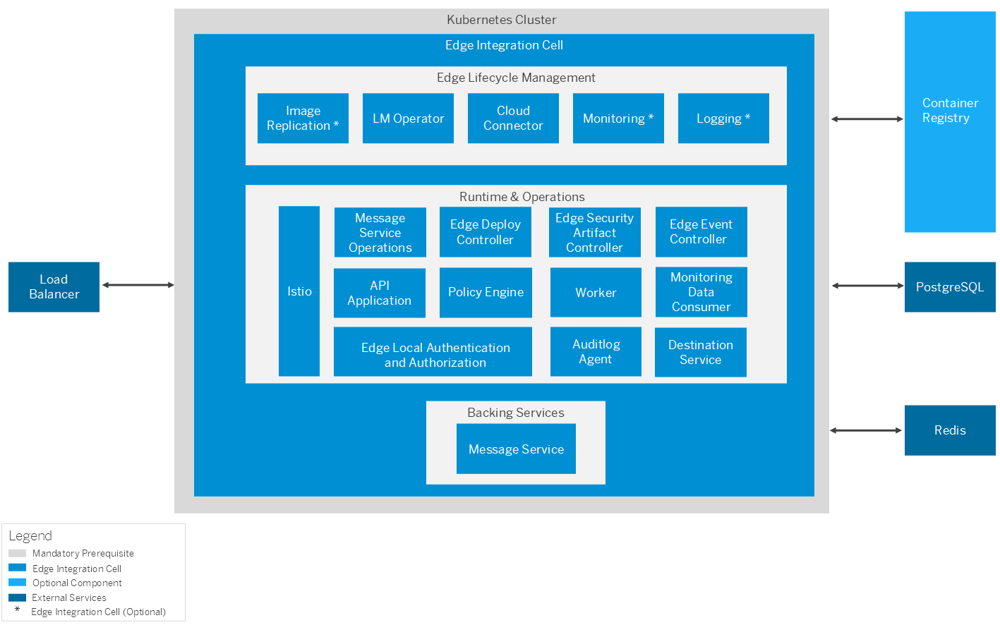

<!-- loiof60efc1363f04d17bb324d7e5f203ee9 -->

# Technical Landscape \(Edge Integration Cell\)

Get to know the system landscape and the components of Edge Integration Cell.

<a name="loiof60efc1363f04d17bb324d7e5f203ee9__section_yll_fny_z5b"/>

## System Landscape

<a name="loiof60efc1363f04d17bb324d7e5f203ee9__section_gg1_mny_z5b"/>

## Components

Edge Integration Cell runs on compute clusters managed by Kubernetes and consists of the following components:

<dl>
<dt><b>

Edge Lifecycle Management

</b></dt>
<dd>

Edge Lifecycle Management \(Edge LM\) is used as the foundation for software lifecycle management. It provides a shipment channel for SAP Business Technology Platform-based products to deliver and manage containerized workloads to on-premise or edge computing sites. It offers a convenient way to standardize the entire SAP Software Lifecycle for usage on the edge: Initial setup, onboarding, deployment, continuous lifecycle management operations, monitoring and logging – all via centrally offered tooling using modern software architecture and industry standards \(such as containers and K8s\) in an SAP environment.

</dd>
<dd>

Software shipment is based on the SAP Repository-Based Shipment Channel \(RBSC\). Edge LM also supports container image replication to a local container registry for offline consumption. Edge Integration Cell will be defined as an Edge LM solution with the different components based on Helm charts.

> ### Note:  
> Edge Integration Celll delivery consists of images retrieved from SAP Repository-Based Shipment Channel \(RBSC\), deployed using Edge LM. The images for Edge LM are also contained in the same repository.

</dd>
<dd>

Additionally, Edge LM offers an optional monitoring and logging stack to allow central system monitoring. This requires single sign-on using an Identity Authentication Service \(IAS\) tenant.

</dd>
<dd>

****

<table>
<tr>
<th valign="top">

Component

</th>
<th valign="top">

Description

</th>
</tr>
<tr>
<td valign="top">

Image Replication Service

</td>
<td valign="top">

Used to mirror container images from RBSC to a local Container Registry \(optional\).

</td>
</tr>
<tr>
<td valign="top">

LM Operator

</td>
<td valign="top">

Handles the lifecycle of solutions represented as K8s custom resources following the K8s operator pattern.

</td>
</tr>
<tr>
<td valign="top">

Cloud Connector

</td>
<td valign="top">

Establishes a secure tunnel between cloud and edge environments.

</td>
</tr>
<tr>
<td valign="top">

Monitoring

</td>
<td valign="top">

\(Based on Prometheus\) Pushes system monitoring data to the cloud \(optional\).

</td>
</tr>
<tr>
<td valign="top">

Logging

</td>
<td valign="top">

\(Based on Fluentd\) Pushes logging data to the cloud \(optional\).

</td>
</tr>
</table>

</dd><dt><b>

Runtime and Operations

</b></dt>
<dd>

In addition to runtime components for executing integration scenarios and API proxies, Edge Integration Cell also includes management components for edge operations.

Components require connectivity to certain SAP Integration Suite and SAP Business Technology Platform services. Service keys are used to share the connectivity information with Edge Integration Cell components. For security reason, these service keys also need to be rotated as part of the software upgrade. Depending on the service type, keys have different validity timelines.

Edge Deploy Controller accesses the platform’s object store where credentials have a validity of 86 days. In general, service keys need to be rotated after 120 days. Key rotation is integrated in Edge Integration Cell lifecycle operations.

> ### Caution:  
> If service key rotation is not performed then connectivity to the respective Cloud services stops working. This will impact functionality like content synchronization or specific runtime features.

Edge Local Authentication and Authorization provides inbound local authentication and authorization for Integration Flows and API proxies. It removes the real-time dependency on SAP Business Technology Platform for inbound authentication and authorization. Currently only service keys of type Certificate/External Certificate are supported for local authentication and authorization. For more information, see [Edge Local Authentication and Authorization](edge-local-authentication-and-authorization-510d447.md).

</dd>
<dd>

****

<table>
<tr>
<th valign="top">

Component

</th>
<th valign="top">

Description

</th>
</tr>
<tr>
<td valign="top">

Istio

</td>
<td valign="top">

A service mesh that manages secure traffic flows between services.

</td>
</tr>
<tr>
<td valign="top">

Edge Deploy Controller

</td>
<td valign="top">

Handles the content lifecycle.

</td>
</tr>
<tr>
<td valign="top">

Edge Security Artifact Controller

</td>
<td valign="top">

Manages security material on the edge.

</td>
</tr>
<tr>
<td valign="top">

Edge Local Authentication and Authorization

</td>
<td valign="top">

Performs inbound local authentication and authorization for integration flow models and API proxies.

</td>
</tr>
<tr>
<td valign="top">

Edge Event Controller

</td>
<td valign="top">

Distributes system internal events on the edge.

</td>
</tr>
<tr>
<td valign="top">

API Application

</td>
<td valign="top">

Provides APIs for monitoring and operations.

</td>
</tr>
<tr>
<td valign="top">

Policy Engine

</td>
<td valign="top">

Enforces policies like security or traffic management on API proxies.

</td>
</tr>
<tr>
<td valign="top">

Worker

</td>
<td valign="top">

Executes integration flow models and services.

</td>
</tr>
<tr>
<td valign="top">

Message Service Operations

</td>
<td valign="top">

Manages the local Message Service.

</td>
</tr>
<tr>
<td valign="top">

Monitoring Data Consumer

</td>
<td valign="top">

Processes and stores monitoring events.

</td>
</tr>
</table>

</dd><dt><b>

Backing Services

</b></dt>
<dd>

Edge Integration Cell includes a Message Service \(Solace Broker\) for asynchronous messages and system internal events.

</dd>
</dl>

****

<table>
<tr>
<th valign="top">

Component

</th>
<th valign="top">

Description

</th>
</tr>
<tr>
<td valign="top">

Message Service

</td>
<td valign="top">

Used for asynchronous messaging and system internal event integration.

</td>
</tr>
</table>

Edge Integration Cell requires external services for managing persistence and policies.A Load Balancer is required to expose Edge Integration Cell endpoints and load balance traffic across K8s nodes and services.

****

<table>
<tr>
<th valign="top">

Component

</th>
<th valign="top">

Description

</th>
</tr>
<tr>
<td valign="top">

PostgreSQL

</td>
<td valign="top">

A relational database system.

</td>
</tr>
<tr>
<td valign="top">

Redis

</td>
<td valign="top">

An in-memory data store used for caching.

</td>
</tr>
<tr>
<td valign="top">

Load Balancer

</td>
<td valign="top">

External Load Balancer integrated with K8s infrastructure.

</td>
</tr>
</table>

> ### Note:  
> For test and development environments, PostgreSQL and Redis services can be deployed as built-in Edge Integration Cell components.

