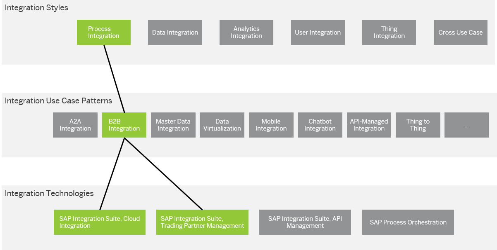

<!-- loioa50d8d6eb5ee435ea68fe89da157e347 -->

# Technology Mapping

Map the selected set of integration domains, integration styles, and use case patterns \(technology-agnostic\) to the best suitable integration technologies.

> ### Example:  
> You have identified the following set of requirements for your integration strategy:
> 
> -   Integration domain: Cloud to cloud
> 
> -   Integration styles: Process integration
> 
> -   Use case patterns: A2A integration, B2B integration
> 
> 
> One integration technology that can be mapped from these requirements is SAP Integration Suite, Cloud Integration.
> 
> A recommended integration technology for the *Connectors* key characteristic is SAP Integration Suite, Cloud Integration. The reason is that this technology comes with a set of predefined connectors \(adapters\) that allow you to set up connectivity with various types of technical systems.

