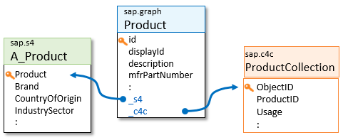

<!-- loiob6318bf4cb5f42149470361d70a63a48 -->

# Custom Entities

Custom entities are created by a skilled customer modeler to extend the business data graph, by designing and adding their own projections as a collection of attribute mappings from available SAP and non-SAP data source entities.

The modeler can submit a set of custom entity definition files, developed with a text editor of their choice.

The ability to extend the business data graph with custom entities is a powerful capability – customers can essentially design their own corporate data model. Here are some of the advantages:

<a name="loiob6318bf4cb5f42149470361d70a63a48__section_fd1_lpy_gvb"/>

## Use the Same Protocols

By mediating your data sources as a data graph, developers enjoy the use of a single data endpoint, a simplification of access and security, and the consistent use of the same query language and protocol. Investments in client-side SDKs, frameworks, and data access abstractions apply to all of the data sources.

<a name="loiob6318bf4cb5f42149470361d70a63a48__section_py3_mpy_gvb"/>

## Create Your Own API Shape

From simple renaming, to more powerful transformations, custom entities allow you to control how the data is perceived by app developers. You can:

-   Replace an existing entity with one that is simpler to understand, by filtering out unnecessary or undesired attributes.

-   Rename entities and attributes to match a consistent corporate or SAP data naming convention.

-   Design your interface to precisely match the API expectations of application developers, or of existing applications.

<a name="loiob6318bf4cb5f42149470361d70a63a48__section_dz1_vpy_gvb"/>

## Hide Landscape Inconsistencies

Hide incompatibilities between data-source variations or versions as an abstraction. This is useful while preparing for major system upgrades or migrations involving API incompatibilities. Custom entities can hide such API changes, providing you with more control over how to implement the migration, while not breaking dependent applications.

<a name="loiob6318bf4cb5f42149470361d70a63a48__section_vy2_xpy_gvb"/>

## Add or Change Semantics

-   Replace a hard-to-understand normalized data representation \(often representing the way that the data is stored\) into a denormalized view that is easier to consume by client applications.

-   Connect separate entities \(with string-type foreign keys\) into a navigable graph of entities, by introducing associations and compositions into the graph.

-   Turn associations into compositions \(to many\) or a structured type \(of one\), making the semantics of the relationship more obvious to understand for consumers.

-   Combine attributes from separate source entities into one virtual, composed entity. Combine data attributes into compositions that hide underlying implementation technicalities. A common example is a side-car extension, such as a CAP-created application that extends an SAP S/4HANA data model, such as a `BusinessPartner`. Using custom entities, you can present a new natural entity with attributes from both.

    > ### Note:  
    > Certain restrictions apply, such as the inability to guarantee atomic data modification, when writing back to two separate data sources.

<a name="loiob6318bf4cb5f42149470361d70a63a48__section_agn_hqy_gvb"/>

## Introduce More Control and Security

In many cases, IT administrators can use API Composition to avoid the need to create data copies, replications, and complex ETLs \(Extract Transform Load\) to serve the need for simpler data APIs for certain application developers and use cases. Administrators can do the following:

-   Secure their data, by only exposing data that is safe to use.

-   Using a data-filter, custom entities can be used to systematically access only a subset of data.

-   Projections can support finer-grain authorization: a custom entity can be read-only, for example, while the underlying entities are not.

<a name="loiob6318bf4cb5f42149470361d70a63a48__section_f1c_t35_l2c"/>

## SAP-Provided Example: Unified Entities

Certain business objects \(primarily master data, such as customer or product descriptions\) are commonly replicated in multiple SAP systems, sometimes under different names. What one system calls `Product`, another may refer to as `ProductCollection`, `Material`, or even `supplierPart`. They all represent the same product object instance, with common attributes like its name and description, but then each SAP system manages additional, system-specific aspects: SAP S/4HANA maintains details of the manufacture and inventory of products, SAP Sales Cloud is concerned with the conditions of selling or using the product \(for example, the skills required by a sales team\), and SAP Ariba manages elaborate buyer-supplier pricing. Enterprises must synchronize the different representations of the same object, which often have different keys in the different systems, leading to high complexity for application developers as well.

Developers often only need the common attributes of such business objects and are mystified by the different system representations and key sequences of the same data. To address this, Graph introduces unified entities. Unified entities define the common and most widely used attributes of a business object, using a consistent and easier to understand structure and naming convention. Unified attributes are accessed under the `sap.graph` namespace.

Developers of extension apps use these common attributes, regardless of where this data resides. Under the hood, API Composition maps these attributes to one of the data sources in the landscape, but this doesn't concern the developer. Consequently, the use of unified entities results in SAP-extending apps that are portable and reusable across a wide range of customer landscapes.

Unified entities have association attributes that connect them to the system-specific representations of the same object \(`_s4` and `_c4c`\). These associations effectively provide developers with a consolidated and navigable 360° view of all the attributes of these objects in SAP. To access an attribute such as `Brand`, the app simply issues a `sap.graph/Product(123)/_s4/Brand` request. Of course, SAP S/4HANA system-specific attributes are only available if such a system is part of the underlying enterprise landscape. API Composition handles key mapping complexities under the hood. For more information, see [Data Locating Policy](data-locating-policy-28d2c2c.md).

Whether or not an entity is read-only depends on various parameters of your landscape. The metadata of your business data graph tells you which entities are writable.

Citizen developers use low-code tools to access the unified entities. Advanced developers with more complex requirements can follow the edges of the graph to use detailed system-specific attributes.

In summary, unified entities play two roles:

1.  They provide consistent and simplified access to the *common* attributes of a multi-sourced business object. This simplified and common information provides sufficient detail for many extension applications. It is written without worrying about the differences and more complex variations of the system-specific models, making these applications portable over a broad range of landscape configurations.

2.  They "connect" the system-specific entities via explicit associations. This provides developers of extension applications a comprehensive 360° perspective of how objects are managed in their enterprise and supports powerful cross-system queries of system-specific attributes.

SAP is gradually introducing new unified entities, along with the extended support of API Composition for more SAP systems.

To all API Composition developers, the business data graph looks and behaves like a single, giant, consistent, navigable SAP system, accessible via a single API and access protocol, ignoring the physical landscape of data source system instances.

