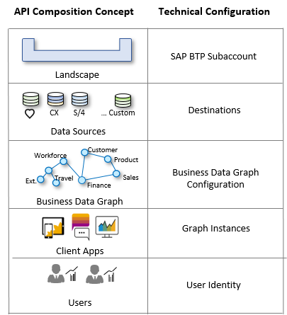

<!-- loio7b44365cac054dcbbbfd550bed7ff27c -->

# Role of the Administrator

The term *administrator* is used to describe an enterprise IT specialist who is responsible for administering and configuring API Composition. In addition to the administrator role, API Composition defines a special user role, called the *key user*.

The key user is authorized to create the business data graphs that are accessed by developers.

API Composition uses token-based authentication, based on OAuth 2.0. To interact securely with API Composition, a client application must present an access token \(A\), as shown in the following diagram. The token represents the authorization of the client and/or the user to access data via API Composition.

API Composition, in turn, communicates securely with data sources in the landscape on behalf of the client \(B\), using a variety of security methods.

For all of this to work, trust must be established. The client application, API Composition, and the data sources \(the business systems\) must trust a common security service, which is responsible for authenticating users and clients, and issuing tokens identifying them. This trust is technically established by an administrator in the context of an SAP BTP subaccount and uses the SAP Authorization and Trust Management service as the security service.

The administrator addresses the following configuration topics \(the order may vary\):

-   Creating landscapes by setting up SAP BTP subaccounts.

-   Setting up connectivity to data sources in landscapes by setting up destinations.

-   Enabling the destinations for API Composition by setting the additional property: <code><code>IntegrationCell.Include</code></code> to `true`. See [Additional SAP BTP Destination Properties](https://help.sap.com/docs/api-composition/isuite-api-composition/connect-to-your-business-systems?version=CLOUD#custom-sap-btp-destination-annotations).
-   Approving client applications to access API Composition by creating instances.

-   Enabling users by establishing an Identity Provider.

-   Supporting the creation of business data graphs by assigning the API Composition key user role to one or more users.
-   Enabling users to have read-only access to API Composition and the API Composition Configuration API by assigning the API Composition guest role to one or more users.

These steps are illustrated in the following diagram:

The overall responsibility for security is shared between the administrator and the developer of the client application. The administrator configures the trust relationship between the parties. The developer implements the secure communications using OAuth 2.0.

