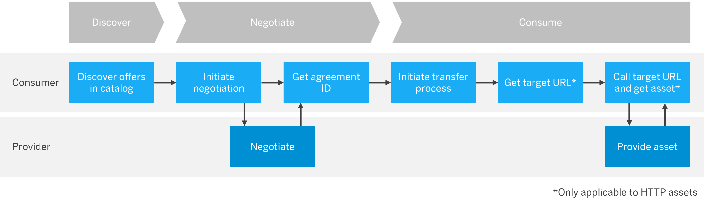

<!-- loio5c0cdb8bc67c42628e5cba01b422ff6b -->

# Consuming Data Space Assets

In Data Space Integration, as a consumer, you want to consume data assets provided by other members of the data space.

> ### Note:  
> This section focuses on working with Data Space Integration as a **consumer**. If you're a provider who wants to create assets, policies, and contract definitions, see [Design within Data Spaces](design-within-data-spaces-079b342.md).

<a name="loio5c0cdb8bc67c42628e5cba01b422ff6b__section_brz_k51_mzb"/>

## Prerequisites

To consume assets, your user requires the `DataspaceConsumer` role collection. See [Configuring User Access](configuring-user-access-6ae0ff7.md) and [Personas and Roles](identity-and-access-management-for-data-space-integration-211c66a.md#loio211c66a2f65e4bf0ad0e93e68cfff984__section_cxz_vsk_pcc).

<a name="loio5c0cdb8bc67c42628e5cba01b422ff6b__section_ang_l3d_2zb"/>

## Overview

In Data Space Integration, providers and consumers of assets can define data exchange via contract agreements in a sovereign and secure way. See [Concepts in Data Space Integration](concepts-in-data-space-integration-fcf96b2.md).

If you want to consume assets provided by another member of a data space, you must do so under their conditions, or policies. The provider drafts an offer that can be checked publicly after publication through the provider's catalog. The consumer then needs to start the negotiations. If both agree, an agreement is formed between the two of them. You, as the consumer, can now consume the asset under the conditions you and the provider agreed upon.

<a name="loio5c0cdb8bc67c42628e5cba01b422ff6b__section_wtw_k3d_2zb"/>

## Consuming Data Space Assets

Depending on the asset that you want to consume or provide, there are two different approaches to consuming assets:

-   The **provider pushes** the asset to a location that the consumer specifies.

    This approach applies to **hyperscaler-based assets** that you want to store in either **S3 storage** or **Azure Blob storage**.

-   The **consumer pulls** the asset from a location that the provider discloses to them.

    This approach applies to **HTTP assets**.

The following overview shows the consumption process on the consumer and provider side:

In general, perform the following steps to consume an asset:

1.  **Discover**: [Discovering Offers Through a Catalog](discovering-offers-through-a-catalog-90f3619.md)
2.  **Negotiate**: [Triggering a Contract Negotiation](triggering-a-contract-negotiation-dc11922.md)
3.  **Consume**: For the consumption, select the topic relevant to your use case:
    -   [Consuming Assets Into S3 Storage](consuming-assets-into-s3-storage-4afdf5c.md)
    -   [Consuming Assets Into Azure Blob Storage](consuming-assets-into-azure-blob-storage-0088840.md)
    -   [Consuming HTTP Assets](consuming-http-assets-f6b27ac.md)

Alternatively, you can also use the **Convenient Data Request API**, which orchestrates the full data exchange workflow for you. Access it at the SAP Business Accelerator Hub under [Convenient Data Request](https://hub.sap.com/api/DSIAPI/resource/Convenient_Data_Request).

