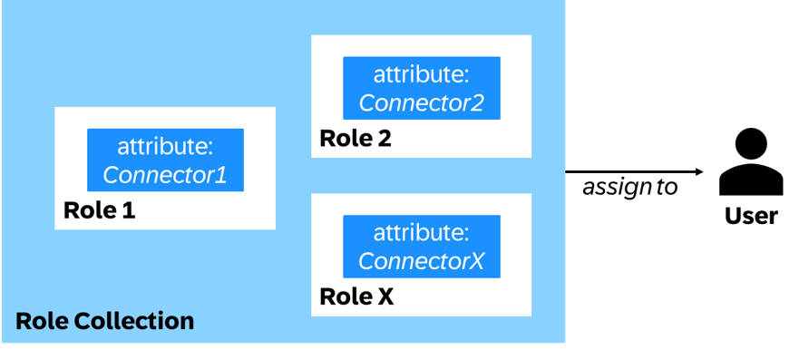
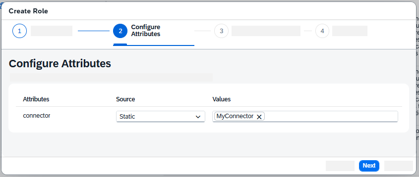

<!-- loio119b70af305845d3aa1414b280353c6d -->

# Creating Role Collections for Connectors

For your users to have access to connector settings, you need to create roles and role collections that contain the rights to these connectors.

## Prerequisites

-   You're the administrator for your SAP BTP subaccount.
-   You've created at least one connector in SAP Integration Suite under *Settings* \> *Data Spaces*.

## Context

By default, the access to connector-specific data is restricted. While users with the role collection `DataspaceConnectorAdmin` can create new connectors and read the connector overview, they, as well as all other roles, can't view the details of a connector or work with its assets.

To grant connector access to users, you, the administrator of your SAP BTP subaccount, must create **roles that are specific to each connector**, assign these roles to **role collections**, and assign these **role collections to users**. Only then can the users work with the referenced connectors. The following graphic explains this hierarchy:

Therefore, you must create a role for each connector and assign one or more of these roles to a role collection. The combination of roles you add to a role collection depends on your use case and preference: You can either only add one role to each role collection, thereby making the role collection specific to one connector, or combine multiple roles in one role collection to grant a user the rights to multiple connectors at once.

## Procedure

1.  In your subaccount in SAP BTP cockpit, go to *Security* \> *Roles*.

2.  For the entry for the application name `dsi`, find the role template `ConnectorNameTemplate`, and choose *Create Role*.

3.  In the upcoming wizard, enter a role name and choose *Next*.

4.  The attribute connector is already entered. As source, select *Static*, and as value, enter the name of an existing connector in SAP Integration Suite to which you want to grant access, and confirm with the [Enter\] key. Choose *Next*.

    

5.  Next, select an existing role collection to which you want to add the role, and choose *Next*. If you want to create a **new role collection**, skip this step for now.

6.  Finally, review your input and create the new role by choosing *Finish*.

7.  Repeat steps 2–6 for each of your connectors to which you want to grant access.

8.  If you didn't add the role to an existing role collection in step 5, create a new role collection. Otherwise, skip this step.

    1.  Go to *Security* \> *Role Collections* and choose *Create*.

    2.  Enter a name for the new role collection and choose *Create*.

    3.  Then, open the new role collection and choose *Edit*.

    4.  In the section *Roles*, select the input field for *Role Name*.

    5.  Select the role or roles you just created and confirm by choosing *Add*.

    6.  Optionally, you can now add the relevant users to the role collection, or do so in the next step.

    7.  Save your changes.

9.  Finally, assign the role collection containing the role or roles to the relevant users.

    1.  Go to *Security* \> *Users* and select the relevant user.

    2.  Choose *Assign Role Collection* and select the role collection that contains the role or roles you created previously.

    3.  Repeat these steps for each user to whom you want to grant access to the connector or connectors.

10. For authorization changes to take effect, it's recommended that the affected users log out of SAP Integration Suite and then log in again.

## Results

The users can now work with the data specific to the connector or connectors included in the role collections. However, the degree of access and actions they can perform depends on the additional data space role collections assigned to them. For the other existing role collections and their rights, see [Identity and Access Management for Data Space Integration](identity-and-access-management-for-data-space-integration-211c66a.md).

