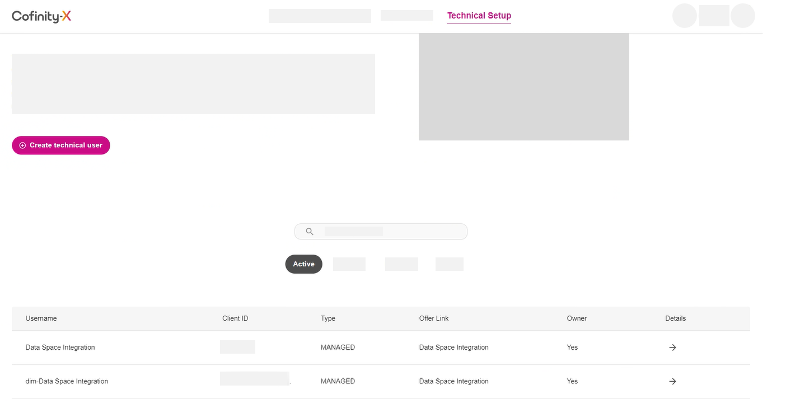

<!-- loiob95f0ef5f2d048dd814a9b09280d944f -->

# Creating Technical Users in Landscape Portal

Prepare your technical users in the landscape portal of your chosen data space.

## Prerequisites

-   You've registered with the data space of your choice.

-   You have the credentials to log into your company account with that data space.

-   You have the role `Company Admin` in the landscape portal of your chosen data space.

-   You want to use a **third-party wallet**, for example, hosted by Cofinity-X.

## Context

As part of the preparation in your onboarding, you must create two technical users in the landscape portal of the Cofinity-X network. The first technical user must have the *Identity Wallet Management* role and the second technical user must have the *Connector Management* role.

## Procedure

1.  Open the portal of your landscape and log in with your account. Log in to the portal to which the connector must be onboarded.

2.  Choose the company account that you want to use. You're redirected to authenticate yourself with the underlying identity provider. Log in with your credentials.

3.  Navigate to the *App Marketplace* and search for `Data Space Integration`. Once found, subscribe to it.

4.  SAP will contact you and ask for your SAP Integration Suite URL, which you subscribed to previously. Then, SAP creates the required technical users for you.

5.  Navigate to *Technical Setup* \> *Technical User Management*, which is where you manage all users assigned to the company.

6.  Scroll down. The technical users that were created for you are now visible in the technical user list.

    

    The user *Data Space Integration* has the *Connector Management* role and the user *dim-Data Space Integration* has the *Identity Wallet Management* role.

7.  Finally, you need to request an additional credential that enables cross-company connector communication.

    1.  Go to your profile and choose *Company Wallet*.

    2.  On the upcoming page, choose *Request New Credential*.

    3.  Select the credential *DataExchangeGovernance* and finish by choosing *Proceed*.

        After a short wait, the credential appears in your list of credentials.

## Results

You've created two technical users in the landscape portal of your data space, one user with the role *Identity Wallet Management* and one with the role *Connector Management*, and their credentials.

## Next Steps

Now, you can continue with the [Connector Setup](connector-setup-abc7524.md).

