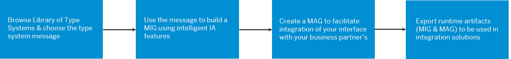

<!-- loio3309fe09278848a29e263931730432ba -->

# Integration Advisor

Integration Advisor is a cloud application that helps you to simplify and streamline the implementation flow of your B2B/A2A and B2G integration process. It uses a crowd-based machine learning approach to help you create integration content easily. Tests indicate that you can speed up the content creation to deployment process by almost 60% using Integration Advisor. You can also manage and share your content, and leverage the content shared by other application users with similar business needs.

> ### Note:  
> Integration Advisor is available on the Cloud Foundry environment. Interfaces and mappings designed in the Neo environment are also compatible in the Cloud Foundry environment.

Integration Advisor solves the biggest problem that you face in B2B/A2A/B2G integration: multiple business partners who use different industry standards like UN/EDIFACT, SAP IDoc, and ASC X12, to name a few. Each new standard creates a need for a new interface that facilitates this integration, and doing this manually is time consuming. With Integration Advisor, you have a library of type systems that you can use as a starting point. Use the messages in this type system library to create a new message implementation guideline \(MIG\), create mapping guidelines \(MAG\) to map the standard you use in your business system to that of your business partner's, and generate runtime artifacts that you can use in different integration solutions like Cloud Integration and SAP Process Orchestration.

The following graphic shows an overview of your journey to implement a B2B/A2A/B2G integration:

**Related Information**  

[Library of Type Systems](library-of-type-systems-740136b.md "")

[Custom Type Systems](custom-type-systems-884bb25.md "")

[Message Implementation Guidelines \(MIGs\)](message-implementation-guidelines-migs-f9f2bab.md "")

[Mapping Guidelines \(MAGs\)](mapping-guidelines-mags-42124f4.md "Learn what mapping guidelines are and how to work with the mapping guideline page.")

