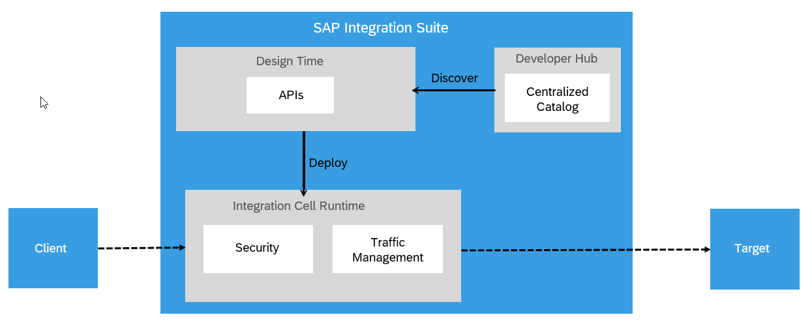

<!-- loioa4f87b1151824ba7b3a76252bca1da37 -->

# API Artifact

API artifacts are the core building blocks used to design, configure, publish, and manage APIs in SAP Integration Suite, API Management. These artifacts define how APIs behave, how they interact with backend systems, and how they are exposed to consumers.

An API artifact represents a complete API configuration that includes its endpoints, policies, security configurations, and runtime behavior. It enables organizations to expose backend services securely, apply governance, and monitor API usage.

## API Lifecycle: From Design to Deployment and Consumption

This section explains the end-to-end process of how API requests flow through the Integration Cell—from client initiation and API design to secure deployment and consumption—ensuring efficient and controlled integration between external systems and backend services.

-   **Client Sends a Request**

    The client represents an external application or system that needs to access data or functionality from a backend target system. Instead of connecting to the target directly, the client sends requests through SAP Integration Suite, which provides centralized control, security, and traffic regulation.

-   **Design Phase \(Design Time\)**

    During the design phase, the API Developer uses the API Management capability to create and manage API artifacts. See, [Design APIs and MCP Servers](design-apis-and-mcp-servers-94957bc.md).

    During this phase, you can:

    -   Define the API artifact and choose the backend connection logic.
    -   Proxify endpoints.
    -   Apply security and traffic management policies.
    -   Connect APIs to systems like SAP S/4HANA or third-party services.

-   **Deployment to Integration Cell**

    Once designed, the API artifacts are deployed to the Integration Cell runtime:

    -   Security policies handle authentication, authorization, and threat detection. For more information, see [Working with Security Policies](working-with-security-policies-aebf968.md).
    -   Traffic management enforces rate limits, surge control, and other performance safeguards. For more information, see [Working with Traffic Management Policies](working-with-traffic-management-policies-165db68.md).

-   **Request Forwarded to Target System**

    After passing through the runtime’s security and traffic policies, the request is forwarded to the designated target system using a communication protocol such as HTTP, which is commonly used for web-based API interactions.

-   **Discovery and Consumption**

    To make APIs available for consumption, they must be published to the catalog. SAP Integration Suite supports this by enabling API discovery through the Developer Hub. Content administrators can discover APIs from the SAP Integration Suite, organize them into products, and publish these products to the Developer Hub catalog — making them available for application developers to view and consume. For more information, see [Discover and Publish APIs From Integration Suite on Developer Hub](discover-and-publish-apis-from-integration-suite-on-developer-hub-dc3b6c9.md).

**Related Information**  

[Model Context Protocol \(MCP\)](model-context-protocol-mcp-9eb9239.md "Model Context Protocol (MCP) is an open-source protocol designed to bridge the gap between AI applications or agents and enterprise tools and data. Just as REST APIs connect web applications to data and services, MCP enables AI-native integrations by exposing tools, APIs, and data sources to AI Agents.")

[Deploy an Artifact](deploy-an-artifact-b70e7ec.md "After creating an API or an MCP server artifact, it is necessary to deploy it on the chosen runtime in order to make it executable and ready for use.")

[Copy an Artifact](copy-an-artifact-820c9e8.md "Create a copy of an existing API artifact or an MCP server with all its configurations and policies intact. This can be useful when you want to create a similar artifact but with some modifications or variations.")

[Delete an Artifact](delete-an-artifact-81694d6.md "Use this procedure to delete an API or an MCP Server artifact from an integration package in the Design workspace.")

