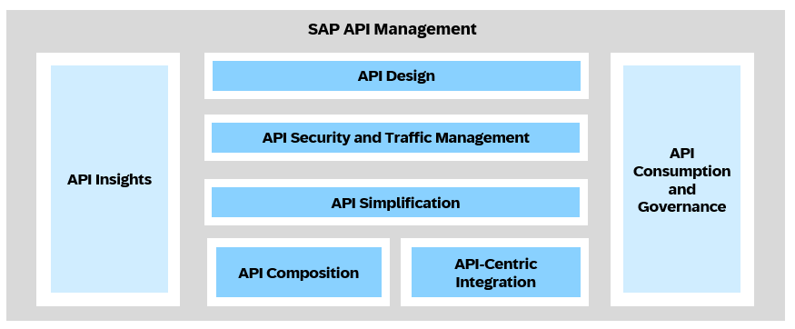
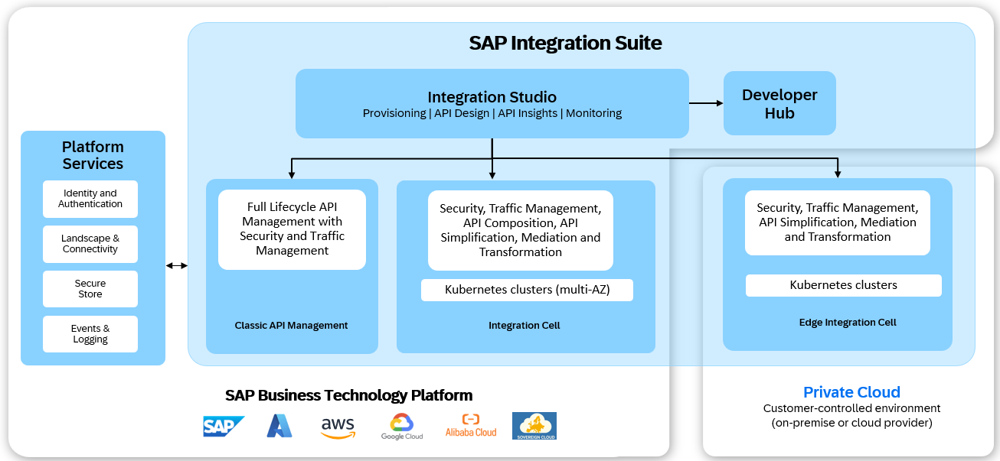

<!-- loiode3fea6ab49e42a7a5c10e7593d52dd1 -->

# API Management

API Management in SAP Integration Suite provides a secure and scalable foundation to design, publish, govern, and monitor APIs across cloud, private-cloud, and on-premise landscapes. It enables organizations to expose backend capabilities in a controlled and standardized manner while ensuring security, traffic management, and lifecycle governance.

API Management complements integration capabilities by ensuring that services are not only connected, but also protected, discoverable, and consumable.

With API Management, you can:

-   **API Design**: Design and expose APIs by creating API artifacts for existing services or by encapsulating integration logic within the API.
-   **API Security and Traffic Management**: Secure and protect APIs by applying authentication, authorization, and traffic management policies such as quota, surge protection, IP filtering, JSON threat protection, XML threat protection, and API validation.
-   **API Simplification**: Simplify access to backend services by creating APIs that provide a consistent and optimized interface while abstracting backend complexity.
-   **API Composition**: Create composite APIs by combining multiple backend services or APIs into a single, unified endpoint.
-   **API-Centric Integration**: Design API artifacts that combine security, traffic management, and integration capabilities within a single development model..
-   **API Consumption and Governance** Govern the API lifecycle and enable controlled API consumption through versioning, reusable policies, products, subscriptions, developer onboarding, and administrative controls.
-   **API Insights**: Monitor API usage, performance, and operational health through analytics, logging, and insights.

## API Management Architecture

API Management capabilities are delivered through a centralized design and management experience in SAP Integration Suite, while supporting multiple runtime options for different deployment requirements.

At the center of the architecture is Integration Studio, which provides capabilities for provisioning runtimes, designing APIs, monitoring operations, and accessing API insights. APIs designed in Integration Studio can be deployed to different API Management runtimes based on organizational requirements.

Developer Hub serves as the central portal for publishing, discovering, and consuming APIs. It enables developers to access API documentation, test APIs, and manage subscriptions.

All runtimes leverage shared platform services, including:

-   Identity and Authentication
-   Landscape and Connectivity
-   Secure Store
-   Events and Logging

## API Management Runtimes

SAP Integration Suite offers multiple API Management runtimes to address different deployment and operational needs. Each runtime supports core API management capabilities while providing flexibility in execution models and responsibilities.

-   **Classic API Management**

    A managed cloud runtime for API proxying, security, traffic management, and policy enforcement.

-   **Integration Cell**

    A managed, cloud-native, Kubernetes-based runtime that supports API-centric integrations, API composition, and API simplification, along with unified API modeling, secure execution, traffic management, and lifecycle governance. It is designed for deeper integration, scalability, and future extensibility.

-   **Edge Integration Cell**

    A customer-managed, cloud-native, Kubernetes-based runtime for private cloud and on-premise environments that supports API-centric integrations, API composition, and API simplification, along with unified API modeling, secure execution, traffic management, and lifecycle governance. It is designed for deeper integration, scalability, and future extensibility.

The Integration Cell and Edge Integration Cell runtimes offer the flexibility to choose the deployment model that best fits your architectural, security, and operational requirements, while maintaining a consistent API management experience across environments.

