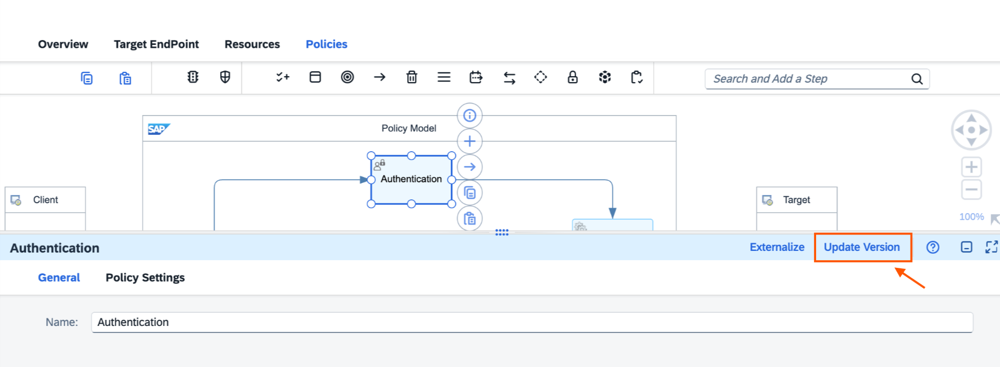
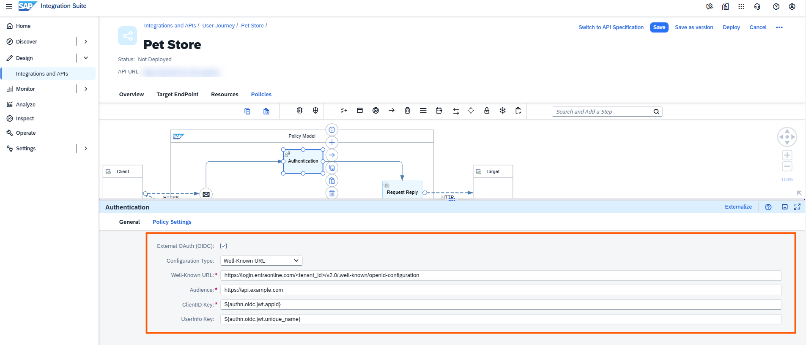

<!-- loiofa6eec4f9ffc45aa89f8a2155b855ca4 -->

# Authentication

Different APIs may have various authentication mechanisms. The Authentication policy supports both external OAuth-based identity providers \(OIDC\) and the SAP internal identity provider \(IDP\).


## **Policy Settings for XSUAA-Based Authentication \(Default\)**

The authentication mechanisms that are currently supported with internal IDP are basic authentication, client certificate, and OAuth. When using the internal IDP, OAuth authentication is performed using credentials issued by the SAP IDP.


<table>
<tr>
<th valign="top">

Attribute

</th>
<th valign="top">

Description

</th>
</tr>
<tr>
<td valign="top">

Name

</td>
<td valign="top">

The unique name of the policy within the API artifact. Each policy in an API artifact must have a unique name to prevent naming conflicts.

</td>
</tr>
<tr>
<td valign="top">

Type

</td>
<td valign="top">

Select the appropriate authentication mechanism for your API.

*Basic* - Used in situations where simple userid/password-based authentication is sufficient.

*Client Certificate* – The user provides a digital certificate consisting of a public and private key, which the server verifies to provide access.

*OAuth* - Used in situations where third-party services are allowed to exchange your information without you having to give away your password.

> ### Caution:  
> If you select the *Enable Default Virtual Host HTTP* option while deploying the Edge Integration Cell solution, the Client Certificate authentication type won't work for HTTP-based calls. However, the *Basic* and *OAuth* authentication types will still function. It's important to note that the authorization header for *Basic* and *OAuth* is transmitted in plaintext format. Therefore, without HTTPS, it's vulnerable to interception attacks.

> ### Note:  
> To execute the API with Authentication policy, configure the*Process Integration Runtime* instance, and access the endpoint using the client id/ secret or certificate from that instance. For step-by-step instruction on how to create a *Process Integration Runtime* instance, see [Invoke an API Artifact by Obtaining API Credentials through Process Integration Runtime](invoke-an-api-artifact-by-obtaining-api-credentials-through-process-integration-runtime-b63baa2.md).
> 
> Now, if you execute the API, the Authentication policy should be able to successfully authenticate the request.


</td>
</tr>
</table>


## **Policy Settings for an OIDC-Compliant OAuth Server**

This feature enables API Developers to validate and propagate tokens issued by OIDC-based identity providers like Microsoft Entra \(Azure AD\), Google, or Okta.

It also allows organizations that use their own Identity Providers \(IDPs\) to securely onboard and consume APIs as an alternative to SAP XSUAA for authentication.

The External OAuth enhancement extends the existing Authentication policy to support:

-   Validation of JWT/OAuth2 tokens issued by external OIDC compliant IDPs.
-   Configuration of a well-known URL to verify token signatures.
-   Mapping of token claims to roles and scopes for access control. For more information, see [Authorization](authorization-6658409.md).

    > ### Note:  
    > The current authentication policy applied to existing API artifacts does not provide the option to select *External OAuth \(OIDC\)*. This option is available only for newly created API artifacts.
    > 
    > To enable this option for the existing APIs, update the authentication policy version. You can do this by selecting*Update Version* in the header of the Authentication policy settings.

    


**General**


<table>
<tr>
<th valign="top">

Attribute

</th>
<th valign="top">

Description

</th>
</tr>
<tr>
<td valign="top">

Name

</td>
<td valign="top">

The unique name of the policy within the API artifact. Each policy in an API artifact must have a unique name to prevent naming conflicts.

</td>
</tr>
</table>



**Policy Settings**


<table>
<tr>
<th valign="top">

Attribute

</th>
<th valign="top">

Description

</th>
</tr>
<tr>
<td valign="top">

External OAuth \(OIDC\)

</td>
<td valign="top">

Enables the use of tokens issued by an external OpenID Connect \(OIDC\)-compliant Identity Provider \(IDP\) for API authentication.

> ### Note:  
> When this option is selected, authentication mechanisms such as basic authentication, client certificate, and OAuth are not applicable. Therefore, the tokens, credentials, or client certificate generated for XSUAA based internal IDP will not work.


</td>
</tr>
<tr>
<td valign="top">

Configuration Type\* \(Mandatory\)

</td>
<td valign="top">

Defines the method for providing the OIDC provider configuration required for token validation..

Select *Well Known URL* to automatically retrieve the metadata from the IDP’s OIDC discovery endpoint.

</td>
</tr>
<tr>
<td valign="top">

Well Known URL\* \(Mandatory\)

</td>
<td valign="top">

Specifies the discovery endpoint URL of the external IdP that provides metadata required for token validation, such as the issuer, authorization endpoints, and public keys.

*Example*:

For Microsoft Entra ID as the OIDC provider, the well-known URL may look like the following:

`https://login.entraonline.com/<tenant_id>/v2.0/.well-known/openid-configuration`

This endpoint returns the OIDC metadata used by the system to validate tokens issued by the identity provider.

</td>
</tr>
<tr>
<td valign="top">

Audience \(Optional\)

</td>
<td valign="top">

Specifies the intended recipient \(audience\) of the token. The platform validates that the token’s `aud` claim matches the configured audience to confirm that it was issued for this specific API or service.

You can provide a single value or multiple comma-separated values to support different client IDs \(applications\).

> ### Note:  
> When configured, the audience corresponds to the client ID\(s\) associated with applications in the Developer Hub and is used during token validation at runtime.

> ### Note:  
> If left empty, audience validation is skipped, allowing tokens issued for different client IDs to be accepted based on other authentication checks.

*Example*:

If your API is hosted at `https://api.example.com`, the audience could be set as:`https://api.example.com.`

`https://api.example.com/api/v2, https://api.example.com/userinfo`

</td>
</tr>
<tr>
<td valign="top">

ClientID Key\* \(Mandatory\)

</td>
<td valign="top">

The value for ClientID Key must be a dynamic expression derived from the claims provided by your configured OIDC provider. Select the expression that maps to the claim in your JWT which represents the ClientID.

**Example**: If your OIDC provider is Microsoft Entra ID, use the following dynamic expression:`${authn.oidc.jwt.appid}`

> ### Sample Code:  
> ```
> {
>   "aud": "https://abc.com",
>   "iss": "https://abc.xyz/9874303e-b92e-4578-1100-5631eb105dde/",
>   "iat": 1755755294,
>   "nbf": 1755755294,
>   "exp": 1755759194,
>   "app_displayname": "new-app",
>   "appid": "1d025071-fe2f-42a8-ab8c-19e07dadb841",
>   "idtyp": "app",
>   "oid": "52253a52-40dc-4436-b70b-c9313dbdb5f4",
>   "sub": "5"
> }
> ```

In this example, the value of the appid claim \(1d025071-fe2f-42a8-ab8c-19e07dadb841\) is equal to the application’s client ID. The dynamic expression $\{authn.oidc.jwt.appid\} resolves to this value during authentication.

Alternatively, you can use the dynamic expression `${authn.oidc.userinfo.<any_claim>}` if your OIDC provider issues a user-based token. In this scenario, instead of reading the ClientID from the JWT claims, the value can be retrieved from the OIDC UserInfo endpoint.

When a user authenticates, the system validates the token and invokes the UserInfo endpoint to fetch additional user attributes. These attributes become available for dynamic resolution using the userinfo expression format.

For example, if the `UserInfo` response returns:

> ### Sample Code:  
> ```
> {
>   "sub": "248289761001",
>   "email": "user@example.com",
>   "preferred_username": "user1",
>   "unique_name": "user@company.com",
>   "department": "IT"
> }
> ```

If you configure:`${authn.oidc.userinfo.unique_name}`

At runtime, this resolves to:`user@company.com`

> ### Note:  
> If the specified claim provided in the Client ID key is not found in the JWT, the token validation will fail.


</td>
</tr>
<tr>
<td valign="top">

UserInfo Key

</td>
<td valign="top">

The value for User Info must be a dynamic expression derived from the claims provided by your configured OIDC provider. Choose the expression that maps to the claim in your JWT which uniquely identifies the authenticated user.

> ### Example:  
> If your OIDC provider is Microsoft Entra ID, use the following dynamic expression: `${authn.oidc.jwt.unique_name}`
> 
> In Entra ID, the `unique_name` claim typically contains the user’s sign-in identifier \(for example, the user principal name or email address\). By configuring User Info Key with this expression, the system extracts the user identity directly from the JWT at runtime.
> 
> > ### Sample Code:  
> > ```
> > {
> >   "aud": "00000003-0000-0000-c000-000000000000",
> >   "iss": "https://xyz.abc.net/4567890e-b92e-4578-9695-5631eb105dde/",
> >   "iat": 1755776199,
> >   "nbf": 1755776199,
> >   "exp": 1755781588,
> >   "appid": "1d025071-fe2f-42a8-ab8c-19e07dadb841",
> >   "idtyp": "user",
> >   "name": "DU",
> >   "oid": "93b6eda3-dab1-415d-83be-ae11ac64391a",
> >   "unique_name": "demouser@demoentratenant.abcxyz.com",
> >   "upn": "demouser@demoentratenant.abcxyz.com",
> >   "tid": "4399535e-b92e-4578-9695-5631eb105dde",
> >   "ver": "1.0"
> > }
> > ```

In this example, the value of the `unique_name` claim `(demouser@demoentratenant.abcxyz.com)` represents the authenticated user. The dynamic expression `${authn.oidc.jwt.unique_name}` resolves to this value during authentication.

Alternatively, you can use the dynamic expression `${authn.oidc.userinfo.<any_claim>}` if your OIDC provider issues a user-based token. In this scenario, instead of reading the `UserInfo` from the JWT claims, the value can be retrieved from the OIDC `UserInfo` endpoint.

When a user authenticates, the system validates the token and invokes the UserInfo endpoint to fetch additional user attributes. These attributes become available for dynamic resolution using the userinfo expression format.

For example, if the `UserInfo` response returns:

> ### Sample Code:  
> ```
> {
>   "sub": "248289761001",
>   "email": "user@example.com",
>   "preferred_username": "user1",
>   "unique_name": "user@example.com",
>   "department": "IT"
> }
>  
> 
> ```

If you configure: `${authn.oidc.userinfo.email}`

At runtime, this resolves to: `user@example.com`

> ### Note:  
> If the specified claim provided for*UserInfo Key* is not found, the `UserInfo` value is defaulted to the value of the already configured clientID.


</td>
</tr>
</table>


## Emitted Variables

Runtime values generated by the authentication policy during execution that capture authentication details \(such as the Client ID\) and can be referenced in other policies for configuration and decision-making.


<table>
<tr>
<th valign="top">

Policy Attributes

</th>
<th valign="top">

Descriptions

</th>
</tr>
<tr>
<td valign="top">

`ClientID`

</td>
<td valign="top">

To reference the ClientID variable, use the expression `${context.authn.getClientID()}`.

Here,

-   `context` is the root object used to access runtime information, including policy-specific data and, in the future, custom variables.
-   `authn` represents the authentication information associated with the request \(with potential extension to other policies later\).
-   is a function that retrieves the client ID of the calling application, typically obtained from OAuth or API key authentication.

One common use case is to use this expression in the **Quota Identifier** field of a Quota policy, enabling quotas to be applied based on the Client ID provided by the authentication policy.

</td>
</tr>
<tr>
<td valign="top">

 

</td>
<td valign="top">

 

</td>
</tr>
</table>


## Error Codes


<table>
<tr>
<th valign="top">

Error Code

</th>
<th valign="top">

HTTP Status

</th>
<th valign="top">

Example Runtime Message

</th>
</tr>
<tr>
<td valign="top">

unauthorized

</td>
<td valign="top">

401

</td>
<td valign="top">

Unauthorized: Unable to authenticate user. Access token has expired. Please obtain a new token.

</td>
</tr>
<tr>
<td valign="top">

invalidToken

</td>
<td valign="top">

401

</td>
<td valign="top">

InvalidToken: Unable to authenticate user. The provided token is invalid. Please verify the token and retry.

</td>
</tr>
<tr>
<td valign="top">

tokenNotPresent

</td>
<td valign="top">

401

</td>
<td valign="top">

tokenNotPresent: Unable to authenticate uer. No token was provided in the Authorization header. Please include a valid token and retry.

</td>
</tr>
<tr>
<td valign="top">

invalidWellKnownURL

</td>
<td valign="top">

400

</td>
<td valign="top">

InvalidWellKnownURL: Unable to reach the well-known configuration endpoint. Please verify the URL and network connectivity.

</td>
</tr>
<tr>
<td valign="top">

badRequest

</td>
<td valign="top">

400

</td>
<td valign="top">

badRequest: Required Authorization header is missing from the request. Please include it and retry.

</td>
</tr>
<tr>
<td valign="top">

noCredentials

</td>
<td valign="top">

401

</td>
<td valign="top">

NoCredentials: Credentials are not present in the request. Please provide valid authentication credentials and retry.

</td>
</tr>
<tr>
<td valign="top">

authModeNotSupported

</td>
<td valign="top">

401

</td>
<td valign="top">

authModeNotSupported: User not authenticated. The provided authentication mode is not supported. Supported authentication types: OAuth2, JWT, Basic.

</td>
</tr>
<tr>
<td valign="top">

authHandlerConfigurationError

</td>
<td valign="top">

500

</td>
<td valign="top">

authHandlerConfigurationError: Error configuring authentication handler. Please verify the authentication policy configuration and try again.

</td>
</tr>
<tr>
<td valign="top">

authTypeInitializationError

</td>
<td valign="top">

500

</td>
<td valign="top">

authTypeInitializationError: An error occurred while initializing OAuth2 authentication. Please verify the OAuth2 configuration and try again.

</td>
</tr>
<tr>
<td valign="top">

authTypeIdentificationError

</td>
<td valign="top">

401

</td>
<td valign="top">

authTypeIdentificationError: Invalid authentication type specified. Please provide a valid authentication type: OAuth2 or JWT.

</td>
</tr>
<tr>
<td valign="top">

tokenFetchError

</td>
<td valign="top">

500

</td>
<td valign="top">

tokenFetchError: An error occurred while fetching the access token from the authorization server. Please verify the authorization server configuration and try again.

</td>
</tr>
<tr>
<td valign="top">

tokenValidationError

</td>
<td valign="top">

500

</td>
<td valign="top">

tokenValidationError: An error occurred during token validation. Please verify the token and try again.

</td>
</tr>
<tr>
<td valign="top">

tokenUpdateInCacheError

</td>
<td valign="top">

500

</td>
<td valign="top">

tokenUpdateInCacheError: An error occurred while updating the authentication token cache. Please retry the request.

</td>
</tr>
<tr>
<td valign="top">

timestampValidationAuthenticationError

</td>
<td valign="top">

500

</td>
<td valign="top">

timestampValidationAuthenticationError: Error occurred during token validation. Timestamp validation for the authentication token has failed. Current time in UTC is `2026-07-06T12:15:30Z`, Token expiry time in UTC is`2026-07-06T12:00:00Z` 

</td>
</tr>
<tr>
<td valign="top">

jkuUrlValidationAuthenticationError

</td>
<td valign="top">

500

</td>
<td valign="top">

jkuUrlValidationAuthenticationError: Error occurred during token validation. Validation failed for the JKU URL of the authentication token. Please verify the token issuer configuration.

</td>
</tr>
<tr>
<td valign="top">

jkuPublicKeyValidationAuthenticationError

</td>
<td valign="top">

500

</td>
<td valign="top">

jkuPublicKeyValidationAuthenticationError: Error occurred during token validation. Token validation failed while validating with the public key retrieved from the JKU URL.

</td>
</tr>
<tr>
<td valign="top">

audienceValidationError

</td>
<td valign="top">

500

</td>
<td valign="top">

audienceValidationError: Error occurred during token validation. Audience validation failed, audience from access token = `api://orders-service`.

</td>
</tr>
<tr>
<td valign="top">

scopeValidationError

</td>
<td valign="top">

500

</td>
<td valign="top">

scopeValidationError: Error validating scope in the token. The token does not have the required scope to access this resource.

</td>
</tr>
<tr>
<td valign="top">

aclCheckFailed

</td>
<td valign="top">

403

</td>
<td valign="top">

Forbidden: Access denied due to insufficient permissions. Your identity does not have the required ACL rights to access this resource. Please contact your administrator to request access.

</td>
</tr>
</table>

**Related Information**  


[Authorization](authorization-6658409.md "This policy evaluates whether a user should be permitted to access a protected API.")

[JSON Threat Protection](json-threat-protection-c4991a6.md "Minimizes the risk posed by content-level attacks by enabling specific limits on various JSON structures, such as arrays and strings.")

[XML Threat Protection](xml-threat-protection-2e04b93.md "An XML Threat Protection policy safeguards XML-based applications and APIs from malicious attacks. It enforces rules on XML data to prevent threats such as recursive payloads, excessive node depth, and oversized payloads.")

[API Validation](api-validation-02ff41b.md "The API validation policy enables you to validate incoming request messages against an OpenAPI 3.0 Specification.")

