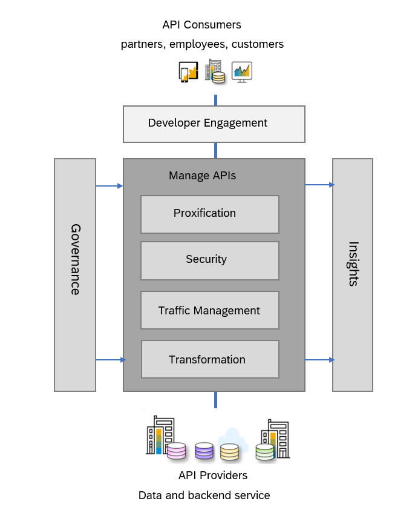

<!-- loio1b17d18006d2472e81aa2f7af066a1b2 -->

# Classic API Management

Classic API Management focuses on securely exposing existing backend services through managed APIs. In this model, APIs primarily function as controlled proxies in front of backend systems.

You create API proxies that abstract backend services and apply policies for security, traffic management, monitoring, and transformation. The integration logic itself remains external to the API artifact and is handled by backend services or separate integration components. For example, an integration flow URL can be secured by exposing it as an API and applying policies such as authentication, authorization, rate limiting, and logging.

This approach is well suited for scenarios where:

-   Backend services already exist and require secure exposure
-   API governance and traffic control are the primary objectives
-   Integration logic is managed independently from the API layer

With API Management you can perform the following tasks:

-   **Proxify your APIs**: Create your own unified and harmonised API presence, using your own domain.

-   **Secure your APIs**: Secure your APIs against unauthorized access and threats. API management helps organizations define a standardized set of policies to protect APIs and the underlying backends.

-   **Perform Traffic Management**: Configure cache, and control traffic quotas and spikes, using the traffic management policies.

-   **Govern your APIs**: Discover and document all your APIs, manage the lifecycle of your APIs and govern them using the policies. Over 30 different policy types are available, ranging from traffic management and security policies.

-   **Get Business Insights**: Monitor with usage analytics, logs, events and triggers; use business insights to monetize your APIs.

-   **Transform your APIs**: Apply advance header and payload modifications.

-   **Developer Engagements**: Developer Hub is a feature-rich, themed, and customizable portal designed specifically for application developers. It provides comprehensive API documentation, code snippets, and more. With Developer Hub, developers can easily engage with the platform, enabling them to discover, subscribe to, and consume APIs directly.

<a name="loio1b17d18006d2472e81aa2f7af066a1b2__section_hvq_1p3_nzb"/>

## Features

<dl>
<dt><b>

Create omni-channel experiences

</b></dt>
<dd>

Use API Designer and Open APIs to create a omni-channel mobile experience across devices.

</dd><dt><b>

Secure your digital assets, interfaces

</b></dt>
<dd>

Help protect your data and digital assets in this hyper-connected world. Get deep insights on API usage.

</dd><dt><b>

Manage the end-to-end lifecycle of APIs

</b></dt>
<dd>

Scale billions of API calls to unlock new opportunities, new business potential and add additional value.

</dd><dt><b>

Engage developers and partners

</b></dt>
<dd>

Developer Hub simplifies sharing managed APIs and collaborations with customers, partners, and developers.

</dd><dt><b>

Grow new revenue streams

</b></dt>
<dd>

Monetize your data and digital assets with help of API Portal. Upsell and cross-sell through your ecosystem.

</dd><dt><b>

Evolve B2B integrations

</b></dt>
<dd>

Extend solutions with additional SAP BTP capabilities for mobile, offline and integration.

</dd><dt><b>

Benefit from multitenancy support 

</b></dt>
<dd>

Use this service in tenant-aware applications.

</dd>
</dl>

<a name="loio1b17d18006d2472e81aa2f7af066a1b2__section_q5k_rh3_nzb"/>

## Getting Started

You can provision the API Management capability from theSAP Integration Suite launchpad. For the detailed steps, see [Activate and Configure the API Management Capability](activate-and-configure-the-api-management-capability-f6eb433.md).

**Related Information**  

[Working with API Management](working-with-api-management-321fb4d.md "Get an understanding of API Management within SAP Integration Suite and leverage its capabilities effectively.")

[API Lifecycle](api-lifecycle-5e8ea7d.md "The API lifecycle in API Management encompasses a series of well-defined stages that enable organizations to securely expose, manage, consume, and analyze APIs. SAP provides a comprehensive platform for managing APIs throughout their lifecycle—from design and deployment to monetization and analysis.")

[Developer Hub](developer-hub-41f7c45.md "The Developer Hub is a web-based platform that serves as a centralized catalog for APIs, events, and MCP servers, empowering developers to discover, explore, and consume the integration capabilities offered by your organization. Acting as a unified and curated storefront, it consolidates APIs, events, and MCP servers in a single location, enabling application developers to discover, explore, and consume APIs and events, while enabling AI agents to discover and consume MCP servers.")

