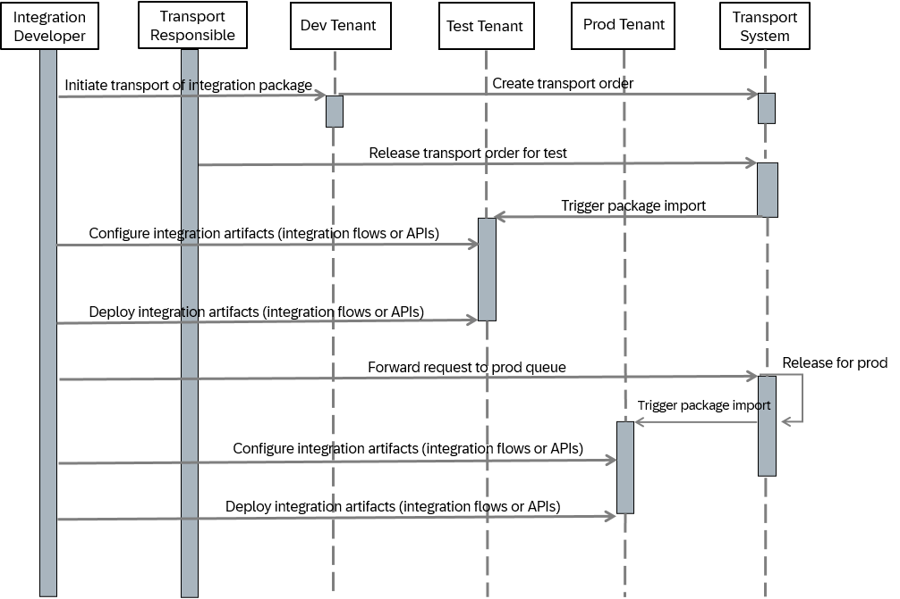

<!-- loio1ca3d1e0b6ba4b84a27bb99a83b06101 -->

# Content Transport - Sequence of Steps \(Example\)

There are the following prerequisites:

-   The tenant administrator of the source system has configured the transport mode \(SAP Cloud Integration under *Settings*\).

-   The integration developer has granted the required transport permissions \(see [Guidelines on Role Assignments](guidelines-on-role-assignments-fc409e8.md)\).

The following diagram shows the typical sequence of steps for transporting integration content, based on the assumption that the content is first transported from a development tenant to a test tenant, and then to a production tenant:

1.  The integration developer initiates transport of the desired integration package by creating a transport order in the transport system.

2.  The transport responsible logs in to the transport system and releases the request in the test node queue.

3.  Once the package is imported on the test tenant, the integration developer configures the integration artifacts \(integration flows, APIs or MCP servers\) and deploys them on the test tenant. If necessary, the integration developer also configures and deploys the associated security artifacts.

4.  If the request is to go to production, the transport responsible forwards transport to production node queue.

5.  Either manually or by means of a job, the request is imported in the production node.

6.  The integration developer configures the integration artifacts \(integration flows, APIs or MCP servers\) and deploys them \(on the prod tenant\). If necessary, the integration developer also configures and deploys the associated security artifacts.

