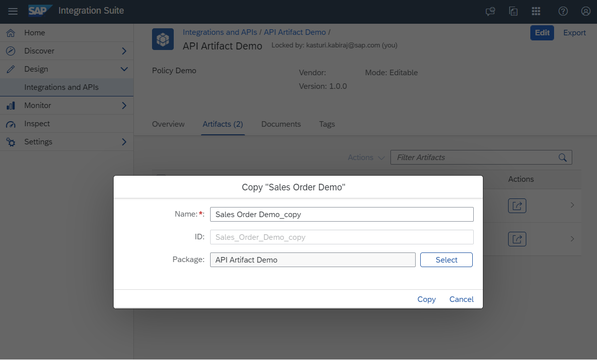

<!-- loio820c9e8219ca4ab88c7a80950c6fe360 -->

<link rel="stylesheet" type="text/css" href="css/sap-icons.css"/>

# Copy an API or an MCP Server Artifact

Create a copy of an existing API artifact or an MCP server with all its configurations and policies intact. This can be useful when you want to create a similar artifact but with some modifications or variations.

<a name="loio820c9e8219ca4ab88c7a80950c6fe360__prereq_rnp_v53_b2b"/>

## Prerequisites

You are assigned the *PI\_Integration\_Developer* role.

<a name="loio820c9e8219ca4ab88c7a80950c6fe360__context_snp_v53_b2b"/>

## Context

The copy feature allows you to quickly duplicate the artifact and make the necessary changes without starting from scratch. You can create a duplicate of an artifact by copying it within the same package or to a different integration package. Please ensure that you explicitly update the base path of the copied artifact; otherwise, the deployment will fail.

Artifacts often have multiple policies, such as authentication, rate limiting, caching, and transformation policies. When you copy an artifact, all the policies are copied, allowing you to maintain consistency across multiple artifacts. This saves time and effort in configuring policies for each API or MCP server individually.

To copy an artifact, proceed as follows:

<a name="loio820c9e8219ca4ab88c7a80950c6fe360__steps_tnp_v53_b2b"/>

## Procedure

1.  Log on to SAP Integration Suite.

2.  Choose the navigation icon on the left and choose *Design* \> *Integrations and APIs*.

3.  Select the *<integration package\>* from where you want to copy the artifact.

4.  On the *<integration package\>* details page, choose *Artifacts*.

5.  Choose the  Action icon against the required artifact and then select the *Copy* option.

6.  In the *Copy <Artifact\>* dialog box, the details for each attribute is pre-filled.

    By default, "\_copy" will get appended to the *Name*. However, you have the option to change the *Name* and provide a unique name for the artifact you are copying. When you change the *Name*, the *ID* will be automatically generated.

    > ### Note:  
    > If you try to copy the artifact with the same name, the copy action will fail and display the following error: "The <artifact\> could not be copied because an artifact with the same ID already exists. Please edit the name to modify the ID and try again.".
    > 
    > Whether you're copying an artifact within the same integration package or a different package, you must provide a unique name for the copied artifact.

    

    > ### Note:  
    > The name should start with an alphabet or an underscore \(\_\). It can also include numbers, spaces, periods, or hyphens \(-\), but it must not end with a period \(.\)

7.  To copy this artifact to an Integration package of your choice, choose *Select*.

    In the *Package Selection* dialog, search for and select the desired package.

8.  Choose *Copy* to initiate the copying process.

<a name="loio820c9e8219ca4ab88c7a80950c6fe360__result_av2_h23_31c"/>

## Results

After the copying process is finished, you will receive a success message instructing you to go to the package where the copied artifact has been added.

You can access the artifact in view mode, allowing you to download, deploy, and copy the artifact. If you want to delete the artifact, simply switch to edit mode by selecting the *Edit* option.

**Related Information**  

[API Artifact](api-artifact-a4f87b1.md "API artifacts are the core building blocks used to design, configure, publish, and manage APIs in SAP Integration Suite, API Management. These artifacts define how APIs behave, how they interact with backend systems, and how they are exposed to consumers.")

[Model Context Protocol \(MCP\)](model-context-protocol-mcp-9eb9239.md "Model Context Protocol (MCP) is an open-source protocol designed to bridge the gap between AI applications or agents and enterprise tools and data. Just as REST APIs connect web applications to data and services, MCP enables AI-native integrations by exposing tools, APIs, and data sources to AI Agents.")

[Deploy APIs and MCP Servers](deploy-apis-and-mcp-servers-b70e7ec.md "After creating an API or an MCP server artifact, it is necessary to deploy it on the chosen runtime in order to make it executable and ready for use.")

[Delete APIs and MCP Servers](delete-apis-and-mcp-servers-81694d6.md "Use this procedure to delete an API or an MCP Server artifact from an integration package in the Design workspace.")

